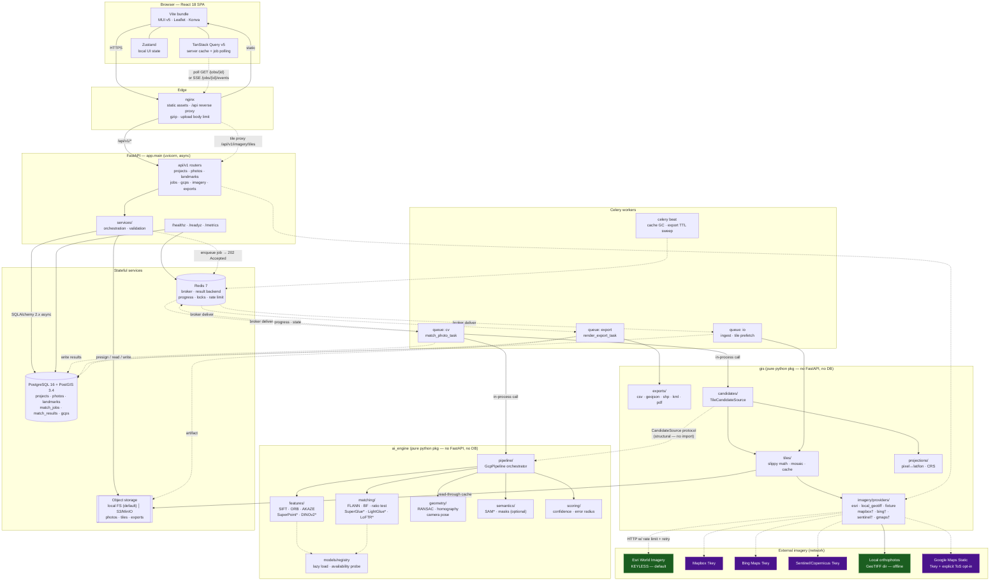
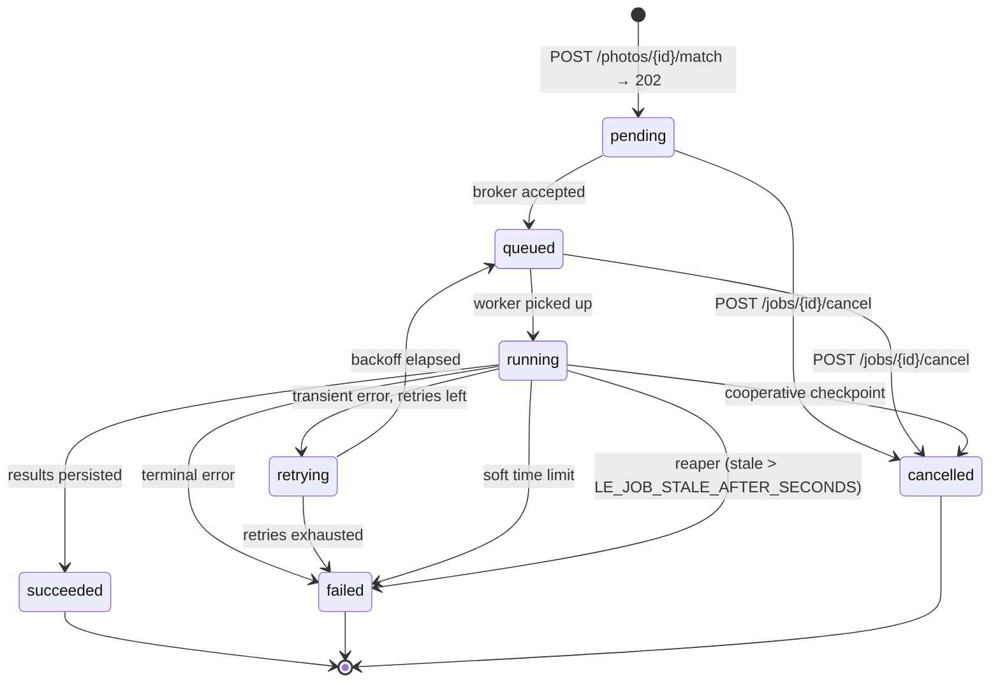

# LandExplorer — Master Architecture Overview

**Status:** Authoritative. This document is the contract every other agent builds to.
**Owner:** System Architect
**Version:** 1.0
**Last updated:** 2026-07-17

---

## 0. Document scope and how to read it

LandExplorer turns a **ground-level field photograph** into **georeferenced Ground Control Points**.

A surveyor uploads a photo, manually marks visible landmarks (fence corners, gate posts, tree bases, tank edges) as pixel coordinates, and the system searches legally accessible satellite imagery for the matching patch of earth. It matches features, estimates a homography with RANSAC, and pushes each marked pixel through that homography into a satellite raster, then out to latitude/longitude with a confidence score. The result is exportable as CSV, GeoJSON, Shapefile, KML, or PDF.

Sections 1–2 are the diagrams. **Section 3 is the folder structure and is the single most important part of this document** — it is normative, not illustrative. Section 4 defines module boundaries as enforceable rules. Section 5 is configuration. Section 6 is the async job lifecycle. Section 7 is the ADR record.

### 0.1 Verified environment facts this design is built on

These were checked on the development machine on 2026-07-17 and are **facts, not assumptions**:

| Fact | Value | Architectural consequence |
| --- | --- | --- |
| Python | 3.12.3 | Target runtime; `X \| None` syntax, `Self`, PEP 695 avoided for tooling compatibility. |
| OpenCV | 4.13.0 | `SIFT_create`, `USAC_MAGSAC`, `FlannBasedMatcher` all present. |
| **`cv2.xfeatures2d`** | **ABSENT** | **No opencv-contrib.** SURF, BEBLID, VGG, LATCH are unavailable. The classical path must use only main-module OpenCV: SIFT, ORB, AKAZE, BRISK. Nothing may `import cv2.xfeatures2d`. |
| NumPy | 2.4.3 | NumPy 2.x ABI. Any compiled extension must be NumPy-2 compatible. |
| torch / torchvision | 2.11.0+cu130 / 0.26.0+cu130 | Installed and importable. |
| **`torch.cuda.is_available()`** | **False** | Despite the CUDA build, **there is no usable GPU here.** `LE_AI_DEVICE=auto` must resolve to `cpu` at runtime, never assume CUDA from the wheel name. |
| GDAL/osgeo | 3.8.4 | Available for raster IO **without** rasterio. `gis.raster` uses a thin adapter so the GDAL path works today and rasterio is an optimization later. |
| SciPy / PIL | 1.17.1 / 12.1.1 | Available. |
| fastapi, sqlalchemy, rasterio, geopandas, shapely, pyproj, celery, redis, pydantic, kornia, reportlab | **not installed** | These live in `requirements.txt`. **`ai_engine` must be importable and fully testable right now, on this machine, with zero installs.** That is only true if `ai_engine` never imports any of them. |
| Docker | not installed | Compose files are authored blind. They must be lint-clean and reviewed, but cannot be executed here. No task may be marked "verified" on the basis of a compose file. |
| Model weights | will not be downloaded | Every deep backend must be lazily loaded and gracefully degrading. A missing `.pth` is a **log line and a fallback**, never a traceback. |

Two consequences deserve to be stated as loudly as possible, because they are the difference between a demo and a product:

> **HR-1 (Hard Requirement).** The full pipeline — upload → mark → search → match → RANSAC → homography → lat/lon → export — **must run end-to-end with only SIFT/ORB + FLANN/BF + RANSAC.** Deep models are optional accelerants. If every weight file on disk vanished, the only observable change is accuracy and a set of `INFO` log lines.

> **HR-2 (Hard Requirement).** The **default imagery provider is keyless.** `git clone && docker compose up` with an empty `.env` yields a working satellite search. Keyed providers (Mapbox, Bing, Copernicus, Google) are strictly opt-in.

---

## 1. Software architecture

Solid arrows are **synchronous** request/response paths where a caller blocks on a reply. Dashed arrows are **asynchronous** paths — enqueue, poll, publish, or background fetch — where nothing blocks. The rule the diagram encodes: **no CV work is ever on a solid line into FastAPI.**



`*` = optional deep backend, lazily loaded, degrades to classical.
`†` = requires an API key; disabled unless the corresponding env var is set.

### 1.1 The three rules the diagram enforces

1. **FastAPI never does CV.** The only solid lines into `ai_engine` originate from a Celery worker. An API handler that called `GcpPipeline.run()` would block the event loop for 10–60 s and is a review-blocking defect.
2. **`ai_engine` has no arrow to Postgres, Redis, storage, or any provider.** It receives NumPy arrays and returns dataclasses. This is what makes it testable on this machine today.
3. **`gis` has no arrow to Postgres or FastAPI.** It receives coordinates and returns rasters, geometry, and files.

### 1.2 Process inventory

| Process | Image | Command | Scale | Blocking work? |
| --- | --- | --- | --- | --- |
| `web` | `nginx:1.27-alpine` | nginx | 1 | no |
| `api` | `landexplorer/backend` | `uvicorn app.main:app` | N | **never** |
| `worker-cv` | `landexplorer/backend` | `celery -A app.tasks.celery_app worker -Q cv -c ${LE_CELERY_WORKER_CONCURRENCY}` | N | yes, by design |
| `worker-io` | `landexplorer/backend` | `celery ... -Q io -c 4` | N | yes (network) |
| `worker-export` | `landexplorer/backend` | `celery ... -Q export -c 2` | N | yes |
| `beat` | `landexplorer/backend` | `celery -A app.tasks.celery_app beat` | **exactly 1** | no |
| `db` | `postgis/postgis:16-3.4` | postgres | 1 | — |
| `redis` | `redis:7-alpine` | redis-server | 1 | — |

`worker-cv` is separated from `worker-io` because they have opposite resource profiles: CV is CPU-saturating with low concurrency, tile fetching is IO-bound with high concurrency. Sharing a queue would let a burst of tile fetches starve matching, or a long match stall ingestion.

---

## 2. AI workflow — sequence

```mermaid
sequenceDiagram
    autonumber
    actor S as Surveyor
    participant FE as React SPA
    participant API as FastAPI
    participant DB as Postgres+PostGIS
    participant OBJ as Object storage
    participant RD as Redis broker
    participant WIO as worker-io
    participant W as worker-cv
    participant CS as gis.candidates
    participant PV as gis.imagery.provider
    participant AE as ai_engine.pipeline
    participant PR as gis.projections
    participant EX as gis.exports

    rect rgb(232, 244, 253)
    note over S,OBJ: PHASE 1 — Upload & ingest (sync accept, async analyse)
    S->>FE: drop field_photo.jpg
    FE->>API: POST /api/v1/projects/{pid}/photos (multipart)
    API->>API: validate MIME · size ≤ LE_UPLOAD_MAX_BYTES · sha256
    API->>OBJ: put photos/{photo_id}/original.jpg
    API->>DB: INSERT photos (status='uploaded', exif_*)
    note right of API: EXIF GPS → photos.exif_location<br/>becomes the search PRIOR if present
    API-->>FE: 201 PhotoRead
    API-)RD: enqueue ingest_photo_task (queue: io)
    RD-)WIO: deliver
    WIO->>OBJ: read original
    WIO->>WIO: thumbnail · downscale to LE_SEARCH_MOSAIC_SIZE_PX
    WIO->>OBJ: put derived/{photo_id}/preview.jpg
    WIO->>DB: UPDATE photos SET status='ready'
    end

    rect rgb(255, 249, 230)
    note over S,DB: PHASE 2 — Landmark marking (pure sync CRUD, no CV)
    FE->>API: GET /api/v1/photos/{id}/features?max=500
    API->>DB: cached keypoint preview (from ingest)
    API-->>FE: [{x,y,response}] → Konva overlay hint layer
    S->>FE: click landmarks on Konva canvas
    FE->>API: PUT /api/v1/photos/{id}/landmarks (bulk upsert)
    API->>DB: INSERT/UPDATE landmarks (pixel_x, pixel_y, label, kind)
    API-->>FE: 200 LandmarkRead[]
    note over S,FE: ≥4 landmarks required; UI blocks Match below that
    end

    rect rgb(237, 247, 237)
    note over S,W: PHASE 3 — Job submission (returns in <100 ms)
    S->>FE: click "Find location"
    FE->>API: POST /api/v1/photos/{id}/match {search_bbox?, provider?, zoom_levels?}
    API->>API: guard: ≥4 landmarks · prior present or bbox given
    API->>DB: INSERT match_jobs (state='pending', idempotency_key)
    API-)RD: enqueue match_photo_task(job_id) (queue: cv)
    API-->>FE: 202 Accepted {job_id, state:'pending'}
    FE->>API: subscribe GET /api/v1/jobs/{job_id}/events (SSE)
    end

    rect rgb(252, 237, 237)
    note over W,PR: PHASE 4 — Matching (async, all CV, ~10–60 s CPU)
    RD-)W: deliver match_photo_task
    W->>DB: UPDATE match_jobs SET state='running', stage='loading_inputs'
    W->>OBJ: fetch preview.jpg → np.ndarray
    W->>DB: SELECT landmarks WHERE photo_id=…

    W->>AE: extract(photo_gray)
    note right of AE: registry.get(LE_AI_EXTRACTOR)<br/>SuperPoint weights missing?<br/>→ log INFO, fall back to SIFT<br/>NEVER raises
    AE-->>W: FeatureSet(kps[N,2], desc[N,128], scores)
    W->>W: progress 15% stage='photo_features'

    W->>CS: iter_candidates(prior, radius_m, zooms)
    CS->>PR: bbox → slippy tile ranges (z/x/y)
    loop per candidate mosaic (≤ LE_SEARCH_MAX_CANDIDATES)
        CS->>PV: fetch_tile(z,x,y)
        alt tile cache HIT
            PV->>OBJ: read tile_cache/{provider}/{z}/{x}/{y}.png
        else cache MISS
            PV->>PV: rate-limit · HTTP GET · retry w/ jitter
            PV->>OBJ: write-through cache + ETag + expires_at
        end
        CS->>CS: stitch 2×2..4×4 → mosaic + affine geotransform
        CS-->>W: Candidate(id, image, geotransform, crs, provider)
    end
    W->>W: progress 35% stage='candidates_ready'

    loop per candidate
        W->>AE: extract(candidate.image)
        AE-->>W: FeatureSet
        W->>AE: match(photo_fs, cand_fs)
        note right of AE: FLANN KD-tree (SIFT/float)<br/>or BF-Hamming (ORB/binary)<br/>+ Lowe ratio LE_AI_RATIO_TEST<br/>+ mutual-NN cross-check
        AE-->>W: MatchSet(correspondences, distances)
        W->>AE: estimate_homography(MatchSet)
        note right of AE: cv2.findHomography<br/>USAC_MAGSAC · reproj 3.0 px<br/>conf 0.999 · iters 10000
        AE-->>W: HomographyResult(H[3,3], inlier_mask,<br/>inlier_count, rmse_px)
        W->>AE: score(HomographyResult, MatchSet)
        AE-->>W: confidence ∈ [0,1]
    end
    W->>W: progress 75% stage='matched'
    W->>W: rank candidates; reject confidence < LE_AI_MIN_CONFIDENCE
    alt no candidate passes
        W->>DB: state='failed', error_code='NO_MATCH_FOUND'
        W--)FE: SSE {state:'failed', error_code:'NO_MATCH_FOUND'}
    end
    end

    rect rgb(243, 237, 252)
    note over W,DB: PHASE 5 — Georeferencing (pixel space → earth)
    W->>AE: estimate_camera_pose(H, best_candidate.shape, intrinsics?)
    note right of AE: decomposeHomographyMat when focal known;<br/>else H⁻¹·principal_point → nadir footprint centroid.<br/>Returns SAT-RASTER PIXEL coords. ai_engine knows<br/>NOTHING about CRS — that is the boundary.
    AE-->>W: CameraPose(pixel_xy, heading_deg, confidence)

    loop per landmark
        W->>AE: transform_points(H, [(px,py)])
        AE-->>W: satellite pixel (sx, sy)
    end
    W->>PR: pixel_to_lonlat(geotransform, crs, [(sx,sy)])
    note right of PR: affine → source CRS → EPSG:4326<br/>THIS is the only place lat/lon is born
    PR-->>W: [(lon, lat)]
    W->>PR: pixel_to_lonlat(geotransform, crs, camera_pixel_xy)
    PR-->>W: camera (lon, lat)
    W->>W: error_radius_m = rmse_px × ground_sample_distance(z, lat)
    W->>DB: INSERT match_results (H, inliers, rmse, confidence,<br/>camera_position, footprint)
    W->>DB: INSERT gcps (lat, lon, geom::geography(Point,4326),<br/>confidence, error_radius_m)
    W->>DB: UPDATE match_jobs SET state='succeeded', progress=100
    W--)FE: SSE {state:'succeeded', job_id}
    end

    rect rgb(232, 244, 253)
    note over S,EX: PHASE 6 — Display & export
    FE->>API: GET /api/v1/jobs/{job_id}/results
    API->>DB: SELECT match_results + gcps
    API-->>FE: MatchResultRead[] with GcpRead[]
    FE->>API: GET /api/v1/match-results/{id}/satellite
    API-->>FE: matched mosaic PNG
    FE->>FE: Leaflet: GCP markers + error circles + camera + footprint<br/>Konva: same GCPs back on the photo (round-trip check)
    S->>FE: Export ▸ GeoJSON
    FE->>API: POST /api/v1/exports {job_id, format:'geojson', crs}
    API->>DB: INSERT exports (status='pending')
    API-)RD: enqueue render_export_task (queue: export)
    API-->>FE: 202 {export_id}
    RD-)EX: deliver
    EX->>DB: SELECT gcps
    EX->>EX: GeoDataFrame → driver (CSV/GeoJSON/SHP+zip/KML/PDF)
    EX->>OBJ: put exports/{export_id}/gcps.geojson
    EX->>DB: UPDATE exports SET status='ready', expires_at
    FE->>API: GET /api/v1/exports/{id}/download
    API-->>S: 302 signed URL / streamed bytes
    end
```

### 2.1 The georeferencing boundary — the most important line in the system

Note steps 4–5 above. **`ai_engine` never sees a coordinate reference system.** It works exclusively in pixel space:

```
photo pixel  --H-->  satellite raster pixel        [ai_engine — pure, no CRS]
satellite raster pixel  --geotransform+CRS-->  lon/lat   [gis.projections — no CV]
```

This split is what makes both packages independently testable and is why swapping Esri for Mapbox cannot change the matching algorithm (HR-2's structural guarantee). The provider changes the *pixels* and the *geotransform*; `ai_engine` cannot tell the difference and does not care.

---

## 3. Monorepo folder structure (NORMATIVE)

> **This tree is the build contract.** If you need a file that is not here, add it in the spirit of the tree and note it in your PR. Do not relocate existing entries. Paths are relative to `/home/yahi/Desktop/landexplorer`.

```text
landexplorer/
│
├── README.md                          # 5-minute quickstart: clone → compose up → upload → GCPs
├── LICENSE
├── .gitignore
├── .env.example                       # EVERY var from §5, commented, all defaults. Copying it is OPTIONAL.
├── .dockerignore
├── .editorconfig
├── .pre-commit-config.yaml            # ruff · black · mypy · eslint · prettier · import-linter
├── Makefile                           # make up/down/test/lint/migrate/seed/fmt — the ONLY memorised interface
├── pyproject.toml                     # workspace root: ruff/black/mypy/pytest config; NOT a package
│
├── ai_engine/                         # ═══ INSTALLABLE PACKAGE — pip install -e ./ai_engine ═══
│   │                                  #     Depends ONLY on: numpy, opencv-python, scipy.
│   │                                  #     torch is an OPTIONAL extra ([deep]). NO fastapi/db/network/CRS.
│   │                                  #     Importable RIGHT NOW on this machine with zero installs.
│   ├── pyproject.toml                 # name="landexplorer-ai-engine"; extras: [deep], [dev]
│   ├── README.md                      # "how to use this without the web app" + weight install guide
│   └── src/ai_engine/
│       ├── __init__.py                # re-exports: GcpPipeline, PipelineConfig, PipelineResult
│       ├── py.typed
│       ├── types.py                   # ★ ZERO-HEAVY-IMPORT value types (numpy only). The shared vocabulary.
│       │                              #   FeatureSet · MatchSet · HomographyResult · CameraPose
│       │                              #   Candidate · CandidateSource(Protocol) · GcpPixelResult
│       │                              #   PipelineResult · BackendInfo · Availability
│       ├── config.py                  # PipelineConfig dataclass — plain, framework-free. NOT pydantic.
│       ├── errors.py                  # AiEngineError · BackendUnavailable · InsufficientMatches
│       │                              #   · DegenerateHomography · NoCandidatesError
│       ├── logging.py                 # logging.getLogger("ai_engine.*") only. NEVER configures handlers.
│       │
│       ├── features/                  # image → keypoints + descriptors
│       │   ├── __init__.py
│       │   ├── base.py                # FeatureExtractor(ABC): extract() · info() · is_available()
│       │   ├── sift.py                # ★ DEFAULT. cv2.SIFT_create. float32/128-d. ALWAYS available.
│       │   ├── orb.py                 # ★ FALLBACK-OF-FALLBACK. binary/32-B. Always available. Fast.
│       │   ├── akaze.py               # main-module OpenCV alternative (NOT contrib)
│       │   ├── brisk.py               # main-module OpenCV alternative (NOT contrib)
│       │   ├── superpoint.py          # OPTIONAL torch. Lazy. Missing weights → BackendUnavailable → caller falls back.
│       │   ├── dinov2.py              # OPTIONAL torch. Dense semantic descriptors for coarse candidate ranking.
│       │   └── preprocess.py          # CLAHE · grayscale · resize · gamma. Shared by all extractors.
│       │
│       ├── matching/                  # (FeatureSet, FeatureSet) → correspondences
│       │   ├── __init__.py
│       │   ├── base.py                # FeatureMatcher(ABC): match() · info() · is_available()
│       │   ├── flann.py               # ★ DEFAULT for float descriptors (SIFT). KD-tree.
│       │   ├── brute_force.py         # ★ DEFAULT for binary descriptors (ORB/BRISK). Hamming + crosscheck.
│       │   ├── ratio_test.py          # Lowe ratio + mutual-NN. Pure numpy. Shared filter.
│       │   ├── superglue.py           # OPTIONAL torch. Lazy.
│       │   ├── lightglue.py           # OPTIONAL torch. Lazy.
│       │   └── loftr.py               # OPTIONAL torch. DETECTOR-FREE — bypasses features/. Lazy.
│       │
│       ├── geometry/                  # correspondences → transform. ★ PIXEL SPACE ONLY. NO CRS. EVER.
│       │   ├── __init__.py
│       │   ├── ransac.py              # cv2.findHomography USAC_MAGSAC wrapper; method-name → cv2 flag map
│       │   ├── homography.py          # estimate_homography() · transform_points() · decompose
│       │   ├── validation.py          # ★ degeneracy guards: convexity, det sign, condition number,
│       │   │                          #   scale/shear sanity. Rejects the "plausible garbage" H.
│       │   └── camera.py              # estimate_camera_pose() → CameraPose in SAT-RASTER PIXELS
│       │
│       ├── semantics/                 # OPTIONAL masks to gate features (fields vs sky vs road)
│       │   ├── __init__.py
│       │   ├── base.py                # Segmenter(ABC)
│       │   ├── sam.py                 # OPTIONAL. Lazy. Missing checkpoint → no-op passthrough.
│       │   └── heuristics.py          # ★ ALWAYS-AVAILABLE fallback: HSV vegetation/sky masks. Pure OpenCV.
│       │
│       ├── scoring/                   # how much do we believe this match?
│       │   ├── __init__.py
│       │   ├── confidence.py          # inlier_ratio · rmse · spatial spread · match count → [0,1]
│       │   ├── ranking.py             # rank + dedupe candidates; enforce margin over runner-up
│       │   └── uncertainty.py         # rmse_px → error_radius_m (needs GSD passed IN, not computed here)
│       │
│       ├── models/                    # backend registry — the graceful-degradation engine
│       │   ├── __init__.py
│       │   ├── registry.py            # ★ ModelRegistry: register/get/list/probe. Name → factory.
│       │   ├── weights.py             # resolve_weights(name) → Path|None. NEVER downloads. NEVER raises.
│       │   ├── device.py              # ★ resolve_device("auto") → "cpu" here (cuda.is_available()==False)
│       │   └── torch_guard.py         # ★ try_import_torch() → module|None. THE ONLY place torch is imported.
│       │
│       ├── pipeline/                  # the orchestrator — the one thing the worker calls
│       │   ├── __init__.py
│       │   ├── gcp_pipeline.py        # ★ GcpPipeline.run(photo, landmarks, CandidateSource, cb) → PipelineResult
│       │   ├── stages.py              # Stage enum + per-stage timing/progress emission
│       │   └── fallback.py            # ★ with_fallback(primary, fallbacks) — turns BackendUnavailable
│       │                              #   into a log line + the next backend. HR-1 lives here.
│       └── tests/                     # runs TODAY: no network, no GPU, no weights, no DB, no fastapi
│           ├── conftest.py            # synthetic_scene() fixture: known H → verifiable ground truth
│           ├── fixtures/              # tiny generated PNGs committed to git (<200 KB total)
│           ├── test_features_*.py
│           ├── test_matching_*.py
│           ├── test_geometry_*.py     # recovers a KNOWN H from a synthetic warp within 1e-3
│           ├── test_registry_fallback.py   # ★ HR-1 REGRESSION TEST: point weights at /nonexistent,
│           │                          #   assert pipeline still SUCCEEDS on SIFT and logs the fallback
│           └── test_pipeline_e2e.py   # full run on synthetic data, asserts pixel error < 2 px
│
├── gis/                               # ═══ INSTALLABLE PACKAGE — pip install -e ./gis ═══
│   │                                  #     Geospatial + imagery. NO fastapi. NO SQLAlchemy. NO cv2 feature code.
│   │                                  #     May import ai_engine.types ONLY (see §4.3, ADR-003).
│   ├── pyproject.toml                 # name="landexplorer-gis"; extras: [rasterio], [exports], [dev]
│   ├── README.md
│   └── src/gis/
│       ├── __init__.py
│       ├── py.typed
│       ├── types.py                   # BBox · LonLat · TileCoord · GeoTransform · RasterMeta · ProviderInfo
│       ├── config.py                  # GisConfig dataclass — framework-free
│       ├── errors.py                  # GisError · ProviderUnavailable · ProviderAuthError
│       │                              #   · TileFetchError · OutOfCoverage · ExportError
│       │
│       ├── imagery/                   # ★ THE LEGAL BOUNDARY (ADR-002)
│       │   ├── __init__.py
│       │   ├── base.py                # ImageryProvider(ABC): fetch_tile · fetch_bbox · info
│       │   │                          #   · is_available · max_zoom · attribution · terms_url
│       │   ├── registry.py            # name → provider factory; resolve(cfg) w/ fallback chain
│       │   ├── attribution.py         # ★ per-provider attribution text — surfaced in UI + PDF export.
│       │   │                          #   Non-optional: several providers' ToS REQUIRE display.
│       │   └── providers/
│       │       ├── esri_world_imagery.py   # ★★ DEFAULT. KEYLESS. Satisfies HR-2.
│       │       ├── local_geotiff.py        # ★★ OFFLINE. GDAL-backed dir of orthophotos. Air-gapped sites.
│       │       ├── fixture.py              # ★★ TEST-ONLY. Deterministic synthetic tiles. NO NETWORK.
│       │       ├── mapbox.py               # †LE_MAPBOX_ACCESS_TOKEN
│       │       ├── bing.py                 # †LE_BING_MAPS_KEY (metadata handshake first)
│       │       ├── sentinel.py             # †Copernicus OAuth2 client credentials
│       │       └── google_static.py        # †key AND LE_GOOGLE_MAPS_ENABLED=true (double opt-in, ADR-002)
│       │                                   #   NOTE: Google EARTH is NOT and never will be a provider.
│       │
│       ├── tiles/
│       │   ├── __init__.py
│       │   ├── slippy.py              # ★ pure math, no IO: lonlat↔tile, tile→bbox, ground_sample_distance(z,lat)
│       │   ├── mosaic.py              # stitch tile grid → single raster + composed GeoTransform
│       │   ├── cache.py               # ★ read-through disk cache; ETag; TTL; LRU byte cap; SHA-keyed
│       │   └── fetcher.py             # concurrency cap · token-bucket rate limit · retry w/ jitter
│       │
│       ├── raster/
│       │   ├── __init__.py
│       │   ├── io.py                  # ★ GDAL/rasterio ADAPTER (ADR-009). GDAL 3.8 works TODAY.
│       │   └── geotransform.py        # affine compose/invert/window
│       │
│       ├── projections/               # ★ THE ONLY PLACE LAT/LON IS BORN
│       │   ├── __init__.py
│       │   ├── crs.py                 # CRS parse/normalise; EPSG:4326 canonical output
│       │   ├── transform.py           # pixel_to_lonlat() · lonlat_to_pixel() · reproject()
│       │   └── utm.py                 # auto-UTM zone for metric error radii
│       │
│       ├── candidates/
│       │   ├── __init__.py
│       │   ├── source.py              # ★ TileCandidateSource — structurally satisfies
│       │   │                          #   ai_engine.types.CandidateSource. THE SEAM.
│       │   └── strategy.py            # prior-centred spiral · bbox raster · multi-zoom pyramid
│       │
│       ├── exports/
│       │   ├── __init__.py
│       │   ├── base.py                # Exporter(ABC): export(gcps, dest, opts) → Path
│       │   ├── models.py              # GcpRecord — export-layer DTO. NOT the ORM row. NOT the pydantic schema.
│       │   ├── csv.py                 # stdlib only — ALWAYS available
│       │   ├── geojson.py             # stdlib json — ALWAYS available
│       │   ├── shapefile.py           # geopandas/fiona → .zip bundle (.shp/.shx/.dbf/.prj)
│       │   ├── kml.py                 # stdlib xml — ALWAYS available
│       │   ├── pdf.py                 # reportlab; map snapshot + table + ★ attribution block
│       │   └── registry.py            # format → exporter; degrades if optional dep absent
│       └── tests/                     # NO NETWORK: fixture provider + committed 64×64 GeoTIFF
│           ├── conftest.py
│           ├── fixtures/
│           ├── test_slippy_math.py    # golden values vs known OSM tile numbers
│           ├── test_projections.py    # round-trip pixel→lonlat→pixel < 1e-6
│           ├── test_cache.py
│           ├── test_providers_contract.py  # ★ PARAMETRISED OVER EVERY PROVIDER — the interchangeability proof
│           └── test_exports_*.py
│
├── backend/                           # ═══ FastAPI web layer — the ONLY place the web frameworks live ═══
│   ├── pyproject.toml                 # name="landexplorer-backend"; depends on ai_engine + gis (path deps)
│   ├── requirements.txt               # ★ pinned runtime: fastapi, uvicorn[standard], sqlalchemy[asyncio]>=2,
│   │                                  #   alembic, pydantic>=2, pydantic-settings, psycopg[binary],
│   │                                  #   geoalchemy2, celery[redis], redis, python-multipart, pillow,
│   │                                  #   httpx, orjson, structlog, prometheus-client, sse-starlette
│   ├── requirements-dev.txt           # pytest, pytest-asyncio, httpx, testcontainers, mypy, ruff, import-linter
│   ├── alembic.ini
│   ├── alembic/
│   │   ├── env.py                     # async engine; imports app.models.* for autogenerate
│   │   ├── script.py.mako
│   │   └── versions/
│   │       ├── 0001_enable_postgis.py         # CREATE EXTENSION postgis; pgcrypto
│   │       ├── 0002_core_tables.py            # projects · photos · landmarks
│   │       ├── 0003_jobs_and_results.py       # match_jobs · match_results · gcps
│   │       ├── 0004_tile_cache_and_exports.py # satellite_tiles · exports
│   │       └── 0005_spatial_indexes.py        # GIST on every geography column
│   └── app/
│       ├── __init__.py
│       ├── main.py                    # create_app() · lifespan · middleware · router mount · exception handlers
│       ├── api/
│       │   ├── __init__.py
│       │   ├── deps.py                # get_db · get_settings · get_current_user · get_storage · get_registry
│       │   ├── errors.py              # domain exception → RFC 9457 problem+json handlers
│       │   └── v1/
│       │       ├── __init__.py
│       │       ├── router.py          # APIRouter aggregation under LE_API_PREFIX
│       │       ├── health.py          # GET /healthz (liveness, NO deps) · /readyz (deps) · /version
│       │       ├── projects.py        # CRUD /projects
│       │       ├── photos.py          # POST /projects/{pid}/photos · GET content/thumbnail/features
│       │       ├── landmarks.py       # CRUD + PUT bulk /photos/{id}/landmarks
│       │       ├── jobs.py            # POST /photos/{id}/match · GET /jobs/{id} · /events (SSE) · /cancel
│       │       ├── gcps.py            # GET /projects/{pid}/gcps · /match-results/{id}/gcps
│       │       ├── imagery.py         # GET /imagery/providers · tile proxy (keeps keys server-side)
│       │       ├── exports.py         # POST /exports · GET /exports/{id} · /download
│       │       └── engines.py         # ★ GET /engines — which backends are live vs degraded AND WHY.
│       │                              #   The UI's honesty surface for HR-1.
│       ├── core/
│       │   ├── __init__.py
│       │   ├── config.py              # ★ Settings(BaseSettings) — env_prefix="LE_". EVERY field has a
│       │   │                          #   default. NO required fields. Import must NEVER raise.
│       │   ├── logging.py             # structlog JSON; request_id/job_id binding
│       │   ├── security.py            # optional JWT/API-key; NO-OP when LE_AUTH_ENABLED=false
│       │   ├── errors.py              # AppError hierarchy + stable error_code strings
│       │   ├── pagination.py          # limit/offset + cursor helpers
│       │   ├── idempotency.py         # Idempotency-Key → Redis SETNX
│       │   └── constants.py           # enums mirrored to DB: JobState · JobStage · ExportFormat · LandmarkKind
│       ├── db/
│       │   ├── __init__.py
│       │   ├── base.py                # DeclarativeBase · naming convention · UUID/timestamp mixins
│       │   ├── session.py             # async_sessionmaker · get_session · sync session for Celery
│       │   ├── types.py               # GeoAlchemy2 Geography wrappers · JSONB helpers
│       │   └── repositories/          # ★ ALL SQL lives here. Services never write raw queries.
│       │       ├── base.py            # generic CRUD repo
│       │       ├── projects.py
│       │       ├── photos.py
│       │       ├── landmarks.py
│       │       ├── jobs.py            # ★ atomic state transitions (compare-and-set on state)
│       │       ├── results.py
│       │       ├── gcps.py            # PostGIS spatial queries live here
│       │       ├── tiles.py
│       │       └── exports.py
│       ├── models/                    # SQLAlchemy 2.x ORM — Mapped[] style. One file per table.
│       │   ├── __init__.py            # imported by alembic env.py for autogenerate
│       │   ├── project.py · photo.py · landmark.py
│       │   ├── match_job.py · match_result.py · gcp.py
│       │   ├── satellite_tile.py · export.py
│       │   └── user.py                # present but inert while LE_AUTH_ENABLED=false
│       ├── schemas/                   # Pydantic v2 — the WIRE contract. Never leaks an ORM object.
│       │   ├── __init__.py
│       │   ├── common.py              # Page[T] · ProblemDetail · HealthReport
│       │   ├── project.py · photo.py · landmark.py
│       │   ├── job.py                 # MatchRequest · JobRead · JobEvent
│       │   ├── result.py · gcp.py
│       │   ├── imagery.py             # ProviderInfoRead
│       │   ├── engine.py              # BackendStatusRead — name, kind, available, reason
│       │   └── export.py
│       ├── services/                  # orchestration; the ONLY layer allowed to touch both db and packages
│       │   ├── __init__.py
│       │   ├── project_service.py
│       │   ├── photo_service.py       # validate · hash · store · EXIF → prior
│       │   ├── exif_service.py        # PIL EXIF → lat/lon/alt/focal/sensor; hostile-input tolerant
│       │   ├── landmark_service.py
│       │   ├── match_service.py       # ★ builds PipelineConfig + CandidateSource, enqueues, NEVER runs CV
│       │   ├── result_service.py
│       │   ├── export_service.py
│       │   ├── imagery_service.py     # wraps gis.imagery.registry; injects keys from Settings
│       │   └── engine_service.py      # probes ai_engine registry for GET /engines
│       ├── storage/                   # ★ object storage abstraction (ADR-007)
│       │   ├── __init__.py
│       │   ├── base.py                # ObjectStorage(ABC): put · get · open · delete · exists · url_for
│       │   ├── local.py               # ★ DEFAULT — LE_STORAGE_LOCAL_ROOT. Zero config.
│       │   ├── s3.py                  # boto3/MinIO, opt-in
│       │   └── keys.py                # ★ canonical key layout — the single source of truth for paths
│       ├── tasks/                     # Celery — thin. Task bodies delegate to services/packages.
│       │   ├── __init__.py
│       │   ├── celery_app.py          # app · queues (cv/io/export) · routes · beat schedule
│       │   ├── base.py                # ★ BaseJobTask: state transitions · retry policy · progress · error mapping
│       │   ├── ingest.py              # ingest_photo_task
│       │   ├── matching.py            # ★ match_photo_task — the big one
│       │   ├── exporting.py           # render_export_task
│       │   └── maintenance.py         # beat: tile cache GC · export TTL sweep · stale job reaper
│       ├── observability/
│       │   ├── __init__.py
│       │   ├── metrics.py             # prometheus: job duration/state, inlier ratio, tile hit rate, fallbacks
│       │   ├── tracing.py             # optional OTEL; no-op when unset
│       │   └── middleware.py          # request id · access log · timing
│       └── tests/
│           ├── conftest.py            # ★ app factory w/ Settings overrides · fixture provider
│           │                          #   · CELERY_TASK_ALWAYS_EAGER · tmp storage
│           ├── unit/                  # no DB — services with mocked repos
│           ├── api/                   # httpx ASGI transport; no live server
│           ├── db/                    # needs Postgres+PostGIS (testcontainers or compose); marked @pytest.mark.db
│           └── tasks/                 # eager Celery
│
├── frontend/
│   ├── package.json · pnpm-lock.yaml
│   ├── vite.config.ts                 # /api proxy → localhost:8000 in dev
│   ├── tsconfig.json · tsconfig.node.json
│   ├── index.html
│   ├── .eslintrc.cjs · .prettierrc
│   ├── vitest.config.ts
│   ├── public/
│   └── src/
│       ├── main.tsx                   # QueryClientProvider · ThemeProvider · RouterProvider
│       ├── App.tsx · router.tsx
│       ├── vite-env.d.ts
│       ├── api/                       # ★ generated + hand-written HTTP layer. THE ONLY fetch() in the app.
│       │   ├── client.ts              # axios/fetch wrapper: base URL, request id, problem+json → AppError
│       │   ├── generated/             # openapi-typescript output from /openapi.json — DO NOT EDIT
│       │   ├── projects.ts · photos.ts · landmarks.ts
│       │   ├── jobs.ts                # incl. SSE subscribe helper
│       │   ├── gcps.ts · imagery.ts · exports.ts · engines.ts
│       │   └── keys.ts                # ★ TanStack query-key factory — one place, no stringly-typed keys
│       ├── hooks/                     # React Query wrappers — components never call api/ directly
│       │   ├── useProjects.ts · usePhotoUpload.ts · useLandmarks.ts
│       │   ├── useMatchJob.ts         # ★ mutation + SSE-with-polling-fallback + cache invalidation
│       │   ├── useGcps.ts · useExport.ts · useImageryProviders.ts · useEngines.ts
│       ├── store/                     # ★ Zustand — LOCAL UI STATE ONLY. Server data lives in React Query.
│       │   ├── useEditorStore.ts      # marking mode, selected landmark, zoom/pan, undo stack
│       │   ├── useMapStore.ts         # basemap, overlay opacity, follow-camera
│       │   └── useUiStore.ts          # drawers, toasts, theme
│       ├── components/
│       │   ├── layout/                # AppShell · TopBar · SideNav · ErrorBoundary
│       │   ├── common/                # ConfidenceChip · ProblemAlert · FileDropzone · EmptyState
│       │   ├── photo/                 # ★ Konva
│       │   │   ├── PhotoCanvas.tsx    # Stage/Layer; image + zoom/pan
│       │   │   ├── LandmarkLayer.tsx  # draggable markers, labels, hit-testing
│       │   │   ├── FeatureHintLayer.tsx  # keypoint preview from /features
│       │   │   └── CanvasToolbar.tsx
│       │   ├── map/                   # ★ Leaflet
│       │   │   ├── SatelliteMap.tsx   # react-leaflet; TileLayer from useImageryProviders
│       │   │   ├── GcpMarkers.tsx · ErrorCircles.tsx
│       │   │   ├── CameraMarker.tsx · FootprintPolygon.tsx
│       │   │   ├── SearchAreaPicker.tsx   # draw the search bbox when EXIF has no GPS
│       │   │   └── AttributionControl.tsx # ★ provider attribution — ToS obligation, not decoration
│       │   ├── job/                   # JobProgress · JobStageStepper · JobErrorPanel
│       │   ├── gcp/                   # GcpTable · GcpDetailDrawer · ConfidenceLegend
│       │   ├── export/                # ExportDialog · ExportHistory
│       │   └── engine/                # EngineStatusPanel — ★ shows "SuperPoint unavailable → using SIFT"
│       ├── pages/
│       │   ├── ProjectsPage.tsx · ProjectDetailPage.tsx
│       │   ├── UploadPage.tsx
│       │   ├── MarkLandmarksPage.tsx  # ★ the Konva workspace
│       │   ├── MatchResultsPage.tsx   # ★ split view: photo ↔ satellite
│       │   ├── ExportPage.tsx · SettingsPage.tsx · NotFoundPage.tsx
│       ├── types/                     # hand-written domain types + re-exports of generated
│       │   ├── domain.ts · geo.ts · job.ts · index.ts
│       ├── theme/                     # MUI theme, palette, confidence colour scale
│       ├── utils/                     # format.ts · geo.ts · imagePixel.ts · download.ts
│       └── __tests__/                 # vitest + RTL; MSW mocks the API — NO backend needed
│
├── infra/
│   ├── docker/
│   │   ├── backend.Dockerfile         # multi-stage; installs ai_engine + gis + backend
│   │   ├── frontend.Dockerfile        # node build → nginx static
│   │   ├── worker.Dockerfile          # backend image + celery entrypoint (may just reuse backend)
│   │   └── entrypoints/               # api.sh · worker.sh · beat.sh (wait-for-deps, optional migrate)
│   ├── compose/
│   │   ├── docker-compose.yml         # ★ BASE — must work with an EMPTY .env (HR-2)
│   │   ├── docker-compose.dev.yml     # hot reload, bind mounts, exposed ports
│   │   ├── docker-compose.prod.yml    # replicas, healthchecks, restart policies, no bind mounts
│   │   └── docker-compose.test.yml    # ephemeral pg+redis for CI
│   ├── nginx/
│   │   ├── nginx.conf
│   │   ├── conf.d/landexplorer.conf   # SPA fallback · /api proxy · client_max_body_size · SSE buffering OFF
│   │   └── mime.types
│   └── postgres/
│       └── init/01-postgis.sql        # CREATE EXTENSION postgis, pgcrypto
│
├── docs/
│   ├── architecture/
│   │   ├── 00-overview.md             # ◀ THIS FILE — the master contract
│   │   ├── 01-ai-engine.md
│   │   ├── 02-gis-imagery.md
│   │   ├── 03-backend-api.md
│   │   ├── 04-data-model.md
│   │   ├── 05-frontend.md
│   │   ├── 06-deployment.md
│   │   └── adr/                       # one file per accepted decision; §7 is the index
│   ├── api/openapi-notes.md
│   ├── guides/                        # quickstart · adding-a-provider · adding-a-backend · offline-mode
│   └── legal/imagery-terms.md         # ★ per-provider ToS summary; why Google Earth is excluded
│
├── tests/                             # CROSS-PACKAGE tests only. Per-package tests live in the package.
│   ├── conftest.py
│   ├── integration/                   # compose-backed: real pg + redis + fixture provider
│   ├── contract/                      # ★ every ImageryProvider and every FeatureExtractor obeys its ABC
│   ├── e2e/                           # API-driven: upload → mark → match → export, fixture provider
│   └── fixtures/                      # shared sample photo + synthetic ortho GeoTIFF
│
├── scripts/
│   ├── bootstrap_dev.sh               # venv + editable installs (ai_engine, gis, backend)
│   ├── download_models.py             # ★ OPT-IN weight fetcher. NOT run at build/boot. Prints licences.
│   ├── seed_demo_data.py              # demo project + photo + landmarks
│   ├── make_fixture_ortho.py          # generates the synthetic GeoTIFF (no network)
│   ├── check_env.py                   # ★ prints the §0.1 capability table for the current machine
│   └── verify_boundaries.sh           # ★ runs import-linter — CI gate for §4
│
└── data/                              # ★ gitignored except .gitkeep — runtime artefacts
    ├── storage/                       # LE_STORAGE_LOCAL_ROOT (photos, derived, exports)
    ├── tile_cache/                    # LE_IMAGERY_TILE_CACHE_DIR
    ├── model_weights/                 # LE_AI_MODEL_WEIGHTS_DIR — EMPTY by default and that is FINE
    └── orthophotos/                   # LE_LOCAL_ORTHO_DIR — drop GeoTIFFs for offline mode
```

### 3.1 Why `ai_engine` and `gis` are separate installable packages

This is the highest-leverage decision in the document, so the reasoning is spelled out rather than asserted.

**1. They are testable *today*, on this machine, with zero installs.**
`fastapi`, `sqlalchemy`, `pydantic`, and `celery` are not installed here. If the matching code lived in `backend/app/services/matching.py`, then `import` of that module would transitively pull `fastapi` and **every CV test on this machine would fail at collection time** — before a single algorithm ran. Because `ai_engine` depends only on numpy/opencv/scipy (all present), `cd ai_engine && pytest` runs right now. The package boundary is not architectural taste; it is the difference between a testable and an untestable repo on the actual hardware.

**2. The dependency graph is acyclic and points the right way.**
`backend → {ai_engine, gis}`. Never the reverse. `ai_engine` cannot import a SQLAlchemy model, so a schema change cannot break RANSAC. `gis` cannot import a FastAPI dependency, so an auth refactor cannot break tile math. Import-linter (`scripts/verify_boundaries.sh`) enforces this in CI, so it is a build failure rather than a code-review opinion.

**3. CV/GIS and web code have different change rates, reviewers, and test rigs.**
Feature matching is validated with synthetic homographies and numeric tolerances. HTTP handlers are validated with status codes and JSON shapes. Fusing them produces a test suite that needs Postgres running to check a ratio test.

**4. Reuse beyond the web app is a real requirement, not speculation.**
`python -m ai_engine` batch processing, a notebook, a QGIS plugin, and a future CLI all need matching without an HTTP server. Surveyors with air-gapped machines are a plausible customer segment; `pip install landexplorer-ai-engine landexplorer-gis` serves them with no Postgres.

**5. Forced interface honesty.**
A shared process makes it trivially easy to reach into a DB session from inside a matcher "just for this one lookup". A package boundary makes that require a new dependency in `pyproject.toml` — a visible, reviewable, refusable act. The seams stay clean because violating them is *inconvenient*.

**6. Independent versioning and deploy shape.**
`ai_engine` can ship `0.4.0` with LightGlue support while `backend` stays on `0.2.0`. The CV worker image can later drop FastAPI entirely.

**The cost, stated honestly:** three `pyproject.toml` files, editable installs in dev, and path dependencies in the Docker build. This is a few hours of setup once, versus a permanently untestable core. Section 7, ADR-001 records the rejected alternative.

---

## 4. Component responsibility table

One module, one responsibility. The "MUST NOT import" column is enforced by import-linter in CI, not by good intentions.

| Module | Single responsibility | MAY import | MUST NOT import |
| --- | --- | --- | --- |
| `ai_engine.types` | The shared vocabulary of the CV domain. Value objects only. | `numpy`, stdlib | **everything else** — this module must stay import-cheap forever; `gis` depends on it |
| `ai_engine.features` | image → keypoints + descriptors | `cv2`, `numpy`, `ai_engine.{types,errors,models,logging}` | `gis`, `backend`, `torch` *directly* (must route through `models.torch_guard`), any network/IO |
| `ai_engine.matching` | descriptors → correspondences | `cv2`, `numpy`, `scipy`, `ai_engine.{types,errors,models}` | `gis`, `backend`, direct `torch`, IO |
| `ai_engine.geometry` | correspondences → homography/pose **in pixels** | `cv2`, `numpy`, `ai_engine.{types,errors}` | **anything CRS/geo-aware**, `gis`, `backend`, `torch` |
| `ai_engine.semantics` | optional masks to gate features | `cv2`, `numpy`, `ai_engine.models` | `gis`, `backend`, direct `torch` |
| `ai_engine.scoring` | match quality → confidence + uncertainty | `numpy`, `ai_engine.types` | `cv2`, `gis`, `backend`; **must not compute GSD** (that is `gis.tiles.slippy`) — GSD is passed in |
| `ai_engine.models` | backend registry, lazy load, availability, device | `torch` (guarded), stdlib, `ai_engine.{types,errors}` | `cv2` algorithms, `gis`, `backend`, **network** (never downloads) |
| `ai_engine.pipeline` | orchestrate stages, apply fallback, emit progress | all of `ai_engine.*` | `gis`, `backend`, `celery`, DB, network |
| `gis.types` | geospatial vocabulary | `numpy`, stdlib | everything else |
| `gis.imagery` | fetch pixels from a provider; carry attribution | `httpx`, `PIL`, `gis.{types,tiles,errors}` | `ai_engine.{features,matching,geometry}`, `backend`, SQLAlchemy, **Google Earth in any form** |
| `gis.tiles` | slippy math, mosaicking, caching, rate limiting | `numpy`, `PIL`, `gis.{types,imagery,raster}` | `ai_engine` algorithms, `backend`, DB |
| `gis.raster` | raster IO via GDAL/rasterio adapter | `osgeo.gdal` / `rasterio`, `numpy` | `ai_engine`, `backend`, network |
| `gis.projections` | **the only birthplace of lat/lon** | `pyproj`, `gis.types` | `cv2`, `ai_engine`, `backend`, DB |
| `gis.candidates` | produce candidate rasters for a search prior | `gis.{tiles,imagery,projections}`, `ai_engine.types` *(types only)* | `ai_engine.{features,matching,geometry,pipeline}`, `backend`, DB |
| `gis.exports` | GCP records → CSV/GeoJSON/SHP/KML/PDF | `geopandas`, `shapely`, `reportlab`, `gis.projections` | `ai_engine`, `backend`, DB, **the ORM** |
| `backend.core` | settings, logging, errors, constants | `pydantic-settings`, `structlog`, stdlib | `backend.{models,services,tasks,api}` (no cycles), `ai_engine`, `gis` |
| `backend.db` | sessions, ORM base, **all SQL** | `sqlalchemy`, `geoalchemy2`, `backend.{models,core}` | `fastapi`, `celery`, `ai_engine`, `gis`, `backend.services` |
| `backend.models` | table definitions | `sqlalchemy`, `geoalchemy2`, `backend.{db.base,core.constants}` | `fastapi`, `pydantic` schemas, `ai_engine`, `gis` |
| `backend.schemas` | wire contract (Pydantic v2) | `pydantic`, `backend.core.constants` | `sqlalchemy`, `backend.models`, `ai_engine`, `gis`, `cv2` |
| `backend.services` | orchestration; **the only both-sides layer** | `backend.{db,models,schemas,core,storage}`, `ai_engine`, `gis` | `fastapi` (no `Request`/`Depends` in a service), `celery` |
| `backend.storage` | bytes in/out of an object store | `boto3` (opt), stdlib, `backend.core.config` | `fastapi`, `sqlalchemy`, `ai_engine`, `gis` |
| `backend.tasks` | Celery task definitions, state machine, retries | `celery`, `backend.{services,db,core}` | `fastapi`, direct `cv2`/`ai_engine` algorithm calls (**must go through a service or `GcpPipeline`**) |
| `backend.api` | HTTP: validate, delegate, serialise | `fastapi`, `backend.{schemas,services,core}` | `backend.{db,models}` directly (**must go through a service**), `ai_engine`, `gis`, `cv2` |
| `backend.observability` | metrics, tracing, request context | `prometheus-client`, `structlog` | domain modules |
| `frontend/src/api` | HTTP transport + error normalisation | `axios`/`fetch`, generated types | React, MUI, Zustand |
| `frontend/src/hooks` | server-state via React Query | `@tanstack/react-query`, `src/api` | MUI components, Konva, Leaflet |
| `frontend/src/store` | **local UI state only** | `zustand` | `src/api`, React Query, **any server data** |
| `frontend/src/components` | presentation | MUI, Leaflet, Konva, `src/hooks` | `src/api` directly (**must go through a hook**) |
| `frontend/src/pages` | routing + composition | components, hooks | `src/api` directly |

### 4.1 The five rules that get PRs rejected

1. **`ai_engine` must not know what a CRS is.** No `pyproj`, no EPSG codes, no "lat"/"lon" identifiers. It ends at satellite-raster pixels. (`grep -ri "epsg\|pyproj\|latitude" ai_engine/src` must return nothing.)
2. **`gis` must not know what a descriptor is.** No `SIFT`, no ratio tests, no RANSAC. It ends at pixels + geotransform.
3. **`backend.api` must not touch the DB.** Routers call services; services call repositories. A `select()` in a router is a defect.
4. **No CV in a request handler.** If a code path can reach `cv2` from an `async def` route (tile proxying excepted, which is IO), it is a defect.
5. **The frontend store must not hold server data.** If it came from the API, it belongs to React Query. Duplicating it into Zustand creates two sources of truth and stale GCPs.

### 4.2 Enforcement

`.importlinter` at the repo root, run by `scripts/verify_boundaries.sh` in CI:

```ini
[importlinter]
root_packages = ai_engine, gis, app

[importlinter:contract:layers]
name = Package layering
type = layers
layers =
    app
    gis
    ai_engine

[importlinter:contract:ai-engine-purity]
name = ai_engine imports no web/db/geo stack
type = forbidden
source_modules = ai_engine
forbidden_modules = fastapi, sqlalchemy, celery, pydantic, redis, pyproj, rasterio, geopandas, gis, app

[importlinter:contract:gis-purity]
name = gis imports no web/db stack and no CV algorithms
type = forbidden
source_modules = gis
forbidden_modules = fastapi, sqlalchemy, celery, app, ai_engine.features, ai_engine.matching, ai_engine.geometry, ai_engine.pipeline

[importlinter:contract:torch-single-entry]
name = torch is imported in exactly one module
type = forbidden
source_modules = ai_engine.features, ai_engine.matching, ai_engine.semantics, ai_engine.geometry
forbidden_modules = torch
# permitted only in ai_engine.models.torch_guard

[importlinter:contract:api-not-db]
name = API layer does not touch the DB directly
type = forbidden
source_modules = app.api
forbidden_modules = app.db, app.models
```

### 4.3 The one permitted cross-package import

`gis.candidates` may import **`ai_engine.types` and nothing else** from `ai_engine`, to reference `Candidate` and the `CandidateSource` protocol. This is allowed because:

- `ai_engine.types` imports only numpy and stdlib — it is cheap and stable, and cannot drag in `cv2` or `torch`.
- `CandidateSource` is a **structural** `typing.Protocol`. `TileCandidateSource` satisfies it without inheriting from it; the import exists purely so type checkers can verify conformance.
- The dependency points `gis → ai_engine`, matching the layer contract. It never inverts.

Alternative considered and rejected: a fourth `contracts` package holding six dataclasses. Rejected as ceremony that would be imported by everything and owned by no one. See ADR-003.

---

## 5. Configuration strategy

### 5.1 Principles

1. **Every setting has a working default. There are no required env vars.** `Settings()` constructing with an empty environment must never raise. A misconfigured deployment should fail at the *readiness probe* with a clear report, not at import with a traceback.
2. **Single prefix, single source.** All backend vars use `LE_`; frontend uses `VITE_`; compose infra vars are unprefixed (`POSTGRES_*`) because upstream images define them.
3. **`Settings` is read exactly once** and injected. No `os.getenv` outside `core/config.py` (and `vite-env.d.ts` on the frontend). This is grep-enforceable.
4. **The packages do not read the environment at all.** `ai_engine` and `gis` take config *objects* (`PipelineConfig`, `GisConfig`). `backend.core.config` translates env → those objects. This is what lets a notebook drive `ai_engine` with different settings without touching `os.environ`.
5. **Secrets are never sent to the browser.** Provider API keys stay server-side; the SPA reaches keyed tiles through `/api/v1/imagery/tiles/{provider}/{z}/{x}/{y}` (ADR-010).

### 5.2 What "boots with zero env vars" means precisely

An honest definition, because the sloppy one is untestable:

| Claim | Guarantee |
| --- | --- |
| `Settings()` with `env={}` | Constructs successfully. Zero required fields. **CI test: `test_settings_zero_env`.** |
| `uvicorn app.main:app` with no env | Process starts. `GET /healthz` → `200`. OpenAPI serves. |
| `GET /readyz` with no infra running | `503` + a per-dependency report: `{"database":"unreachable: connection refused","redis":"unreachable","storage":"ok","imagery":"ok (esri_world_imagery, keyless)"}`. **Diagnosis, not a stack trace.** |
| `docker compose up` with **no `.env` file** | Full working stack. Compose supplies `db`/`redis` hostnames; app defaults do the rest; Esri (keyless) serves imagery. **This is HR-2.** |
| `cd ai_engine && pytest` with no env, no network, no GPU, no weights | Green **on this machine right now**. |
| `cd gis && pytest` with no env, no network | Green (fixture provider + committed GeoTIFF). |

The defaults below use hostnames `db` and `redis`, which resolve inside compose. On a bare host, override with `LE_DATABASE_URL`/`LE_REDIS_URL` or use `make up`. This is a deliberate trade: optimise the default for the documented happy path (compose), and make the bare-host failure *legible* via `/readyz`.

### 5.3 Complete environment variable reference

†  = secret. Never logged, never returned by any API, redacted in `/readyz`.

#### Core / app

| Var | Default | Read by | Notes |
| --- | --- | --- | --- |
| `LE_ENV` | `development` | `core.config` | `development` \| `staging` \| `production`. Gates docs exposure + debug. |
| `LE_DEBUG` | `false` | `core.config`, `main` | Forced `false` when `LE_ENV=production`. |
| `LE_APP_NAME` | `LandExplorer` | `core.config` | OpenAPI title. |
| `LE_API_PREFIX` | `/api/v1` | `api.v1.router`, nginx | Change ⇒ update nginx + `VITE_API_BASE_URL`. |
| `LE_API_HOST` | `0.0.0.0` | entrypoint | |
| `LE_API_PORT` | `8000` | entrypoint, compose | |
| `LE_API_WORKERS` | `2` | entrypoint | uvicorn workers. |
| `LE_CORS_ORIGINS` | `http://localhost:5173,http://localhost:8080` | `main` | CSV. Ignored in prod when same-origin behind nginx. |
| `LE_LOG_LEVEL` | `INFO` | `core.logging` | |
| `LE_LOG_FORMAT` | `json` | `core.logging` | `json` \| `console`. |
| `LE_REQUEST_ID_HEADER` | `X-Request-ID` | `observability.middleware` | Propagated into job logs. |
| `LE_SECRET_KEY` † | *(ephemeral random per boot)* | `core.security` | Random default is safe **because auth is off by default**. Required-in-effect once `LE_AUTH_ENABLED=true`: readiness fails loudly if unset in prod. |
| `LE_TESTING` | `false` | `core.config` | Set by conftest. Enables fixture provider + eager Celery. |

#### Auth (off by default — single-tenant local install)

| Var | Default | Read by | Notes |
| --- | --- | --- | --- |
| `LE_AUTH_ENABLED` | `false` | `core.security`, `api.deps` | `false` ⇒ `get_current_user` returns a fixed local user. |
| `LE_AUTH_MODE` | `apikey` | `core.security` | `apikey` \| `jwt`. |
| `LE_ACCESS_TOKEN_TTL_SECONDS` | `3600` | `core.security` | |
| `LE_API_KEYS` † | `` | `core.security` | CSV of hashed keys. |
| `LE_RATE_LIMIT_ENABLED` | `false` | `api.deps` | Redis token bucket. |
| `LE_RATE_LIMIT_PER_MINUTE` | `120` | `api.deps` | |

#### Database

| Var | Default | Read by | Notes |
| --- | --- | --- | --- |
| `LE_DATABASE_URL` † | `postgresql+psycopg://landexplorer:landexplorer@db:5432/landexplorer` | `db.session`, `alembic/env` | `db` resolves in compose. |
| `LE_DB_POOL_SIZE` | `5` | `db.session` | |
| `LE_DB_MAX_OVERFLOW` | `10` | `db.session` | |
| `LE_DB_POOL_TIMEOUT_SECONDS` | `30` | `db.session` | |
| `LE_DB_ECHO` | `false` | `db.session` | |
| `LE_DB_STATEMENT_TIMEOUT_MS` | `30000` | `db.session` | Server-side guard. |
| `LE_DB_AUTO_MIGRATE` | `false` | `entrypoints/api.sh` | `true` runs `alembic upgrade head` at boot. Compose dev sets `true`; **prod leaves `false`** (ADR-011). |

#### Redis / Celery

| Var | Default | Read by | Notes |
| --- | --- | --- | --- |
| `LE_REDIS_URL` † | `redis://redis:6379/0` | `tasks.celery_app`, health, idempotency | |
| `LE_CELERY_BROKER_URL` † | *(= `LE_REDIS_URL`)* | `tasks.celery_app` | |
| `LE_CELERY_RESULT_BACKEND` † | `redis://redis:6379/1` | `tasks.celery_app` | Separate DB from broker. |
| `LE_CELERY_TASK_ALWAYS_EAGER` | `false` | `tasks.celery_app` | Tests set `true`. |
| `LE_CELERY_WORKER_CONCURRENCY` | `2` | worker entrypoint | CV queue. Keep low: SIFT is CPU-hungry. |
| `LE_CELERY_TASK_SOFT_TIME_LIMIT` | `600` | `tasks.base` | Soft ⇒ catchable ⇒ job marked `failed` cleanly. |
| `LE_CELERY_TASK_TIME_LIMIT` | `900` | `tasks.celery_app` | Hard kill. |
| `LE_CELERY_PREFETCH_MULTIPLIER` | `1` | `tasks.celery_app` | Long tasks ⇒ no hoarding. |
| `LE_CELERY_ACKS_LATE` | `true` | `tasks.celery_app` | Redelivery on worker crash (ADR-008). |
| `LE_JOB_MAX_RETRIES` | `3` | `tasks.base` | Transient only. |
| `LE_JOB_RETRY_BACKOFF_SECONDS` | `5` | `tasks.base` | Exponential base. |
| `LE_JOB_RETRY_BACKOFF_MAX_SECONDS` | `300` | `tasks.base` | |
| `LE_JOB_RESULT_TTL_SECONDS` | `86400` | `tasks.celery_app` | |
| `LE_JOB_STALE_AFTER_SECONDS` | `1800` | `tasks.maintenance` | Reaper marks orphaned `running` → `failed`. |
| `LE_JOB_PROGRESS_TTL_SECONDS` | `3600` | `tasks.base` | Redis progress key TTL. |

#### Storage

| Var | Default | Read by | Notes |
| --- | --- | --- | --- |
| `LE_STORAGE_BACKEND` | `local` | `storage` | `local` \| `s3`. |
| `LE_STORAGE_LOCAL_ROOT` | `./data/storage` | `storage.local` | Must be a shared volume across api + workers. |
| `LE_STORAGE_S3_BUCKET` | `` | `storage.s3` | |
| `LE_STORAGE_S3_ENDPOINT_URL` | `` | `storage.s3` | Set for MinIO. |
| `LE_STORAGE_S3_REGION` | `us-east-1` | `storage.s3` | |
| `LE_STORAGE_S3_ACCESS_KEY_ID` † | `` | `storage.s3` | |
| `LE_STORAGE_S3_SECRET_ACCESS_KEY` † | `` | `storage.s3` | |
| `LE_STORAGE_SIGNED_URL_TTL_SECONDS` | `900` | `storage.s3` | Local backend streams instead. |
| `LE_UPLOAD_MAX_BYTES` | `52428800` | `api.photos`, nginx | 50 MB. Mirror in `client_max_body_size`. |
| `LE_UPLOAD_ALLOWED_MIME` | `image/jpeg,image/png,image/tiff` | `services.photo_service` | Sniffed, not trusted from the header. |
| `LE_UPLOAD_MAX_DIMENSION_PX` | `12000` | `services.photo_service` | Decompression-bomb guard. |

#### Imagery providers

| Var | Default | Read by | Notes |
| --- | --- | --- | --- |
| `LE_IMAGERY_PROVIDER` | **`esri_world_imagery`** | `services.imagery_service` | **KEYLESS default — HR-2.** |
| `LE_IMAGERY_FALLBACK_PROVIDERS` | `local_geotiff` | `gis.imagery.registry` | CSV, tried in order. |
| `LE_IMAGERY_OFFLINE` | `false` | `gis.imagery.registry` | `true` ⇒ only `local_geotiff` + `fixture`. Air-gapped mode. |
| `LE_IMAGERY_TILE_CACHE_DIR` | `./data/tile_cache` | `gis.tiles.cache` | |
| `LE_IMAGERY_TILE_CACHE_TTL_SECONDS` | `604800` | `gis.tiles.cache` | 7 d. Several ToS cap caching — see `docs/legal/imagery-terms.md`. |
| `LE_IMAGERY_TILE_CACHE_MAX_BYTES` | `5368709120` | `tasks.maintenance` | 5 GB LRU cap. |
| `LE_IMAGERY_MAX_CONCURRENT_FETCHES` | `4` | `gis.tiles.fetcher` | Politeness. |
| `LE_IMAGERY_RATE_LIMIT_RPS` | `5` | `gis.tiles.fetcher` | Token bucket per provider. |
| `LE_IMAGERY_REQUEST_TIMEOUT_SECONDS` | `15` | `gis.tiles.fetcher` | |
| `LE_IMAGERY_MAX_RETRIES` | `3` | `gis.tiles.fetcher` | Jittered backoff. |
| `LE_IMAGERY_USER_AGENT` | `LandExplorer/1.0 (+https://example.invalid)` | `gis.tiles.fetcher` | Operators should set a real contact. |
| `LE_ESRI_TILE_URL_TEMPLATE` | `https://services.arcgisonline.com/ArcGIS/rest/services/World_Imagery/MapServer/tile/{z}/{y}/{x}` | `providers.esri_world_imagery` | Note `{z}/{y}/{x}` order. |
| `LE_ESRI_MAX_ZOOM` | `19` | `providers.esri_world_imagery` | |
| `LE_LOCAL_ORTHO_DIR` | `./data/orthophotos` | `providers.local_geotiff` | Empty dir ⇒ provider reports unavailable, no crash. |
| `LE_MAPBOX_ACCESS_TOKEN` † | `` | `providers.mapbox` | Empty ⇒ provider not registered. |
| `LE_MAPBOX_STYLE_ID` | `mapbox.satellite` | `providers.mapbox` | |
| `LE_BING_MAPS_KEY` † | `` | `providers.bing` | |
| `LE_BING_IMAGERY_SET` | `Aerial` | `providers.bing` | |
| `LE_COPERNICUS_CLIENT_ID` † | `` | `providers.sentinel` | OAuth2 client credentials. |
| `LE_COPERNICUS_CLIENT_SECRET` † | `` | `providers.sentinel` | |
| `LE_COPERNICUS_MAX_CLOUD_PCT` | `20` | `providers.sentinel` | |
| `LE_GOOGLE_MAPS_STATIC_KEY` † | `` | `providers.google_static` | |
| `LE_GOOGLE_MAPS_ENABLED` | **`false`** | `providers.google_static` | **Double opt-in.** Key alone is insufficient; operator must assert their own ToS coverage. **Google Earth is never a provider — see ADR-002.** |

#### Search strategy

| Var | Default | Read by | Notes |
| --- | --- | --- | --- |
| `LE_SEARCH_ZOOM_LEVELS` | `17,18,19` | `gis.candidates.strategy` | Multi-scale — photo scale is unknown a priori. |
| `LE_SEARCH_RADIUS_M` | `1000` | `gis.candidates.strategy` | Around the EXIF/user prior. |
| `LE_SEARCH_MAX_CANDIDATES` | `64` | `gis.candidates.strategy` | Hard bound on cost per job. |
| `LE_SEARCH_TILE_SIZE_PX` | `256` | `gis.tiles` | |
| `LE_SEARCH_MOSAIC_SIZE_PX` | `1024` | `gis.tiles.mosaic` | Also the photo downscale target. |
| `LE_SEARCH_OVERLAP_RATIO` | `0.25` | `gis.candidates.strategy` | Mosaic stride overlap. |
| `LE_SEARCH_REQUIRE_PRIOR` | `true` | `services.match_service` | `true` ⇒ reject a job with neither EXIF GPS nor a user bbox. Global blind search is not offered (ADR-012). |
| `LE_SEARCH_MAX_BBOX_AREA_KM2` | `100` | `services.match_service` | Rejects absurd search areas at the API. |

#### AI engine

| Var | Default | Read by | Notes |
| --- | --- | --- | --- |
| `LE_AI_EXTRACTOR` | **`sift`** | `services.match_service` → `PipelineConfig` | **HR-1 default.** |
| `LE_AI_MATCHER` | **`flann_ratio`** | → `PipelineConfig` | Auto-switches to `bf_hamming` for binary descriptors. |
| `LE_AI_FALLBACK_EXTRACTORS` | `sift,orb` | `ai_engine.pipeline.fallback` | Ordered chain. Terminates on an always-available backend. |
| `LE_AI_FALLBACK_MATCHERS` | `flann_ratio,bf_hamming` | `ai_engine.pipeline.fallback` | |
| `LE_AI_ALLOW_DEEP_MODELS` | `true` | `ai_engine.models.registry` | `true` = *attempt* deep backends; unavailability is still graceful. `false` = never even probe. |
| `LE_AI_STRICT_BACKEND` | **`false`** | `ai_engine.pipeline.fallback` | `true` ⇒ missing weights raise instead of falling back. **For CI accuracy suites only. `true` in prod violates HR-1.** |
| `LE_AI_MODEL_WEIGHTS_DIR` | `./data/model_weights` | `ai_engine.models.weights` | Empty by default and that is the supported state. |
| `LE_AI_DEVICE` | `auto` | `ai_engine.models.device` | `auto` \| `cpu` \| `cuda`. **`auto` → `cpu` on this machine** (`cuda.is_available()` is `False` despite the cu130 wheel). `cuda` when unavailable ⇒ warn + `cpu`. |
| `LE_AI_TORCH_THREADS` | `0` | `ai_engine.models.device` | `0` = leave torch's default. |
| `LE_AI_DETERMINISTIC_SEED` | `42` | `ai_engine.pipeline` | RANSAC reproducibility. |
| `LE_AI_SIFT_NFEATURES` | `8000` | `features.sift` | `0` = unlimited. |
| `LE_AI_ORB_NFEATURES` | `10000` | `features.orb` | |
| `LE_AI_CLAHE_ENABLED` | `true` | `features.preprocess` | Big win on hazy field photos. |
| `LE_AI_RATIO_TEST` | `0.75` | `matching.ratio_test` | Lowe. |
| `LE_AI_CROSS_CHECK` | `true` | `matching.*` | Mutual NN. |
| `LE_AI_MIN_MATCHES` | `10` | `matching.*` | Below ⇒ `InsufficientMatches`, candidate skipped. |
| `LE_AI_RANSAC_METHOD` | `magsac` | `geometry.ransac` | `magsac` \| `ransac` \| `lmeds` \| `rho`. Verified: `cv2.USAC_MAGSAC` exists. |
| `LE_AI_RANSAC_REPROJ_THRESHOLD_PX` | `3.0` | `geometry.ransac` | |
| `LE_AI_RANSAC_MAX_ITERS` | `10000` | `geometry.ransac` | |
| `LE_AI_RANSAC_CONFIDENCE` | `0.999` | `geometry.ransac` | |
| `LE_AI_MIN_INLIERS` | `15` | `scoring.confidence` | |
| `LE_AI_MIN_INLIER_RATIO` | `0.25` | `scoring.confidence` | |
| `LE_AI_MIN_CONFIDENCE` | `0.35` | `scoring.ranking` | Below ⇒ `NO_MATCH_FOUND`. **Refusing to answer beats a confident wrong coordinate** (ADR-006). |
| `LE_AI_RANK_MARGIN` | `0.10` | `scoring.ranking` | Winner must beat runner-up by this, else `AMBIGUOUS_MATCH`. |
| `LE_AI_MAX_RESULTS` | `5` | `pipeline` | Ranked candidates persisted. |
| `LE_AI_SEMANTICS_ENABLED` | `false` | `semantics` | Off: SAM is heavy and weight-dependent. |
| `LE_AI_SAM_CHECKPOINT` | `` | `semantics.sam` | Empty ⇒ heuristic masks. |
| `LE_AI_SUPERPOINT_WEIGHTS` | `` | `features.superpoint` | Empty ⇒ resolve in weights dir ⇒ absent ⇒ fall back. |
| `LE_AI_SUPERGLUE_WEIGHTS` | `` | `matching.superglue` | |
| `LE_AI_LIGHTGLUE_WEIGHTS` | `` | `matching.lightglue` | |
| `LE_AI_LOFTR_WEIGHTS` | `` | `matching.loftr` | |
| `LE_AI_DINOV2_WEIGHTS` | `` | `features.dinov2` | |

#### Exports

| Var | Default | Read by | Notes |
| --- | --- | --- | --- |
| `LE_EXPORT_DIR` | `./data/storage/exports` | `services.export_service` | Under the storage root. |
| `LE_EXPORT_FORMATS` | `csv,geojson,kml,shapefile,pdf` | `gis.exports.registry` | Unavailable optional deps are dropped from `GET /exports/formats`, not crashed on. |
| `LE_EXPORT_DEFAULT_CRS` | `EPSG:4326` | `gis.exports` | |
| `LE_EXPORT_TTL_SECONDS` | `86400` | `tasks.maintenance` | |
| `LE_EXPORT_MAX_ROWS` | `100000` | `services.export_service` | |
| `LE_EXPORT_PDF_ENABLED` | `true` | `gis.exports.pdf` | Auto-`false` if reportlab missing. |
| `LE_EXPORT_INCLUDE_ATTRIBUTION` | `true` | `gis.exports.*` | **Should not be turned off** — several providers' ToS require attribution on derived output. |

#### Observability

| Var | Default | Read by | Notes |
| --- | --- | --- | --- |
| `LE_METRICS_ENABLED` | `true` | `observability.metrics` | |
| `LE_METRICS_PATH` | `/metrics` | `main` | |
| `LE_SENTRY_DSN` † | `` | `main` | Empty ⇒ not initialised. |
| `LE_OTEL_EXPORTER_OTLP_ENDPOINT` | `` | `observability.tracing` | Empty ⇒ no-op tracer. |
| `LE_OTEL_SERVICE_NAME` | `landexplorer-api` | `observability.tracing` | |

#### Frontend (build-time, `VITE_` — **never secret**)

| Var | Default | Read by | Notes |
| --- | --- | --- | --- |
| `VITE_API_BASE_URL` | `/api/v1` | `src/api/client.ts` | Same-origin via nginx. |
| `VITE_APP_NAME` | `LandExplorer` | `layout/TopBar` | |
| `VITE_MAP_DEFAULT_CENTER` | `0,0` | `store/useMapStore` | |
| `VITE_MAP_DEFAULT_ZOOM` | `3` | `store/useMapStore` | |
| `VITE_MAP_TILE_URL` | `` | `map/SatelliteMap` | **Empty ⇒ fetch from `GET /api/v1/imagery/providers`.** Backend is the source of truth; keys stay server-side. |
| `VITE_MAP_ATTRIBUTION` | `` | `map/AttributionControl` | Ditto. |
| `VITE_JOB_POLL_INTERVAL_MS` | `1500` | `hooks/useMatchJob` | Polling fallback when SSE is unavailable. |
| `VITE_JOB_SSE_ENABLED` | `true` | `hooks/useMatchJob` | |
| `VITE_MAX_UPLOAD_MB` | `50` | `components/common/FileDropzone` | Mirror `LE_UPLOAD_MAX_BYTES`. |
| `VITE_ENABLE_DEVTOOLS` | `false` | `main.tsx` | React Query devtools. |
| `VITE_MIN_LANDMARKS` | `4` | `MarkLandmarksPage` | Homography needs ≥4. |

#### Compose infrastructure (unprefixed — upstream images own these)

| Var | Default | Read by |
| --- | --- | --- |
| `POSTGRES_USER` | `landexplorer` | `db` service |
| `POSTGRES_PASSWORD` † | `landexplorer` | `db` service (**change in prod**) |
| `POSTGRES_DB` | `landexplorer` | `db` service |
| `POSTGRES_PORT` | `5432` | compose |
| `REDIS_PORT` | `6379` | compose |
| `LE_WEB_PORT` | `8080` | compose (nginx publish) |
| `LE_WORKER_CV_REPLICAS` | `1` | `compose.prod` |
| `LE_WORKER_IO_REPLICAS` | `1` | `compose.prod` |
| `LE_WORKER_EXPORT_REPLICAS` | `1` | `compose.prod` |

**Total: 104 documented variables. Zero are required.**

---

## 6. Async job lifecycle

### 6.1 States

`match_jobs.state` — a Postgres enum, mirrored in `core.constants.JobState` and `frontend/src/types/job.ts`.



| State | Terminal | Meaning | HTTP on `GET /jobs/{id}` |
| --- | --- | --- | --- |
| `pending` | no | Row written, not yet acknowledged by the broker | `200` |
| `queued` | no | On the broker, no worker yet | `200` |
| `running` | no | Worker executing; `stage` + `progress_pct` live | `200` |
| `retrying` | no | Transient failure, backoff scheduled; `retry_count` incremented | `200` |
| `succeeded` | **yes** | `match_results` + `gcps` committed | `200` |
| `failed` | **yes** | `error_code` + `error_message` set | `200` (job fetch succeeds; the *job* failed) |
| `cancelled` | **yes** | User-requested or superseded | `200` |

**Terminal states are immutable.** `JobRepository.transition(job_id, from_states, to_state)` is a compare-and-set `UPDATE ... WHERE id=? AND state = ANY(?)`; a zero-row result means someone else got there first, and the loser logs and returns rather than clobbering.

### 6.2 Stages and progress

`match_jobs.stage` (`core.constants.JobStage`) drives the UI stepper. Progress is **monotonic and stage-derived**, never a guess:

| Stage | `progress_pct` | Typical CPU wall-time |
| --- | --- | --- |
| `queued` | 0 | — |
| `loading_inputs` | 5 | < 1 s |
| `photo_features` | 15 | 0.5–3 s |
| `generating_candidates` | 25 | < 1 s |
| `fetching_tiles` | 35 | 1–20 s (network; cache-dependent) |
| `tile_features` | 55 | 2–15 s |
| `matching` | 70 | 2–20 s |
| `ransac_homography` | 80 | < 1 s |
| `camera_pose` | 85 | < 1 s |
| `georeferencing` | 92 | < 1 s |
| `persisting` | 97 | < 1 s |
| `done` | 100 | — |

Progress flows through a **callback, not a coupling**. `ai_engine` knows nothing about Redis or Celery:

```
GcpPipeline.run(..., on_progress: Callable[[Stage, float, dict], None] | None)
        │
        └── backend/app/tasks/matching.py supplies the callback
                ├── Redis SETEX job:{id}:progress  (TTL LE_JOB_PROGRESS_TTL_SECONDS) → hot path for SSE
                └── Postgres UPDATE match_jobs     (throttled to ≤1/2 s)             → durable, survives Redis flush
```

Redis is the fast path; Postgres is the truth. If Redis loses the key, the SSE stream falls back to the DB row and the client sees a coarser but correct progression. `GET /jobs/{id}` reads Redis first, then the DB row.

The client uses `GET /api/v1/jobs/{id}/events` (SSE, `sse-starlette`) and **automatically degrades to polling `GET /jobs/{id}` every `VITE_JOB_POLL_INTERVAL_MS`** on stream error — an ordinary condition behind corporate proxies, so it is a designed path, not an error path. (nginx must set `proxy_buffering off` on the events route.)

### 6.3 Retry policy

The distinction that matters: **retry transient failures, never retry deterministic ones.** Retrying `NO_MATCH_FOUND` burns 60 s of CPU to produce the identical answer.

| Error class | Example | Retryable | Policy |
| --- | --- | --- | --- |
| Transient network | tile fetch timeout, 5xx, connection reset | **yes** | up to `LE_JOB_MAX_RETRIES` (3), exponential `5·2ⁿ` s jittered, capped at `LE_JOB_RETRY_BACKOFF_MAX_SECONDS` |
| Provider rate limit | HTTP 429 | **yes** | honour `Retry-After`; does **not** count against `max_retries` |
| Transient infra | DB deadlock, Redis blip | **yes** | 3× rapid backoff |
| Worker died | SIGKILL, OOM, node loss | **yes** | `acks_late=true` ⇒ broker redelivers once; idempotency guard prevents duplicate work |
| Provider auth | 401/403, bad key | **no** | terminal `PROVIDER_AUTH_ERROR` — a retry cannot fix a wrong key |
| No coverage | provider has no imagery for the bbox | **no** | terminal `OUT_OF_COVERAGE` |
| Insufficient matches | < `LE_AI_MIN_MATCHES` on every candidate | **no** | terminal `NO_MATCH_FOUND` — deterministic |
| Low confidence | best < `LE_AI_MIN_CONFIDENCE` | **no** | terminal `NO_MATCH_FOUND` |
| Ambiguous | winner margin < `LE_AI_RANK_MARGIN` | **no** | terminal `AMBIGUOUS_MATCH` |
| Degenerate H | fails `geometry.validation` | **no** | terminal `DEGENERATE_HOMOGRAPHY` |
| Bad input | corrupt image, < 4 landmarks | **no** | terminal `INVALID_INPUT` (and the API should have caught it first) |
| Backend unavailable | weights missing | **N/A** | **not an error** — `fallback.py` logs `INFO` and proceeds on SIFT (**HR-1**) |
| Timeout | soft limit hit | **no** | terminal `TIMEOUT` — retrying a too-slow job just repeats the timeout |
| Unknown | unhandled exception | **no** | terminal `INTERNAL_ERROR`, full traceback logged, generic message to the client |

Implemented once in `tasks/base.py::BaseJobTask`:

```python
autoretry_for = (TransientError,)          # a single base class, not a scattered exception list
retry_backoff = LE_JOB_RETRY_BACKOFF_SECONDS
retry_backoff_max = LE_JOB_RETRY_BACKOFF_MAX_SECONDS
retry_jitter = True                         # anti-thundering-herd on provider recovery
max_retries = LE_JOB_MAX_RETRIES
acks_late = True
reject_on_worker_lost = True
```

`gis` and `ai_engine` raise their **own** exception types; `tasks/base.py` owns the mapping to `TransientError`/`TerminalError` + `error_code`. Neither package imports Celery. That mapping table is the single place retry semantics are decided.

### 6.4 Idempotency

Three independent layers, because each defends a different failure:

1. **Client-supplied `Idempotency-Key` header** (optional) on `POST /photos/{id}/match`. `core/idempotency.py` does a Redis `SETNX key → job_id` with a 24 h TTL. A replay returns `200` with the *original* `job_id` instead of `202` with a new one. Defends double-clicks and client retries.

2. **Content-derived natural key** — `match_jobs.idempotency_key = sha256(photo_id ‖ sha256(sorted landmarks) ‖ canonical_json(params) ‖ provider)`, with a **partial unique index** on non-terminal states:

   ```sql
   CREATE UNIQUE INDEX uq_match_jobs_active_idem
     ON match_jobs (idempotency_key)
     WHERE state IN ('pending','queued','running','retrying');
   ```

   Submitting the same photo + landmarks + params while a job is in flight **returns the in-flight job** rather than starting a redundant 60 s match. Terminal jobs are excluded so a deliberate re-run after a failure is allowed.

3. **Task-level guard** — `match_photo_task` re-reads the job row on entry and returns immediately if the state is terminal. This is what makes `acks_late` redelivery safe: a worker that crashed *after* committing but *before* acking will be redelivered, see `succeeded`, and no-op.

Side effects are idempotent by construction:
- Tile cache writes are content-addressed (same key ⇒ same bytes).
- `match_results`/`gcps` writes are wrapped in `DELETE WHERE job_id=? ; INSERT ...` inside **one transaction** — a partial re-run cannot produce duplicate GCPs.
- Export artefacts are keyed `exports/{export_id}/...` and overwrite idempotently.

### 6.5 Failure surfaces

Every failure is visible in **four** places, each with a different audience:

| Surface | Audience | Content |
| --- | --- | --- |
| `match_jobs.error_code` / `.error_message` | API/UI | Stable machine code + one human sentence. **Never a traceback.** |
| `GET /jobs/{id}` → `JobRead` | SPA | `{state, stage, progress_pct, error_code, error_message, retry_count, provider_used, extractor_used, matcher_used, degraded: bool, degradation_reason}` |
| Structured log | operator | `job_id`, `photo_id`, `stage`, `error_code`, timings, provider, backend, **full traceback** |
| Prometheus | on-call | `le_job_total{state,error_code}`, `le_job_duration_seconds{stage}`, `le_ai_fallback_total{requested,actual,reason}`, `le_tile_cache_hits_total`, `le_provider_errors_total{provider,status}` |

`degraded: true` + `degradation_reason: "superpoint weights not found at ./data/model_weights/superpoint_v1.pth; using sift"` is **the UX contract for HR-1**. The system does not silently pretend it ran SuperPoint. It succeeds, tells you what it actually used, and `EngineStatusPanel` renders it. Silent degradation is how a surveyor ends up trusting a coordinate they should have questioned.

`le_ai_fallback_total` is deliberately a metric and not just a log line: a fleet-wide spike in fallbacks means someone's weight volume did not mount, and that should page rather than hide in `INFO`.

---

## 7. Architectural decision records

Each ADR gets a fuller file in `docs/architecture/adr/`. This is the index and the reasoning of record.

---

### ADR-001 — `ai_engine` and `gis` are separate installable packages, not backend subpackages

**Status:** Accepted

**Context.** The obvious layout is `backend/app/services/matching.py`. On this machine, `fastapi`, `sqlalchemy`, and `pydantic` are **not installed**, while `cv2`, `numpy`, `torch`, and `scipy` **are**.

**Decision.** Three Python distributions: `landexplorer-ai-engine`, `landexplorer-gis`, `landexplorer-backend`. The first two depend on neither web nor DB frameworks. Enforced by import-linter in CI.

**Consequences.** `cd ai_engine && pytest` runs today with zero installs. A DB migration cannot break RANSAC. The CV core is reusable from a notebook, a CLI, or QGIS. Cost: three `pyproject.toml`s and editable installs in dev.

**Rejected — everything under `backend/app/`.** Every CV test would import `fastapi` transitively and fail at collection on this machine. Cycles between services and CV code would appear within weeks; they always do.

**Rejected — a separate git repo per package.** Cross-cutting changes would need coordinated PRs and version pins before the interfaces have stabilised. A monorepo with package boundaries gives the isolation without the release choreography. Revisit if `ai_engine` gains external consumers.

**Rejected — a microservice per concern (gRPC CV service).** Real isolation, but adds serialisation of multi-MB rasters, a second deploy unit, and network failure modes to a system whose actual concurrency problem is already solved by Celery. Nothing is gained that a process boundary does not already give.

---

### ADR-002 — Imagery is abstracted behind `ImageryProvider`; the default is keyless Esri; Google Earth is structurally excluded

**Status:** Accepted — **client legal constraint**

**Context.** The client states plainly that Google Earth imagery **cannot legally or technically** be searched or processed via its app or API. The UX must still be a 2D satellite view. Additionally, HR-2 requires a keyless default.

**Decision.**
- All imagery access flows through `gis.imagery.base.ImageryProvider`. **No module outside `gis/imagery/providers/` may issue an imagery HTTP request.**
- The **default is `esri_world_imagery`** — publicly reachable with no API key, so `docker compose up` with an empty `.env` produces a working search (HR-2).
- `local_geotiff` (offline, GDAL) and `fixture` (deterministic, test-only) are the other keyless providers. `LE_IMAGERY_OFFLINE=true` restricts to those two.
- Keyed providers register **only** when their key var is non-empty. A missing key means "not offered", not "crash".
- `google_static` requires **double opt-in** (`LE_GOOGLE_MAPS_STATIC_KEY` *and* `LE_GOOGLE_MAPS_ENABLED=true`), because the ToS position depends on the operator's own agreement — which we cannot assess for them.
- **There is no Google Earth provider and no scaffolding for one.** Not a disabled flag: an absence.
- `attribution.py` is not optional. Several ToS require attribution, so it is surfaced in the map UI **and** in PDF exports (`LE_EXPORT_INCLUDE_ATTRIBUTION=true`).

**Consequences.** Swapping providers cannot change matching, because the provider returns pixels + a geotransform and `ai_engine` never learns where they came from (§2.1). `tests/contract/test_providers_contract.py` runs the same ABC suite over every provider — that parametrised test *is* the interchangeability guarantee. Legal risk is concentrated in one directory and one doc.

**Rejected — scraping Google Earth / reverse-engineering its tile endpoints.** Prohibited by the client and by Google's terms. Not implemented, not stubbed, not hinted at.

**Rejected — hardcoding one provider "for now".** Provider choice would leak into the pipeline, and the abstraction would have to be retrofitted through matching code later, which is exactly when it is most expensive.

**Rejected — Mapbox as default.** Better imagery, but it needs a token, which breaks HR-2's zero-config boot. Mapbox remains the recommended *upgrade*.

---

### ADR-003 — Classical CV is the default path; deep models are optional plugins that degrade gracefully

**Status:** Accepted — **HR-1**

**Context.** Weights will not be downloaded here. `torch.cuda.is_available()` is `False`. But the mandated stack lists SuperPoint, SuperGlue, LightGlue, LoFTR, DINOv2, and SAM.

**Decision.**
- The default pipeline is **SIFT → FLANN + Lowe ratio + mutual-NN → `cv2.USAC_MAGSAC`**, all verified present in OpenCV 4.13 on this machine.
- Every deep backend implements the same ABC and is **lazily constructed**. `ModelRegistry.probe(name)` returns `Availability(available: bool, reason: str)` **without importing torch or touching the network**.
- `ai_engine/models/torch_guard.py` is **the only module that imports torch**, behind `try/except ImportError → None`. Import-linter enforces this.
- `pipeline/fallback.py` catches `BackendUnavailable` and walks `LE_AI_FALLBACK_EXTRACTORS`, terminating on SIFT/ORB, which are always available. It logs at `INFO`, increments `le_ai_fallback_total`, and sets `degraded=true` on the job.
- `LE_AI_STRICT_BACKEND=true` disables fallback **for CI accuracy suites only**. Using it in production violates HR-1.
- `scripts/download_models.py` is opt-in and prints each model's licence. It is never invoked at build or boot.
- **`ai_engine/tests/test_registry_fallback.py` is the HR-1 regression test**: point the weights dir at a nonexistent path, assert the pipeline still **succeeds** on SIFT and emits the fallback log.

**Consequences.** The product works out of the box on a CPU-only, weightless, offline machine. Deep models become a measurable accuracy upgrade rather than a hard dependency. `GET /engines` reports exactly which backends are live and why the others are not.

**Rejected — deep-first with classical fallback.** Inverts the risk. Every dev without weights hits the slow path, and the "fallback" rots because nobody exercises it. The default path must be the tested path.

**Rejected — bundling weights in the Docker image.** Hundreds of MB, licence redistribution questions, and it still would not help here.

**Rejected — auto-downloading weights on first use.** A silent multi-hundred-MB network fetch inside a Celery task, on a machine that may be air-gapped, triggered by a user clicking "Match". Unacceptable failure mode and unacceptable surprise.

---

### ADR-004 — `ai_engine` ends at pixels; `gis.projections` is the only birthplace of lat/lon

**Status:** Accepted

**Context.** The pipeline spans photo pixels → satellite pixels → lat/lon. The split point determines both packages' dependency sets.

**Decision.** `ai_engine` is **CRS-free**. It returns homographies, camera poses, and transformed points in **satellite-raster pixel coordinates**. `gis.projections.transform.pixel_to_lonlat(geotransform, crs, points)` performs the one conversion to EPSG:4326. `ai_engine/scoring/uncertainty.py` converts RMSE px → metres using a **GSD passed in as an argument** — it does not compute GSD, because that needs `zoom` and `latitude`, and latitude is geographic knowledge.

**Consequences.** `ai_engine` needs no `pyproj`/`rasterio`/`geopandas` — it is installable from numpy + opencv + scipy alone, which is why it runs here today. Geometry tests use synthetic homographies with no geospatial fixtures. `grep -ri "epsg\|pyproj\|latitude" ai_engine/src` returning empty is a CI check.

**Rejected — georeferenced coordinates inside `ai_engine`.** Drags `pyproj` (and a PROJ database) into the CV package, makes every geometry test need a CRS fixture, and puts CRS bugs in the same blast radius as RANSAC bugs.

**Rejected — a fourth `contracts` package for shared dataclasses.** Six dataclasses do not justify a distribution that everything imports and nobody owns. `ai_engine.types` is deliberately import-cheap (numpy + stdlib) and serves the role. `gis` may import it (§4.3); the dependency points down the layer stack.

---

### ADR-005 — Celery + Redis for async; the API never performs CV

**Status:** Accepted

**Context.** A match is 10–60 s of CPU-saturating work. FastAPI is a single-threaded async event loop per worker.

**Decision.** `POST /photos/{id}/match` writes a row and enqueues, returning **`202 Accepted` in < 100 ms**. All CV runs in Celery workers. Three queues (`cv`, `io`, `export`) with distinct concurrency — CV is CPU-bound at low concurrency; tile fetching is IO-bound at high concurrency; sharing a queue lets a fetch burst starve matching. `acks_late=true` + `prefetch_multiplier=1` + idempotency (§6.4) make redelivery safe. Progress via a callback → Redis (hot) + Postgres (durable).

**Consequences.** The API stays responsive under load. Workers scale independently and can be GPU-scheduled later without touching the API. Cost: a broker, a result backend, and a real distributed-state problem — which §6.4 addresses head-on rather than hoping.

**Rejected — FastAPI `BackgroundTasks`.** Runs in the API process. One match pins a worker for a minute; a restart silently drops in-flight jobs with no state to recover; no retries, no progress, no cancellation. Fine for sending an email, wrong for a minute of CV.

**Rejected — `run_in_threadpool` / `ProcessPoolExecutor`.** Removes event-loop blocking but keeps the work coupled to API process lifetime. No durability, no cross-host scaling, no retry, no visibility.

**Rejected — RQ / Dramatiq / arq.** Simpler than Celery, and genuinely tempting. Rejected because Celery's mandated presence in the stack, plus beat scheduling, routing, `acks_late`, and soft time limits, are all needed here — we would end up reimplementing them.

**Rejected — Kafka / RabbitMQ.** Redis is already required for caching, progress, and idempotency. A second broker is operational cost with no benefit at this scale.

---

### ADR-006 — Confidence gating: refuse to answer rather than emit a confidently wrong coordinate

**Status:** Accepted

**Context.** Feature matching on ground-photo↔satellite pairs — a hard, extreme-viewpoint-change problem — will sometimes produce a homography with plausible inlier counts that is completely wrong. The output is a **survey coordinate**. Someone may dig, build, or file against it.

**Decision.** Multiple independent gates, each of which can veto:

| Gate | Threshold | Failure |
| --- | --- | --- |
| Match count | `LE_AI_MIN_MATCHES=10` | candidate skipped |
| Inlier count | `LE_AI_MIN_INLIERS=15` | candidate rejected |
| Inlier ratio | `LE_AI_MIN_INLIER_RATIO=0.25` | candidate rejected |
| `geometry/validation.py` | convexity, det sign, condition number, scale/shear sanity | `DEGENERATE_HOMOGRAPHY` |
| Confidence | `LE_AI_MIN_CONFIDENCE=0.35` | `NO_MATCH_FOUND` |
| Rank margin | `LE_AI_RANK_MARGIN=0.10` over runner-up | `AMBIGUOUS_MATCH` |

Every surviving GCP carries `confidence ∈ [0,1]` **and** `error_radius_m` (= `rmse_px × GSD`). The UI renders error circles at true scale, and `ConfidenceChip` colour-codes. Exports include both columns — a GCP without its uncertainty is a lie of omission.

**Consequences.** The system returns "I could not find this" more often than a naive one. That is the correct trade for a surveying instrument.

**Rejected — always return the best candidate.** Ranking guarantees a winner exists; it says nothing about whether it is right. The top-ranked match of a hopeless search is noise with a rank of 1.

**Rejected — confidence as a raw inlier count.** Not comparable across candidates with different feature densities. A ratio plus reprojection error plus spatial spread is comparable.

**Rejected — hiding low-confidence results entirely.** `AMBIGUOUS_MATCH` with the ranked candidates visible is more useful to a surveyor who knows the site than a bare "no match" — they can often adjudicate instantly. Show the ambiguity; do not resolve it silently.

---

### ADR-007 — Object storage abstracted behind `ObjectStorage`; local filesystem is the default

**Status:** Accepted

**Context.** Photos, derived previews, cached tiles, and exports are binary artefacts. Blobs in Postgres bloat backups; hard-coding S3 breaks zero-config boot.

**Decision.** `backend/app/storage/base.py::ObjectStorage` ABC with `put/get/open/delete/exists/url_for`. `local.py` is the default (`LE_STORAGE_LOCAL_ROOT=./data/storage`), `s3.py` (S3/MinIO) is opt-in. `keys.py` is the **single source of truth for key layout**:

```
photos/{photo_id}/original.{ext}
photos/{photo_id}/derived/preview.jpg
photos/{photo_id}/derived/thumb.jpg
tile_cache/{provider}/{z}/{x}/{y}.{ext}
results/{match_result_id}/satellite.png
exports/{export_id}/{filename}
```

`url_for()` returns a presigned URL on S3 and an API-streamed route locally, so callers never branch on backend.

**Consequences.** Zero-config boot with no MinIO. Production scales out by flipping one env var. **Constraint: with `local`, the api and worker containers must share the volume** — compose does this; a multi-host deploy must use `s3`. `/readyz` checks writability to catch the mistake at deploy rather than at upload.

**Rejected — Postgres large objects / `bytea`.** Bloats the DB, makes backups enormous, streams badly, and puts multi-MB blobs through the connection pool.

**Rejected — MinIO as the compose default.** Another container, another set of credentials, another moving part, to serve a local install that a directory serves perfectly.

---

### ADR-008 — PostgreSQL + PostGIS with `geography(*, 4326)`, and PostGIS is a real dependency

**Status:** Accepted

**Context.** GCPs, camera positions, footprints, tile bboxes, and search areas are all spatial. Queries include "all GCPs in this project within this bbox" and "cached tiles covering this area".

**Decision.** PostgreSQL 16 + PostGIS 3.4 (`postgis/postgis:16-3.4`). Spatial columns use **`geography(Point, 4326)` / `geography(Polygon, 4326)`**, not `geometry`, so distance and radius operations return **metres without a projection step** — which is what `error_radius_m` needs. GIST indexes on every spatial column (migration `0005`). Raw lat/lon are **also** stored as plain `double precision` on `gcps` for cheap export and debuggability without a PostGIS function call. GeoAlchemy2 maps the types. **All spatial SQL lives in `db/repositories/gcps.py`.**

**Consequences.** PostGIS is not optional — SQLite cannot host these models. This is a *feature* of the package split: `ai_engine` and `gis` tests need no DB at all, so the DB requirement touches only `backend/app/tests/db/` (marked `@pytest.mark.db`) and `tests/integration/`. The vast majority of the suite runs with no database.

**Rejected — `geometry(*, 4326)` + on-the-fly UTM.** Faster for planar ops, but every distance needs an explicit projection, and a forgotten `ST_Transform` produces *degrees* silently interpreted as *metres*. `geography` makes the correct thing the default. `gis/projections/utm.py` remains for cases needing true planar work.

**Rejected — SQLite/SpatiaLite for dev.** Two dialects means migrations, types, and queries diverge, and bugs appear only in prod. One DB, run in compose.

**Rejected — lat/lon as bare floats, no PostGIS.** Punts every spatial query to Python. Falls apart the moment "GCPs near here" is asked.

---

### ADR-009 — GDAL/rasterio behind a `gis.raster.io` adapter

**Status:** Accepted

**Context.** The mandated stack lists rasterio. **rasterio is not installed here; `osgeo.gdal` 3.8.4 is.** Rasterio is far nicer to use; GDAL works today.

**Decision.** All raster IO goes through `gis/raster/io.py`, which exposes a small surface (`open_raster`, `read_window`, `read_geotransform`, `write_raster`) and selects a backend at import: rasterio if importable, else GDAL. No other module imports `osgeo` or `rasterio`.

**Consequences.** `gis` tests pass today on GDAL. Adding rasterio to `requirements.txt` is a transparent upgrade. The adapter surface is small enough to be honest about (a few functions), not a Greenbergian re-implementation of GDAL.

**Rejected — rasterio only.** `gis` would be untestable on this machine right now, violating the testability principle for a package that is *supposed* to be independently runnable.

**Rejected — GDAL only.** Rasterio's context managers and windowed reads are meaningfully safer; GDAL's C-style error handling and dataset lifetime rules are a reliable source of segfaults under Celery. Keep the door open.

**Rejected — scattering `try: import rasterio except: from osgeo import gdal` across modules.** Duplicated fallback logic in N places, N chances to get it wrong.

---

### ADR-010 — The imagery tile proxy lives on the backend; provider keys never reach the browser

**Status:** Accepted

**Context.** Leaflet needs a tile URL. Keyed providers need a key in that URL. Anything in `VITE_*` is compiled into the bundle and is **public**.

**Decision.** The SPA calls `GET /api/v1/imagery/providers` to learn the active provider, attribution, max zoom, and its `tile_url_template`. For keyless providers (Esri, the default) the backend returns the **direct upstream URL** — no proxy, no bandwidth cost. For keyed providers it returns `/api/v1/imagery/tiles/{provider}/{z}/{x}/{y}` and proxies server-side, injecting the key from `Settings` and reusing the same `gis.tiles.cache`. `VITE_MAP_TILE_URL` exists only as an escape hatch and defaults to empty, meaning "ask the backend".

**Consequences.** Keys stay server-side. The tile cache is shared between the map UI and the matching pipeline — the surveyor's browsing *warms the cache for their own match job*, which is a genuine and pleasant win. Cost: proxied tiles cost API bandwidth, which is why keyless providers bypass the proxy entirely.

**Rejected — a Mapbox token in `VITE_MAPBOX_TOKEN`.** It is public the moment the bundle ships. Mapbox URL-restrictions mitigate but do not solve; and it forecloses caching.

**Rejected — always proxy, including Esri.** Wastes bandwidth and adds a hop for tiles the browser can fetch directly. Proxy only when there is a secret to protect.

---

### ADR-011 — Migrations are explicit; auto-migrate is dev-only

**Status:** Accepted

**Context.** `alembic upgrade head` at container start is convenient and, with N replicas, races.

**Decision.** `LE_DB_AUTO_MIGRATE` defaults `false`. `compose.dev` sets `true` (single replica, convenience). Production runs `make migrate` / a one-shot job **before** rollout. Migration `0001` enables PostGIS; `0005` adds spatial indexes. Alembic autogenerate is a **draft** — every migration is hand-reviewed, because autogenerate mishandles PostGIS types and index changes.

**Consequences.** No startup races. Migration is a deliberate, reviewable, rollback-able step.

**Rejected — auto-migrate everywhere.** N replicas racing to `upgrade head` yields lock contention and partially applied schemas. Postgres advisory locks help, but the right fix is not doing it.

**Rejected — `create_all()`.** No versioning, no rollback, no path to production. Fine for a prototype; this is not one.

---

### ADR-012 — A search prior is required; global blind search is not offered

**Status:** Accepted

**Context.** Matching one photo against the entire earth at z=18 is ~10¹¹ tiles. It is not a slow feature; it is not a feature.

**Decision.** A match job requires a prior: **EXIF GPS** (extracted at upload into `photos.exif_location`) **or** a user-drawn bbox (`SearchAreaPicker`). `LE_SEARCH_REQUIRE_PRIOR=true` rejects at the API with `400 INVALID_INPUT` — **before** a job row is created, so a user never watches a progress bar that was always doomed. `LE_SEARCH_MAX_BBOX_AREA_KM2=100` bounds the search. Within the prior, `LE_SEARCH_RADIUS_M=1000` × `LE_SEARCH_ZOOM_LEVELS=17,18,19` × `LE_SEARCH_MAX_CANDIDATES=64` bounds cost per job.

**Consequences.** Every job has a bounded, predictable cost. The UI is explicit that a location hint is required, which is a far better experience than an unbounded search that fails after ten minutes.

**Rejected — global search via a DINOv2 embedding index.** A genuinely interesting future feature: embed the world at low zoom, ANN-search for coarse candidates, then refine. But it needs DINOv2 weights (unavailable), a vector index (pgvector/FAISS, not in the stack), and a pre-computed global embedding corpus (not obtainable). Deliberately deferred — the `CandidateSource` protocol is exactly the seam where it would slot in later without touching `ai_engine`. Recorded as a rejected-for-now, not rejected-forever.

**Rejected — a coarse-to-fine spiral with no prior.** Still unbounded; merely fails more slowly.

---

### ADR-013 — Server state in React Query, UI state in Zustand, and never both

**Status:** Accepted

**Context.** The stack mandates both. Overlapping them is the classic way to get two sources of truth and stale GCPs on screen.

**Decision.** A single rule: **if it came from the API, it lives in React Query. If it exists only in the browser, it lives in Zustand.**

| Data | Owner |
| --- | --- |
| Projects, photos, landmarks, jobs, results, GCPs, exports, provider list, engine status | **React Query** |
| Marking mode, selected landmark id, canvas zoom/pan, undo stack, basemap choice, overlay opacity, drawer/toast/theme | **Zustand** |

Landmarks are the sharp edge: they are edited locally but persisted server-side. Resolution — Konva drag updates a **transient** Zustand draft; on drop, a React Query mutation `PUT`s the bulk upsert with optimistic update + rollback on error, and the server response is authoritative. The draft is cleared on settle. Query keys are centralised in `api/keys.ts`; a `useMatchJob` success invalidates `keys.gcps(projectId)` and `keys.job(jobId)`.

**Consequences.** Cache invalidation is React Query's problem, not ours. Components never call `api/` directly; they go through `hooks/`, which is what makes MSW-based tests possible with no backend running.

**Rejected — Redux Toolkit + RTK Query.** Capable, but not in the mandated stack, and heavier for a form-light, canvas-heavy app.

**Rejected — Zustand for everything.** Hand-rolled caching, refetching, staleness, and polling. That is precisely the wheel React Query already turns.

**Rejected — React Query for everything, no Zustand.** Canvas zoom/pan and undo stacks in a server cache is a category error, and the re-render behaviour is wrong for 60 fps dragging.

---

### ADR-014 — Landmarks are user-marked; automatic detection is an optional hint layer

**Status:** Accepted

**Context.** The spec says the surveyor marks landmarks manually. It would be tempting to auto-detect them.

**Decision.** `landmarks` rows are **always** user-authored (`pixel_x`, `pixel_y`, `label`, `kind`). `GET /photos/{id}/features` returns the SIFT/ORB keypoint preview computed at ingest as a **non-binding hint layer** (`FeatureHintLayer.tsx`) — snapping assistance, not a source of GCPs. Automatic keypoints and user landmarks are never confused: keypoints drive the *homography*; landmarks are what the homography is *applied to*.

**Consequences.** The surveyor's domain knowledge — which fence corner is the actual control point — is preserved. Provenance is unambiguous: every exported GCP traces to a human click. That is defensible in a way an auto-detected point is not.

**Rejected — auto-detecting GCPs from keypoints.** SIFT keypoints are wherever gradients are interesting: leaf texture, shadow edges, image noise. They are not survey landmarks, and a corner-of-a-shadow GCP exported to a Shapefile is worse than no GCP.

**Rejected — SAM-proposed landmark regions as the primary flow.** Needs weights (unavailable), and it changes the product from "mark what you know" to "confirm what the model guessed" — a different and less trustworthy tool. Available later behind `LE_AI_SEMANTICS_ENABLED`.

---

## 8. Cross-cutting contracts (quick reference)

### 8.1 Endpoint index

| Method | Path | Sync/Async | Returns |
| --- | --- | --- | --- |
| GET | `/healthz` | sync | `200` liveness, no dep checks |
| GET | `/readyz` | sync | `200`/`503` + per-dependency report |
| GET | `/metrics` | sync | Prometheus |
| GET | `/api/v1/version` | sync | build info |
| GET/POST | `/api/v1/projects` | sync | `Page[ProjectRead]` / `201` |
| GET/PATCH/DELETE | `/api/v1/projects/{project_id}` | sync | `ProjectRead` |
| POST | `/api/v1/projects/{project_id}/photos` | sync accept + async ingest | `201 PhotoRead` |
| GET | `/api/v1/photos/{photo_id}` | sync | `PhotoRead` |
| GET | `/api/v1/photos/{photo_id}/content` \| `/thumbnail` | sync | image bytes |
| GET | `/api/v1/photos/{photo_id}/features?max=500` | sync | keypoint hints (precomputed) |
| DELETE | `/api/v1/photos/{photo_id}` | sync | `204` |
| GET/POST/PUT | `/api/v1/photos/{photo_id}/landmarks` | sync | `LandmarkRead[]` (PUT = bulk upsert) |
| PATCH/DELETE | `/api/v1/landmarks/{landmark_id}` | sync | `LandmarkRead` / `204` |
| POST | `/api/v1/photos/{photo_id}/match` | **async** | **`202 {job_id, state}`** |
| GET | `/api/v1/jobs/{job_id}` | sync | `JobRead` |
| GET | `/api/v1/jobs/{job_id}/events` | **SSE** | `JobEvent` stream |
| POST | `/api/v1/jobs/{job_id}/cancel` | sync | `JobRead` |
| GET | `/api/v1/jobs/{job_id}/results` | sync | `MatchResultRead[]` |
| GET | `/api/v1/match-results/{id}` \| `/satellite` \| `/gcps` | sync | result / PNG / `GcpRead[]` |
| GET | `/api/v1/projects/{project_id}/gcps` | sync | `Page[GcpRead]` |
| GET | `/api/v1/imagery/providers` | sync | `ProviderInfoRead[]` |
| GET | `/api/v1/imagery/tiles/{provider}/{z}/{x}/{y}` | sync | tile bytes (keyed providers only) |
| GET | `/api/v1/engines` | sync | `BackendStatusRead[]` — **the HR-1 honesty surface** |
| GET/POST | `/api/v1/exports` | **async** | `Page[ExportRead]` / **`202 {export_id}`** |
| GET | `/api/v1/exports/{export_id}` \| `/download` | sync | `ExportRead` / bytes |

Only two endpoints are async-initiating: `POST /photos/{id}/match` and `POST /exports`. Everything else answers immediately. That is the shape of a system where CV never touches a request handler.

### 8.2 Table index

`projects` · `photos` · `landmarks` · `match_jobs` · `match_results` · `gcps` · `satellite_tiles` · `exports` · `users` (inert while `LE_AUTH_ENABLED=false`).

Spatial columns (all `geography(*, 4326)`, all GIST-indexed): `photos.exif_location` · `match_jobs.search_bbox` · `match_results.camera_position` · `match_results.footprint` · `gcps.geom` · `satellite_tiles.bbox`. Full column-level detail lives in `docs/architecture/04-data-model.md`.

### 8.3 Error codes (stable — the UI and clients depend on these strings)

`INVALID_INPUT` · `NOT_FOUND` · `CONFLICT` · `PAYLOAD_TOO_LARGE` · `UNSUPPORTED_MEDIA_TYPE` · `RATE_LIMITED` · `PROVIDER_AUTH_ERROR` · `PROVIDER_UNAVAILABLE` · `OUT_OF_COVERAGE` · `TILE_FETCH_FAILED` · `NO_MATCH_FOUND` · `AMBIGUOUS_MATCH` · `DEGENERATE_HOMOGRAPHY` · `INSUFFICIENT_LANDMARKS` · `TIMEOUT` · `CANCELLED` · `EXPORT_FAILED` · `INTERNAL_ERROR`

All HTTP errors are RFC 9457 `application/problem+json`:
```json
{"type":"https://landexplorer.dev/errors/no-match-found","title":"No match found",
 "status":422,"detail":"Best candidate confidence 0.21 < threshold 0.35",
 "instance":"/api/v1/jobs/018f...","error_code":"NO_MATCH_FOUND","request_id":"01HZ..."}
```

### 8.4 Definition of done for any module

1. Unit tests pass **without** network, GPU, model weights, or a DB (DB tests are `@pytest.mark.db` and separate).
2. `scripts/verify_boundaries.sh` (import-linter) passes.
3. `mypy --strict` passes on `ai_engine` and `gis`; `mypy` passes on `backend`.
4. `ruff` + `black` clean; `eslint` + `prettier` clean.
5. Public functions carry type hints and docstrings stating **units and coordinate frames** (`px` vs `m` vs `deg`; photo frame vs raster frame vs EPSG:4326). Most bugs in this system will be a frame confusion; naming is the cheapest defence.
6. New env vars appear in `.env.example`, in §5.3 of this document, and have a default.
7. New backends/providers/exporters are registered and appear in the parametrised contract test.

---

## 9. Known risks

| Risk | Severity | Mitigation |
| --- | --- | --- |
| **Ground-photo ↔ satellite matching is genuinely hard.** ~90° viewpoint change; a fence looks nothing alike from the side and from above. SIFT may fail on many real inputs. | **High** | This is a research risk, not an engineering one, and no architecture removes it. The architecture's job is to (a) fail honestly via ADR-006 gating, (b) make backends swappable so LoFTR/SuperGlue can be evaluated the moment weights exist, (c) support oblique/local orthophotos via `local_geotiff` where the viewpoint gap is smaller. **Set expectations accordingly: the classical path proves the pipeline end-to-end; accuracy on real oblique photos is an open empirical question.** |
| Homography assumes a planar scene | Medium | Reasonable for flat agricultural fields — the target domain. `geometry/validation.py` rejects degenerate fits. Non-planar terrain is out of scope for v1. |
| Esri ToS may restrict programmatic/cached use | Medium | `docs/legal/imagery-terms.md`; TTL-capped cache; attribution enforced; provider swap is one env var. |
| No GPU here ⇒ deep paths unexercised | Medium | Classical is the default and tested path (HR-1); deep backends ship behind `probe()` and a parametrised contract test that runs with weights absent. |
| Compose files unverifiable on this machine | Medium | Lint + review; explicitly **not** marked verified. First CI run with Docker is the gate. |
| Local storage requires a shared volume across api/workers | Low | `/readyz` writability check; ADR-007 documents the constraint; `s3` for multi-host. |
| Tile cache unbounded growth | Low | `LE_IMAGERY_TILE_CACHE_MAX_BYTES` LRU GC in `tasks/maintenance.py` via beat. |

---

## 10. Downstream document ownership

| Doc | Owner | Must not contradict |
| --- | --- | --- |
| `01-ai-engine.md` | AI/CV architect | §3 tree, §4 table, ADR-003/004/006 |
| `02-gis-imagery.md` | GIS architect | §3 tree, §4 table, ADR-002/004/009/010 |
| `03-backend-api.md` | Backend architect | §3 tree, §5 env vars, §6 lifecycle, §8.1 endpoints |
| `04-data-model.md` | Data architect | §8.2 tables, ADR-008 |
| `05-frontend.md` | Frontend architect | §3 tree, §5.3 `VITE_*`, ADR-013 |
| `06-deployment.md` | DevOps | §1.2 processes, §5.3 compose vars, ADR-011 |

**This document wins conflicts.** If a downstream doc needs to contradict it, that is a change request against this file, not a local deviation. Silent divergence between these documents is the most likely way this project fails.
