# 10 — Database Design

**Component:** Persistence layer
**Engine:** PostgreSQL 16 + PostGIS 3.4
**ORM:** SQLAlchemy 2.x (Declarative, `Mapped[...]` / `mapped_column`) + GeoAlchemy2
**Migrations:** Alembic (single head, linear history)
**Owner:** GIS Data Engineer / DBA
**Status:** Design — normative. Implementation must match the DDL in this document.

---

## 0. Table of contents

1. [Design goals and invariants](#1-design-goals-and-invariants)
2. [SRID policy — the single most important decision in this document](#2-srid-policy)
3. [Global conventions](#3-global-conventions)
4. [Enum types](#4-enum-types)
5. [Extensions and bootstrap DDL](#5-extensions-and-bootstrap-ddl)
6. [Entity–relationship diagram](#6-entityrelationship-diagram)
7. [Table DDL](#7-table-ddl)
   - 7.1 [projects](#71-projects)
   - 7.2 [images](#72-images)
   - 7.3 [annotations](#73-annotations-landmarks)
   - 7.4 [annotation_versions + project_revisions](#74-annotation_versions--project_revisions)
   - 7.5 [match_jobs](#75-match_jobs)
   - 7.6 [match_results](#76-match_results)
   - 7.7 [gcps](#77-gcps)
   - 7.8 [camera_poses](#78-camera_poses)
   - 7.9 [confidence_heatmaps + confidence_heatmap_cells](#79-confidence_heatmaps--confidence_heatmap_cells)
   - 7.10 [semantic_features](#710-semantic_features)
   - 7.11 [batch_jobs + batch_job_items](#711-batch_jobs--batch_job_items)
   - 7.12 [exports](#712-exports)
8. [Index catalogue and justification](#8-index-catalogue-and-justification)
9. [Alembic migration strategy](#9-alembic-migration-strategy)
10. [SQLAlchemy 2.x model map](#10-sqlalchemy-2x-model-map)
11. [Retention, vacuum, and operational notes](#11-retention-vacuum-and-operational-notes)
12. [Appendix A — canonical coordinate pipeline](#appendix-a--canonical-coordinate-pipeline)

---

## 1. Design goals and invariants

The schema is the contract between the async CV pipeline (Celery), the FastAPI read/write API, and the React client. It is designed against five invariants:

**I1 — The database never stores pixels-as-lat/lon or lat/lon-as-pixels.** Pixel space and geographic space are physically different column types (`geometry(..., 0)` vs `geography(Point, 4326)`). A developer cannot accidentally join them; PostGIS will raise a type error. This is deliberate: the single largest class of bug in a photogrammetry pipeline is a silent coordinate-space mixup, and we push detection of that class to DDL rather than to code review.

**I2 — Provenance is total.** Every `gcps` row can be traced back to (a) the exact annotation revision the user drew, (b) the exact `match_results` row, hence the exact homography, tile, and provider, and (c) the exact `match_jobs` row, hence the exact parameter set and code version. A GCP with no reproducible lineage is a liability in a surveying deliverable.

**I3 — Deep models are optional at the schema level too.** No column requires a deep model to be populated. `semantic_features.detector` and `match_results.feature_extractor` are free-text-ish enums that accept `'sift'`/`'orb'`/`'classical_cv'`. Every score sub-component is nullable, and `overall_confidence` is computed from whichever sub-scores are non-null (weights recorded per-job). A classical-only run produces a complete, valid, exportable row set.

**I4 — Provider swap changes data, not shape.** `imagery_provider` is an enum column on `match_jobs`/`match_results`, never a table. Adding Sentinel-2 alongside Esri adds an enum label and zero schema changes.

**I5 — Everything is testable offline.** No column depends on network reachability. `spatial_ref_sys` ships with PostGIS; we never call an external geoid/datum service. All reprojection is `ST_Transform` between 4326 and 3857, both of which are hardcoded in `spatial_ref_sys`.

### Non-goals

- **No multi-tenancy / auth tables in this document.** `projects.owner_id` is a nullable `TEXT` placeholder. Identity is owned by a later ADR; when it lands it adds an FK, not a restructure.
- **No PostGIS `raster` usage anywhere.** See §7.9 for the justification.
- **No PostGIS topology, no `pgRouting`.** Not needed; they inflate the extension surface and the Docker image.

---

## 2. SRID policy

There are exactly **three** coordinate spaces in LandExplorer. Every spatial column belongs to exactly one, and the type system enforces which.

### 2.1 The three spaces

| Space | Storage type | SRID | Units | Used by |
|---|---|---|---|---|
| **Geographic (canonical truth)** | `geography(Point\|Polygon\|…, 4326)` | 4326 | degrees, on the WGS84 ellipsoid | `images.exif_gps`, `gcps.geom`, `camera_poses.position`, `confidence_heatmap_cells.geom`, `semantic_features.geo_geom`, `projects.aoi` |
| **Web-Mercator (tile math only)** | `geometry(Polygon, 3857)` / computed, mostly **not stored** | 3857 | metres (Mercator, badly distorted with latitude) | tile index ↔ bounds conversion, tile-pixel ↔ world math inside the matcher |
| **Image pixel (local Cartesian)** | `geometry(Geometry, 0)` | 0 (undefined) | pixels, **y-axis points DOWN** | `annotations.pixel_geom`, `semantic_features.pixel_geom` |

### 2.2 Why 4326 for storage

1. **It is what the deliverable is.** CSV/GeoJSON/KML all specify or default to WGS84 lon/lat. GeoJSON (RFC 7946) *mandates* CRS84. Storing 4326 means the export path is a serialization, not a reprojection — fewer places to introduce error into the surveyor's output.
2. **`geography` gives correct distances for free.** `ST_Distance` on `geography` returns metres on the spheroid. Our accuracy checks ("is this GCP within 5 m of the reference?"), our heatmap radius queries (`ST_DWithin(geom, :center, 500)`), and our duplicate-GCP suppression all want true metres. On `geometry(…, 3857)` the same call returns Mercator metres, which at latitude φ are inflated by `1/cos(φ)` — a 60 % error at 53° N (much of European farmland) and ~100 % at 60° N. Agricultural survey work happens at exactly the latitudes where Mercator is worst. **This is the deciding argument.**
3. **Datum-neutral interchange.** Every provider (Mapbox, Bing, Esri, Sentinel L2A via reprojection, local orthos) can be expressed in or converted to WGS84. Storing in any local projection would make the provider abstraction leak into the schema, violating I4.

**We do not store a projected UTM zone column.** Per-project UTM (`projects.working_srid`) is recorded as an *integer hint* for exporters that need a metric CRS (Shapefile/DXF consumers often do), but the authoritative geometry is always 4326. Reprojection to UTM happens in the exporter, in-memory, via pyproj/GeoPandas — never as a stored second copy. Two copies of a geometry are two chances to disagree.

### 2.3 Why 3857 for tile math, and why it is (almost) never stored

Web mercator is the native space of an XYZ tile pyramid: the whole point of it is that tile `(z, x, y)` maps to an axis-aligned square in 3857 by pure arithmetic, with no projection library involved:

```
world_size = 2^z
tile_span_3857 = 40075016.685578488 / world_size
min_x = -20037508.342789244 + x * tile_span_3857
max_y =  20037508.342789244 - y * tile_span_3857
```

The matcher works in tile-pixel coordinates (0..255 within a tile, or 0..W within a stitched mosaic), and the only sane bridge from tile-pixel to the world is 3857. So 3857 lives in **three** places, all of them transient:

1. **In Python**, inside `TileMath` / the imagery provider adapters, converting `(z,x,y)` ↔ bounds ↔ lon/lat.
2. **In the homography chain**, where the estimated `H` maps *image pixel → satellite mosaic pixel*, and a stored 6-element affine geotransform maps *satellite mosaic pixel → 3857* (see `match_results.sat_geotransform`, §7.6).
3. **In query-time expressions**, e.g. `ST_Transform(geom::geometry, 3857)` when the API serves MVT tiles via `ST_AsMVTGeom`, which requires the geometry to already be in the tile's CRS.

**Stored 3857 columns:** exactly one — `match_results.tile_bounds_3857`, and it is *derived and denormalized on purpose* (§7.6). Everything else that is stored is 4326.

### 2.4 Where reprojection happens — the exhaustive list

| # | From → To | Where | Mechanism |
|---|---|---|---|
| R1 | tile `(z,x,y)` → 3857 bounds | Python, `imagery/tiles.py` | arithmetic (no lib) |
| R2 | 3857 bounds → 4326 polygon | Python at write time, for `match_results.tile_bounds` | `pyproj.Transformer` (or `ST_Transform` in the INSERT) |
| R3 | satellite mosaic pixel → 3857 | Python, matcher | `sat_geotransform` affine |
| R4 | 3857 point → 4326 lon/lat | Python, matcher, before writing `gcps.geom` | `pyproj.Transformer(3857→4326, always_xy=True)` |
| R5 | GeoTIFF native CRS → 4326 | Python, ingest, for `images.bounds` | `rasterio.warp.transform_bounds` |
| R6 | 4326 → project UTM | Python, exporters only | GeoPandas `.to_crs(projects.working_srid)` |
| R7 | 4326 → 3857 | SQL, MVT endpoint only | `ST_Transform(g::geometry, 3857)` |
| R8 | pixel space → anything | **never** — only via `H` in R3 | — |

Everything written to a `geography(…, 4326)` column has already passed through R4 or R5. **The database performs no reprojection on write.** This keeps `ST_Transform` off the hot INSERT path and means a `COPY`-based bulk load of GCPs is possible.

### 2.5 Pixel space: SRID 0, and the axis trap

`annotations.pixel_geom` is `geometry(Geometry, 0)`. SRID 0 in PostGIS means "unknown/undefined CRS" — which is exactly, honestly, what image pixel space is. Consequences we accept and rely on:

- PostGIS refuses `ST_Transform` on SRID 0 (raises). **This is a feature**: it makes I1 mechanical. You cannot accidentally reproject pixels into the world.
- `ST_Intersects`, `ST_Within`, `ST_Area`, `ST_Length`, `ST_Simplify`, `ST_IsValid`, and GIST indexing all work fine on SRID 0. Every operation we actually need on pixel geometry is planar and unitless.
- A spatial join between a pixel geometry and a 4326 geography is a **type error**, not a wrong answer.

**Axis convention (normative):** image pixel space is `x` = column index increasing rightward, `y` = row index increasing **downward**, origin at the **top-left** of the full-resolution image, in the image's *stored* orientation **after** EXIF-orientation normalization at ingest. Because y points down, a polygon that looks counter-clockwise on screen is clockwise in the stored ring. Therefore:

> **Do not attach meaning to ring winding order in pixel space, and never compare `ST_Area` sign across spaces.** We normalize all pixel polygons to a deterministic orientation with `ST_ForcePolygonCW` at write time purely so that byte-level equality of two annotations is meaningful for the versioning system (§7.4).

**EXIF orientation is normalized at ingest.** The stored image on disk is rewritten to orientation 1 (or the pixel dimensions are recorded post-rotation). `images.width`/`height` describe the file as stored, and *all* pixel coordinates in the database refer to that stored orientation. The original EXIF orientation tag is preserved inside `images.exif` for forensic purposes but must never be re-applied by consumers.

### 2.6 SRID summary card

```
projects.aoi                       geography(Polygon,4326)
images.exif_gps                    geography(Point,4326)
images.bounds                      geography(Polygon,4326)   -- GeoTIFF footprint, reprojected at ingest
images.crs_epsg                    int                       -- GeoTIFF native EPSG, informational
annotations.pixel_geom             geometry(Geometry,0)      -- PIXELS, y-down
semantic_features.pixel_geom       geometry(Geometry,0)      -- PIXELS, y-down
semantic_features.geo_geom         geography(Geometry,4326)
match_results.tile_bounds          geography(Polygon,4326)   -- canonical
match_results.tile_bounds_3857     geometry(Polygon,3857)    -- derived, denormalized for tile math
gcps.geom                          geography(Point,4326)
camera_poses.position              geography(Point,4326)
camera_poses.footprint             geography(Polygon,4326)
confidence_heatmap_cells.geom      geography(Point,4326)
confidence_heatmaps.bbox           geography(Polygon,4326)
```

---

## 3. Global conventions

| Concern | Decision | Rationale |
|---|---|---|
| **Primary keys** | `id UUID PRIMARY KEY DEFAULT gen_random_uuid()` on every table except `confidence_heatmap_cells` and `annotation_versions` (see below). | IDs are minted client-side for optimistic UI (Konva draws an annotation before the POST returns) and appear in export filenames and URLs; sequential integers would leak volume and make idempotent retry of Celery tasks harder. `gen_random_uuid()` is core in PG 13+, so **no `pgcrypto` needed**. |
| **High-volume PK exception** | `annotation_versions.id BIGSERIAL`, `confidence_heatmap_cells.id BIGSERIAL`. | Both are append-only, high-row-count, never referenced by URL. BIGSERIAL keeps the index tight and the inserts sequential (no UUID index bloat / WAL amplification). |
| **Timestamps** | `TIMESTAMPTZ NOT NULL DEFAULT now()`. Never `TIMESTAMP`. | The pipeline runs in Celery workers in UTC containers; surveyors are in arbitrary zones. `TIMESTAMPTZ` stores an absolute instant. `TIMESTAMP` without zone is a bug generator. |
| **`updated_at`** | Maintained by a single trigger function `tg_set_updated_at()`, attached per table. Not by the ORM. | A Celery worker doing a bulk `UPDATE` must not be able to skip it. |
| **Soft delete** | Only `projects.deleted_at` and `images.deleted_at`. Everything below them hard-cascades. | Surveyors ask "restore my project". Nobody asks to restore an orphan heatmap cell. Partial indexes carry `WHERE deleted_at IS NULL`. |
| **Money/measures** | `DOUBLE PRECISION` for all CV scalars (reprojection error, scores, focal length). `NUMERIC` nowhere. | These are IEEE-754 values produced by NumPy; `NUMERIC` would imply a decimal exactness the data does not have and would cost casts on every read. |
| **Confidence** | `DOUBLE PRECISION` in **0–100** for user-facing overall confidence; **0–1** for internal sub-scores. Both `CHECK`-constrained. | The UI shows "87 %". Sub-scores are model outputs, natively 0–1. Mixing them silently is a real bug; the differing `CHECK` ranges make a mistake fail loudly on INSERT. Column names carry the unit: `*_confidence` (0–100) vs `*_score` (0–1). |
| **JSONB not JSON** | Always `JSONB`. | Binary, indexable with GIN, deduplicates keys. `JSON` is only useful for byte-preserving round-trips, which we don't need. |
| **Naming** | `snake_case`; tables plural; FKs `<singular>_id`; indexes `ix_<table>_<cols>`; unique `uq_<table>_<cols>`; checks `ck_<table>_<rule>`; FKs `fk_<table>_<col>`. | Alembic autogenerate is configured with a matching `naming_convention` so migration diffs are stable. |
| **`ON DELETE`** | `CASCADE` down the ownership tree (project→image→annotation→…). `RESTRICT` where deletion would silently invalidate a delivered artifact. `SET NULL` where the child is meaningful without the parent. Each is justified inline. | — |
| **Arrays** | `DOUBLE PRECISION[]` with a `CHECK (array_length(col,1) = N)` for fixed-size numeric bundles (homography, geotransform). | A 3×3 homography is not a relation; nine columns `h00..h22` would be unreadable and unjoinable anyway. A `JSONB` would lose the float64 precision guarantee and cost parsing. The `CHECK` restores the arity guarantee the type system lacks. |

---

## 4. Enum types

Native PostgreSQL `ENUM`s, not lookup tables and not `VARCHAR + CHECK`.

**Why native enums:** they are 4 bytes, self-documenting in `\dT+`, and — critically — **`ALTER TYPE ... ADD VALUE` is non-blocking and instant in PG 12+**, which kills the classic "enums are hard to extend" objection. Lookup tables would add a join to every read of the hottest tables for data that changes at the rate of *code releases*, not user actions. `VARCHAR + CHECK` requires a full table rewrite-scan to extend, which is strictly worse.

**The one caveat we accept:** `ADD VALUE` cannot run inside a transaction block in some paths, so Alembic migrations that add enum labels declare `transaction_per_migration` handling (§9.5).

```sql
-- ─── Job lifecycle ────────────────────────────────────────────────────────────
CREATE TYPE job_status AS ENUM (
    'pending',      -- row created, not yet handed to Celery
    'queued',       -- celery_task_id assigned, sitting in Redis
    'running',      -- worker picked it up; progress is being written
    'succeeded',
    'failed',       -- terminal, error_* populated
    'cancelled',    -- user-requested revocation
    'retrying'      -- transient failure, will re-enter 'queued'
);

-- ─── Imagery ──────────────────────────────────────────────────────────────────
-- Values are the registry keys of ImageryProvider implementations.
-- 'esri_world_imagery' is the KEYLESS default (zero-config boot).
CREATE TYPE imagery_provider AS ENUM (
    'esri_world_imagery',   -- DEFAULT. keyless.
    'mapbox_satellite',     -- requires MAPBOX_TOKEN
    'bing_aerial',          -- requires BING_KEY
    'sentinel_copernicus',  -- requires COPERNICUS_* creds
    'google_maps_static',   -- requires GOOGLE_MAPS_KEY; opt-in, ToS-gated
    'local_orthophoto'      -- local GeoTIFF directory, keyless, offline
);
-- NOTE: there is deliberately no 'google_earth' label. Google Earth imagery is
-- out of scope by client legal constraint; making it unrepresentable in the type
-- system is the cheapest possible enforcement.

-- ─── Annotations ──────────────────────────────────────────────────────────────
CREATE TYPE annotation_geom_type AS ENUM ('point', 'polyline', 'polygon');

-- Semantic role the surveyor assigns via the annotation toolbar.
CREATE TYPE annotation_kind AS ENUM (
    'generic',
    'field_corner',      -- prime GCP candidate
    'field_border',
    'road',
    'road_intersection', -- prime GCP candidate
    'irrigation_canal',
    'tree',
    'tree_line',
    'greenhouse',
    'building',
    'building_corner',   -- prime GCP candidate
    'water_body',
    'pole_or_pylon',
    'fence_post',
    'crop_row',
    'other'
);

-- ─── Versioning ───────────────────────────────────────────────────────────────
CREATE TYPE annotation_op AS ENUM ('create', 'update', 'delete', 'restore');

-- ─── Semantic features (AI-detected) ──────────────────────────────────────────
CREATE TYPE semantic_class AS ENUM (
    'field_border',
    'road',
    'irrigation_canal',
    'tree',
    'tree_line',
    'greenhouse',
    'building',
    'water_body',
    'crop_row',
    'bare_soil',
    'vegetation',
    'shadow',
    'unknown'
);

-- Which coordinate space this detection lives in. Enforced against the geometry
-- columns by ck_semantic_features_space_xor.
CREATE TYPE feature_space AS ENUM ('image_pixel', 'satellite_geo');

CREATE TYPE feature_detector AS ENUM (
    'classical_cv',   -- Canny/Hough/contours — the always-available path
    'sam',
    'dinov2',
    'manual',         -- promoted from a user annotation
    'other'
);

-- ─── Matching backends ────────────────────────────────────────────────────────
CREATE TYPE feature_extractor AS ENUM ('sift', 'orb', 'akaze', 'superpoint', 'disk', 'loftr_dense');
CREATE TYPE feature_matcher   AS ENUM ('bf', 'flann', 'superglue', 'lightglue', 'loftr');
CREATE TYPE robust_estimator  AS ENUM ('ransac', 'usac_magsac', 'lmeds', 'prosac');

-- ─── Camera pose ──────────────────────────────────────────────────────────────
CREATE TYPE pose_method AS ENUM (
    'homography_decomposition',  -- decompose H given K
    'pnp',                       -- solvePnP against geo-located GCPs
    'exif_gps_only',             -- position from EXIF, orientation unknown
    'manual',
    'heatmap_argmax'             -- best cell of confidence_heatmap
);

-- ─── Exports ──────────────────────────────────────────────────────────────────
CREATE TYPE export_format AS ENUM ('csv', 'geojson', 'shapefile', 'kml', 'kmz', 'pdf', 'gpkg', 'dxf');
```

---

## 5. Extensions and bootstrap DDL

```sql
CREATE EXTENSION IF NOT EXISTS postgis;          -- 3.4.x
CREATE EXTENSION IF NOT EXISTS btree_gist;       -- for the mixed btree+gist exclusion/composite indexes in §8
CREATE EXTENSION IF NOT EXISTS pg_trgm;          -- fuzzy search on projects.name / images.filename
-- Deliberately NOT installed:
--   postgis_raster    -- see §7.9
--   postgis_topology  -- unused
--   pgcrypto          -- gen_random_uuid() is core in PG13+
```

`postgis` creates the `spatial_ref_sys` table, which is owned by the extension. Alembic must never try to manage it (§9.3).

**Shared `updated_at` trigger:**

```sql
CREATE OR REPLACE FUNCTION tg_set_updated_at() RETURNS trigger
LANGUAGE plpgsql AS $$
BEGIN
    NEW.updated_at := now();
    RETURN NEW;
END $$;
```

Attached to every table carrying `updated_at`:

```sql
CREATE TRIGGER trg_<table>_updated_at
    BEFORE UPDATE ON <table>
    FOR EACH ROW EXECUTE FUNCTION tg_set_updated_at();
```

---

## 6. Entity–relationship diagram

```mermaid
erDiagram
    projects ||--o{ images : "contains"
    projects ||--o{ batch_jobs : "runs"
    projects ||--o{ exports : "produces"
    projects ||--o{ project_revisions : "has history"

    images ||--o{ annotations : "is marked with"
    images ||--o{ match_jobs : "is matched by"
    images ||--o{ gcps : "yields"
    images ||--o{ camera_poses : "resolves to"
    images ||--o{ semantic_features : "is segmented into"
    images ||--o{ batch_job_items : "is queued in"

    annotations ||--o{ annotation_versions : "is versioned by"
    annotations ||--o| gcps : "resolves to"
    annotations ||--o{ semantic_features : "promotes to"

    project_revisions ||--o{ annotation_versions : "groups"

    match_jobs ||--o{ match_results : "produces candidates"
    match_jobs ||--o| confidence_heatmaps : "produces"
    batch_jobs ||--o{ batch_job_items : "fans out to"
    batch_job_items ||--o| match_jobs : "delegates to"

    match_results ||--o{ gcps : "geolocates"
    match_results ||--o{ semantic_features : "sources satellite features"
    match_results ||--o| camera_poses : "estimates"

    confidence_heatmaps ||--o{ confidence_heatmap_cells : "consists of"

    projects {
        uuid id PK
        text name
        text description
        text owner_id
        geography aoi "Polygon,4326"
        int working_srid "UTM hint for exporters"
        imagery_provider default_provider
        jsonb settings
        bigint current_revision_seq
        timestamptz created_at
        timestamptz updated_at
        timestamptz deleted_at
    }

    images {
        uuid id PK
        uuid project_id FK
        text filename
        text storage_path UK
        text thumbnail_path
        text mime_type
        bigint size_bytes
        char64 checksum_sha256 UK
        int width
        int height
        double resolution_dpi
        jsonb exif
        geography exif_gps "Point,4326 NULL"
        double exif_gps_altitude_m
        double exif_gps_direction_deg
        text camera_make
        text camera_model
        double focal_length_mm
        double focal_length_35mm
        double sensor_width_mm
        boolean is_geotiff
        int crs_epsg
        geography bounds "Polygon,4326 NULL"
        double_array geotransform "6 elems NULL"
        timestamptz captured_at
        timestamptz uploaded_at
        timestamptz deleted_at
    }

    annotations {
        uuid id PK
        uuid image_id FK
        annotation_kind kind
        annotation_geom_type geom_type
        double pixel_x "NULL unless point"
        double pixel_y "NULL unless point"
        geometry pixel_geom "Geometry,0"
        text label
        text description
        double confidence "0-1 user certainty"
        int ordering
        jsonb style
        jsonb attributes
        boolean is_deleted
        bigint revision_seq
        timestamptz created_at
        timestamptz updated_at
    }

    annotation_versions {
        bigserial id PK
        uuid annotation_id FK
        uuid image_id FK
        uuid revision_id FK
        annotation_op op
        int version_no
        jsonb before
        jsonb after
        geometry pixel_geom_after "Geometry,0 NULL"
        text actor_id
        text client_op_id UK
        timestamptz created_at
    }

    project_revisions {
        uuid id PK
        uuid project_id FK
        bigint seq
        text label
        text actor_id
        boolean is_checkpoint
        jsonb snapshot "full state when checkpoint"
        int annotation_count
        timestamptz created_at
    }

    match_jobs {
        uuid id PK
        uuid image_id FK
        uuid batch_job_item_id FK
        text celery_task_id UK
        job_status status
        int attempt
        imagery_provider provider
        feature_extractor extractor
        feature_matcher matcher
        robust_estimator estimator
        geography search_aoi "Polygon,4326 NULL"
        int search_zoom
        jsonb params
        jsonb score_weights
        double progress "0-1"
        text progress_stage
        int tiles_fetched
        int candidates_evaluated
        text error_type
        text error_message
        text error_traceback
        text code_version
        timestamptz queued_at
        timestamptz started_at
        timestamptz finished_at
        int duration_ms
        jsonb timings
        timestamptz created_at
        timestamptz updated_at
    }

    match_results {
        uuid id PK
        uuid match_job_id FK
        int rank
        boolean is_selected
        imagery_provider provider
        int tile_z
        int tile_x
        int tile_y
        int mosaic_cols
        int mosaic_rows
        geography tile_bounds "Polygon,4326"
        geometry tile_bounds_3857 "Polygon,3857 derived"
        text satellite_image_path
        double_array homography "9 elems row-major, img_px->mosaic_px"
        double_array sat_geotransform "6 elems, mosaic_px->3857"
        int keypoints_query
        int keypoints_train
        int raw_matches
        int inlier_count
        double inlier_ratio
        double ransac_reproj_error_px
        double ransac_threshold_px
        double homography_condition_number
        double feature_similarity_score "0-1"
        double geometric_consistency_score "0-1"
        double landmark_consistency_score "0-1"
        double semantic_similarity_score "0-1 NULL"
        double overall_confidence "0-100"
        jsonb score_breakdown
        timestamptz created_at
    }

    gcps {
        uuid id PK
        uuid image_id FK
        uuid landmark_id FK
        uuid match_result_id FK
        text code
        double pixel_x
        double pixel_y
        double satellite_pixel_x
        double satellite_pixel_y
        geography geom "Point,4326"
        double elevation_m
        text elevation_source
        double confidence "0-100"
        double horizontal_accuracy_m
        boolean manually_adjusted
        geography original_geom "Point,4326 NULL"
        text adjusted_by
        timestamptz adjusted_at
        boolean is_included_in_export
        timestamptz created_at
        timestamptz updated_at
    }

    camera_poses {
        uuid id PK
        uuid image_id FK
        uuid match_result_id FK
        geography position "Point,4326"
        double altitude_m
        double yaw_deg
        double pitch_deg
        double roll_deg
        double hfov_deg
        double vfov_deg
        geography footprint "Polygon,4326 NULL"
        pose_method method
        double confidence "0-100"
        double_array rotation_matrix "9 elems NULL"
        double_array intrinsics_k "9 elems NULL"
        double reproj_error_px
        boolean is_selected
        timestamptz created_at
    }

    confidence_heatmaps {
        uuid id PK
        uuid match_job_id FK
        uuid image_id FK
        geography bbox "Polygon,4326"
        double cell_size_m
        int grid_cols
        int grid_rows
        int cell_count
        double min_score
        double max_score
        geography argmax_geom "Point,4326"
        double argmax_score
        text colormap
        timestamptz created_at
    }

    confidence_heatmap_cells {
        bigserial id PK
        uuid heatmap_id FK
        int col
        int row
        geography geom "Point,4326 centroid"
        double score "0-1"
        int sample_count
        jsonb components
    }

    semantic_features {
        uuid id PK
        uuid image_id FK
        uuid match_result_id FK
        uuid source_annotation_id FK
        semantic_class class
        feature_space space
        feature_detector detector
        text model_version
        geometry pixel_geom "Geometry,0 NULL"
        geography geo_geom "Geometry,4326 NULL"
        double confidence "0-1"
        double area_px
        double area_m2
        jsonb attributes
        jsonb embedding_meta
        timestamptz created_at
    }

    batch_jobs {
        uuid id PK
        uuid project_id FK
        text celery_group_id UK
        text name
        job_status status
        int total_items
        int completed_items
        int failed_items
        double progress "0-1"
        imagery_provider provider
        jsonb params
        text error_message
        timestamptz started_at
        timestamptz finished_at
        timestamptz created_at
        timestamptz updated_at
    }

    batch_job_items {
        uuid id PK
        uuid batch_job_id FK
        uuid image_id FK
        uuid match_job_id FK
        int ordinal
        job_status status
        text error_message
        timestamptz created_at
        timestamptz updated_at
    }

    exports {
        uuid id PK
        uuid project_id FK
        uuid image_id FK
        export_format format
        job_status status
        text celery_task_id
        text storage_path
        bigint size_bytes
        text checksum_sha256
        int gcp_count
        int target_srid
        jsonb options
        jsonb filter
        text error_message
        text requested_by
        timestamptz expires_at
        timestamptz created_at
        timestamptz updated_at
    }
```



---

## 7. Table DDL

### 7.1 `projects`

```sql
CREATE TABLE projects (
    id                    UUID PRIMARY KEY DEFAULT gen_random_uuid(),
    name                  TEXT NOT NULL,
    description           TEXT,
    owner_id              TEXT,                       -- placeholder until auth ADR lands
    aoi                   geography(Polygon, 4326),   -- optional area of interest; bounds the tile search
    working_srid          INTEGER,                    -- e.g. 32633; exporter hint ONLY, never storage
    default_provider      imagery_provider NOT NULL DEFAULT 'esri_world_imagery',
    settings              JSONB NOT NULL DEFAULT '{}'::jsonb,
    current_revision_seq  BIGINT NOT NULL DEFAULT 0,  -- monotonic per-project revision counter
    created_at            TIMESTAMPTZ NOT NULL DEFAULT now(),
    updated_at            TIMESTAMPTZ NOT NULL DEFAULT now(),
    deleted_at            TIMESTAMPTZ,

    CONSTRAINT ck_projects_name_nonblank
        CHECK (length(btrim(name)) > 0),
    CONSTRAINT ck_projects_working_srid
        CHECK (working_srid IS NULL OR working_srid BETWEEN 1024 AND 32767),
    CONSTRAINT ck_projects_revision_seq_nonneg
        CHECK (current_revision_seq >= 0)
);

CREATE INDEX ix_projects_owner_active
    ON projects (owner_id, updated_at DESC) WHERE deleted_at IS NULL;
CREATE INDEX ix_projects_name_trgm
    ON projects USING GIN (name gin_trgm_ops);
CREATE INDEX ix_projects_aoi
    ON projects USING GIST (aoi);
CREATE INDEX ix_projects_settings
    ON projects USING GIN (settings jsonb_path_ops);

CREATE TRIGGER trg_projects_updated_at BEFORE UPDATE ON projects
    FOR EACH ROW EXECUTE FUNCTION tg_set_updated_at();
```

**Notes.**
`default_provider` defaults to the **keyless** `esri_world_imagery`, satisfying the zero-configuration boot requirement at the *data* layer, not just in a config file — a freshly `INSERT`ed project is runnable.
`current_revision_seq` is the source of the monotonic revision numbers in §7.4; it is bumped with `UPDATE projects SET current_revision_seq = current_revision_seq + 1 ... RETURNING current_revision_seq` inside the same transaction that writes the revision, which serializes concurrent editors on that single row. That row-level lock is the concurrency control for undo/redo — deliberately simple, and correct.

---

### 7.2 `images`

```sql
CREATE TABLE images (
    id                      UUID PRIMARY KEY DEFAULT gen_random_uuid(),
    project_id              UUID NOT NULL,

    -- ── file identity ────────────────────────────────────────────────────────
    filename                TEXT NOT NULL,                -- original client filename, untrusted
    storage_path            TEXT NOT NULL,                -- server-controlled; s3://… or /data/uploads/<uuid>.jpg
    thumbnail_path          TEXT,
    mime_type               TEXT NOT NULL,
    size_bytes              BIGINT NOT NULL,
    checksum_sha256         CHAR(64) NOT NULL,

    -- ── raster properties ────────────────────────────────────────────────────
    width                   INTEGER NOT NULL,             -- post EXIF-orientation normalization
    height                  INTEGER NOT NULL,
    band_count              SMALLINT NOT NULL DEFAULT 3,
    resolution_dpi          DOUBLE PRECISION,             -- from EXIF XResolution, informational
    gsd_m                   DOUBLE PRECISION,             -- ground sample distance, GeoTIFF only

    -- ── EXIF ─────────────────────────────────────────────────────────────────
    exif                    JSONB NOT NULL DEFAULT '{}'::jsonb,  -- FULL exif, verbatim
    exif_gps                geography(Point, 4326),              -- decoded from GPSLatitude/GPSLongitude
    exif_gps_altitude_m     DOUBLE PRECISION,
    exif_gps_direction_deg  DOUBLE PRECISION,                    -- GPSImgDirection; seeds pose prior
    exif_gps_hpe_m          DOUBLE PRECISION,                    -- GPSHPositioningError, if present

    -- ── camera ───────────────────────────────────────────────────────────────
    camera_make             TEXT,
    camera_model            TEXT,
    lens_model              TEXT,
    focal_length_mm         DOUBLE PRECISION,
    focal_length_35mm       DOUBLE PRECISION,
    sensor_width_mm         DOUBLE PRECISION,   -- resolved from camera DB or EXIF; needed for K
    f_number                DOUBLE PRECISION,

    -- ── GeoTIFF ──────────────────────────────────────────────────────────────
    is_geotiff              BOOLEAN NOT NULL DEFAULT FALSE,
    crs_epsg                INTEGER,                       -- NATIVE crs of the GeoTIFF, e.g. 32633
    crs_wkt                 TEXT,                          -- full WKT2 for exotic/custom CRS
    bounds                  geography(Polygon, 4326),      -- footprint, REPROJECTED at ingest (R5)
    geotransform            DOUBLE PRECISION[],            -- 6 elems, GDAL order, in NATIVE crs
    nodata_value            DOUBLE PRECISION,

    -- ── lifecycle ────────────────────────────────────────────────────────────
    captured_at             TIMESTAMPTZ,   -- EXIF DateTimeOriginal + GPS/offset tz when resolvable
    uploaded_at             TIMESTAMPTZ NOT NULL DEFAULT now(),
    created_at              TIMESTAMPTZ NOT NULL DEFAULT now(),
    updated_at              TIMESTAMPTZ NOT NULL DEFAULT now(),
    deleted_at              TIMESTAMPTZ,

    CONSTRAINT fk_images_project_id FOREIGN KEY (project_id)
        REFERENCES projects (id) ON DELETE CASCADE,

    CONSTRAINT ck_images_dims          CHECK (width > 0 AND height > 0),
    CONSTRAINT ck_images_size          CHECK (size_bytes > 0),
    CONSTRAINT ck_images_checksum_hex  CHECK (checksum_sha256 ~ '^[0-9a-f]{64}$'),
    CONSTRAINT ck_images_mime          CHECK (mime_type IN (
                                          'image/jpeg','image/png','image/tiff','image/webp')),
    CONSTRAINT ck_images_direction     CHECK (exif_gps_direction_deg IS NULL
                                          OR exif_gps_direction_deg >= 0
                                         AND exif_gps_direction_deg < 360),
    CONSTRAINT ck_images_focal         CHECK (focal_length_mm IS NULL OR focal_length_mm > 0),
    -- A GeoTIFF is only usable if it carries the full georeferencing triple.
    CONSTRAINT ck_images_geotiff_complete CHECK (
        NOT is_geotiff
        OR (crs_epsg IS NOT NULL AND bounds IS NOT NULL
            AND geotransform IS NOT NULL AND array_length(geotransform, 1) = 6)
    ),
    CONSTRAINT ck_images_geotransform_arity CHECK (
        geotransform IS NULL OR array_length(geotransform, 1) = 6
    )
);

-- Identity / dedup
CREATE UNIQUE INDEX uq_images_storage_path ON images (storage_path);
CREATE UNIQUE INDEX uq_images_project_checksum
    ON images (project_id, checksum_sha256) WHERE deleted_at IS NULL;

-- Listing
CREATE INDEX ix_images_project_uploaded
    ON images (project_id, uploaded_at DESC) WHERE deleted_at IS NULL;
CREATE INDEX ix_images_filename_trgm
    ON images USING GIN (filename gin_trgm_ops);

-- Spatial
CREATE INDEX ix_images_exif_gps ON images USING GIST (exif_gps)
    WHERE exif_gps IS NOT NULL;
CREATE INDEX ix_images_bounds   ON images USING GIST (bounds)
    WHERE bounds IS NOT NULL;

-- EXIF
CREATE INDEX ix_images_exif_gin ON images USING GIN (exif jsonb_path_ops);
CREATE INDEX ix_images_camera   ON images (camera_make, camera_model)
    WHERE camera_make IS NOT NULL;

CREATE TRIGGER trg_images_updated_at BEFORE UPDATE ON images
    FOR EACH ROW EXECUTE FUNCTION tg_set_updated_at();
```

**Notes.**

*Why full EXIF as JSONB **and** promoted columns.* The promoted columns (`camera_make`, `focal_length_mm`, `exif_gps`, …) are the ones the pipeline reads on every job — they belong in fixed columns with real types and real indexes. The `exif` JSONB is the *forensic record*: a surveying deliverable may be challenged years later, and "what did the camera actually report" must be answerable byte-for-byte. Promoted columns are derived from `exif` at ingest and are, formally, a cache. If they ever disagree, `exif` wins and it is an ingest bug.

*`uq_images_project_checksum`* prevents the very common "surveyor drags the same folder in twice" case, scoped per project (the same photo legitimately appearing in two projects is fine) and only among live rows, so a soft-deleted image doesn't block re-upload.

*`geotransform` is in the image's **native** CRS*, not 4326 — a 6-element affine only makes sense in a projected/metric space. `bounds` is the 4326 reprojection of the corner points, computed once at ingest (R5), and exists purely so `ix_images_bounds` can answer "which orthos cover this AOI" without a per-row `ST_Transform`.

*`sensor_width_mm`* is not an EXIF tag on most phones; it is resolved from a bundled camera database keyed on `(camera_make, camera_model)` — hence the composite index. It is required to build the intrinsics matrix `K` for `pose_method = 'homography_decomposition'`, and its absence is exactly why `camera_poses` degrades to `'exif_gps_only'`.

---

### 7.3 `annotations` (landmarks)

The user-marked landmarks from the annotation toolbar. **One table for all three geometry types**, not three tables.

*Why one table.* Point/polyline/polygon annotations are the same entity with the same lifecycle, the same versioning, the same ordering, the same `kind` vocabulary, and the same consumers. Three tables would triple the versioning machinery, force `UNION ALL` on every read (the toolbar list is heterogeneous and ordered), and make the `gcps.landmark_id` FK impossible to express — a GCP can derive from a polygon's corner as easily as from a point. PostGIS's `geometry(Geometry, 0)` is precisely the type for a heterogeneous collection, and a `CHECK` restores the per-row rigor.

```sql
CREATE TABLE annotations (
    id            UUID PRIMARY KEY DEFAULT gen_random_uuid(),
    image_id      UUID NOT NULL,

    kind          annotation_kind      NOT NULL DEFAULT 'generic',
    geom_type     annotation_geom_type NOT NULL,

    -- Denormalized point coords. Populated for geom_type='point'; for polyline/
    -- polygon they hold the representative point (ST_PointOnSurface / midpoint)
    -- so the UI can label any annotation without parsing WKB.
    pixel_x       DOUBLE PRECISION NOT NULL,
    pixel_y       DOUBLE PRECISION NOT NULL,

    -- The authoritative geometry, in IMAGE PIXEL space (SRID 0, y-DOWN).
    pixel_geom    geometry(Geometry, 0) NOT NULL,

    label         TEXT,
    description   TEXT,
    confidence    DOUBLE PRECISION NOT NULL DEFAULT 1.0,  -- USER's certainty, 0-1
    ordering      INTEGER NOT NULL DEFAULT 0,             -- toolbar / export order
    style         JSONB NOT NULL DEFAULT '{}'::jsonb,     -- Konva render hints: color, width…
    attributes    JSONB NOT NULL DEFAULT '{}'::jsonb,     -- free-form user metadata

    is_deleted    BOOLEAN NOT NULL DEFAULT FALSE,         -- tombstone; see §7.4
    version_no    INTEGER NOT NULL DEFAULT 1,             -- optimistic-lock counter
    revision_seq  BIGINT NOT NULL,                        -- project revision that last touched this

    created_by    TEXT,
    updated_by    TEXT,
    created_at    TIMESTAMPTZ NOT NULL DEFAULT now(),
    updated_at    TIMESTAMPTZ NOT NULL DEFAULT now(),

    CONSTRAINT fk_annotations_image_id FOREIGN KEY (image_id)
        REFERENCES images (id) ON DELETE CASCADE,

    -- The geometry column and the declared type must agree. This is the guard that
    -- makes the single-table design safe.
    CONSTRAINT ck_annotations_geom_type_match CHECK (
        (geom_type = 'point'    AND GeometryType(pixel_geom) = 'POINT')
     OR (geom_type = 'polyline' AND GeometryType(pixel_geom) = 'LINESTRING')
     OR (geom_type = 'polygon'  AND GeometryType(pixel_geom) = 'POLYGON')
    ),
    CONSTRAINT ck_annotations_geom_valid   CHECK (ST_IsValid(pixel_geom)),
    CONSTRAINT ck_annotations_geom_2d      CHECK (ST_NDims(pixel_geom) = 2),
    CONSTRAINT ck_annotations_geom_srid    CHECK (ST_SRID(pixel_geom) = 0),
    CONSTRAINT ck_annotations_polyline_min CHECK (
        geom_type <> 'polyline' OR ST_NPoints(pixel_geom) >= 2
    ),
    CONSTRAINT ck_annotations_polygon_min CHECK (
        geom_type <> 'polygon' OR ST_NPoints(ST_ExteriorRing(pixel_geom)) >= 4
    ),
    CONSTRAINT ck_annotations_pixel_nonneg CHECK (pixel_x >= 0 AND pixel_y >= 0),
    CONSTRAINT ck_annotations_confidence   CHECK (confidence BETWEEN 0 AND 1),
    CONSTRAINT ck_annotations_version_pos  CHECK (version_no >= 1)
);

-- Hot path: "give me every live annotation for this image, in toolbar order"
CREATE INDEX ix_annotations_image_order
    ON annotations (image_id, ordering, created_at) WHERE is_deleted = FALSE;

-- Spatial: hit-testing a click, and "which annotations fall inside this crop"
CREATE INDEX ix_annotations_pixel_geom
    ON annotations USING GIST (pixel_geom);

CREATE INDEX ix_annotations_kind
    ON annotations (image_id, kind) WHERE is_deleted = FALSE;

CREATE INDEX ix_annotations_attributes
    ON annotations USING GIN (attributes jsonb_path_ops);

CREATE INDEX ix_annotations_revision
    ON annotations (revision_seq);

CREATE TRIGGER trg_annotations_updated_at BEFORE UPDATE ON annotations
    FOR EACH ROW EXECUTE FUNCTION tg_set_updated_at();
```

**Notes.**

*Why `pixel_x`/`pixel_y` are `NOT NULL` even for polygons.* The brief asks for "pixel_x, pixel_y (for points)". Making them nullable would mean every consumer — the Konva label renderer, the CSV exporter, the landmark-consistency scorer — writes a `COALESCE(pixel_x, ST_X(ST_PointOnSurface(pixel_geom)))`. Instead we define them as **the representative point of the annotation, whatever its type**, computed at write time: identical to the vertex for points, `ST_PointOnSurface` for polygons, midpoint-along for polylines. Points get exact round-tripping; polygons get a free, indexed, always-present anchor. The cost is one derived column pair; the benefit is that `gcps.pixel_x/pixel_y` can be copied from *any* landmark type uniformly, which is what makes "a polygon corner can be a GCP" work.

*Bounds are not `CHECK`ed against `images.width/height`* — a `CHECK` cannot reference another table. It is validated in the Pydantic layer and by a nightly consistency query. Annotations very slightly outside the frame (a corner dragged 2 px past the edge) are tolerated by design.

*`ST_ForcePolygonCW` is applied at write time* (application-side, not a trigger, so that the ORM's in-memory object matches the row) so that two identical polygons serialize to identical WKB — which the versioning system in §7.4 relies on for no-op detection.

---

### 7.4 `annotation_versions` + `project_revisions`

This is the part of the schema that most repays care, so the reasoning is spelled out.

#### 7.4.1 The requirement

Three distinct features are being asked for, and they have different shapes:

1. **Undo/redo within a session** — must be O(1)-ish, must survive a page refresh, must be per-user, and is *linear*.
2. **Revision history for a project** — "show me what this project looked like on Tuesday", "restore to revision 47". *Coarse-grained*, browsable, sparse.
3. **Audit** — who changed what, when. *Append-only*, never mutated, legally relevant for a survey deliverable.

#### 7.4.2 Snapshot vs event-log: the decision

**We use a hybrid: an append-only event log (`annotation_versions`) as the source of truth, with periodic full snapshots (`project_revisions.snapshot`) as a checkpoint/read-optimization.** This is the same shape as an event-sourced aggregate with rolling snapshots, deliberately.

**Why not pure snapshot** (copy every annotation of the image on each edit):
- Write amplification is O(n) per keystroke-scale edit. A field photo with 200 landmarks, dragged 60 times while the surveyor nudges a fence post, writes 12 000 rows for 60 semantically-tiny changes.
- It cannot answer "who moved *this* landmark" without diffing two blobs.
- Undo becomes "restore 200 rows", which fights the FK from `gcps.landmark_id` (a snapshot restore would have to preserve annotation IDs or orphan every GCP).

**Why not pure event log:**
- Reconstructing "the project at revision 47" requires folding the whole log from zero. At a realistic 50k events per project that is a multi-second read for a feature (revision browsing) users expect to be instant.
- A corrupted or mis-ordered event permanently poisons all later states with no recovery point.

**Why the hybrid wins:**
- **Undo/redo is a pure log operation and is O(1).** Undo = read the newest `annotation_versions` row for this actor's undo cursor, apply its `before` payload, and append a compensating event. Redo walks forward. Because every event carries **both** `before` and `after`, undo needs *no* fold and *no* snapshot — it is a single row read and a single row write. This is the property that makes the feature feel instant, and it is why we store both sides rather than just `after`.
- **Revision browsing is a snapshot read plus a short fold.** `project_revisions` rows are created on meaningful boundaries (explicit user save, job submission, export, and automatically every `SNAPSHOT_EVERY_N = 200` events). `is_checkpoint = TRUE` rows carry a complete `snapshot` JSONB of every live annotation on every image in the project. Reconstruction = load nearest preceding checkpoint, replay ≤ 200 events. Bounded, sub-100 ms, always.
- **Audit is satisfied trivially** because the log is append-only with `actor_id` and never rewritten.
- **GCP FKs survive**, because the log preserves annotation *identity*: an undone delete is a `'restore'` op on the same UUID, not a new row. `gcps.landmark_id` never dangles.

The cost is one derived duplication (`before` is the previous event's `after`). We accept it: it buys O(1) undo, it makes each event independently interpretable in an audit without log context, and JSONB payloads of a few hundred bytes are cheap. Storage is bounded by the retention policy in §11.

*Why `annotations.is_deleted` is a tombstone rather than a real `DELETE`:* undoing a delete must resurrect the **same UUID**, or every `gcps.landmark_id` and `semantic_features.source_annotation_id` pointing at it breaks. A tombstone makes undo a one-column `UPDATE`. Real deletion happens only via the parent `images` cascade.

#### 7.4.3 DDL

```sql
CREATE TABLE project_revisions (
    id                UUID PRIMARY KEY DEFAULT gen_random_uuid(),
    project_id        UUID NOT NULL,
    seq               BIGINT NOT NULL,       -- monotonic within project; from projects.current_revision_seq
    label             TEXT,                  -- user-supplied ("before re-survey") or auto ("checkpoint")
    actor_id          TEXT,
    is_checkpoint     BOOLEAN NOT NULL DEFAULT FALSE,

    -- Populated IFF is_checkpoint. Shape:
    -- { "images": { "<image_uuid>": [ {annotation-payload}, ... ] },
    --   "schema_version": 1 }
    snapshot          JSONB,

    annotation_count  INTEGER NOT NULL DEFAULT 0,
    event_count       INTEGER NOT NULL DEFAULT 0,   -- events since previous checkpoint
    created_at        TIMESTAMPTZ NOT NULL DEFAULT now(),

    CONSTRAINT fk_project_revisions_project_id FOREIGN KEY (project_id)
        REFERENCES projects (id) ON DELETE CASCADE,
    CONSTRAINT uq_project_revisions_project_seq UNIQUE (project_id, seq),
    CONSTRAINT ck_project_revisions_snapshot_iff_checkpoint CHECK (
        (is_checkpoint AND snapshot IS NOT NULL)
     OR (NOT is_checkpoint AND snapshot IS NULL)
    ),
    CONSTRAINT ck_project_revisions_seq_pos CHECK (seq > 0)
);

CREATE INDEX ix_project_revisions_project_seq
    ON project_revisions (project_id, seq DESC);
-- Finds "nearest preceding checkpoint" in one index-only backward scan.
CREATE INDEX ix_project_revisions_checkpoints
    ON project_revisions (project_id, seq DESC) WHERE is_checkpoint;
CREATE INDEX ix_project_revisions_snapshot
    ON project_revisions USING GIN (snapshot jsonb_path_ops) WHERE is_checkpoint;


CREATE TABLE annotation_versions (
    id             BIGSERIAL PRIMARY KEY,

    annotation_id  UUID NOT NULL,      -- NOT an FK; see note
    image_id       UUID NOT NULL,
    revision_id    UUID,               -- the project_revisions row grouping this event

    op             annotation_op NOT NULL,
    version_no     INTEGER NOT NULL,   -- resulting annotations.version_no

    -- Full annotation payload before/after. NULL 'before' iff op='create';
    -- NULL 'after' iff op='delete'.
    before         JSONB,
    after          JSONB,

    -- Denormalized post-state geometry: lets history be rendered on the Konva
    -- canvas ("ghost" preview of a past revision) without deserializing JSONB
    -- GeoJSON in Python, and lets a GIST index answer "what changed near here".
    pixel_geom_after geometry(Geometry, 0),

    actor_id       TEXT,
    client_op_id   TEXT,               -- client-generated idempotency key
    created_at     TIMESTAMPTZ NOT NULL DEFAULT now(),

    CONSTRAINT fk_annotation_versions_image_id FOREIGN KEY (image_id)
        REFERENCES images (id) ON DELETE CASCADE,
    CONSTRAINT fk_annotation_versions_revision_id FOREIGN KEY (revision_id)
        REFERENCES project_revisions (id) ON DELETE SET NULL,

    CONSTRAINT uq_annotation_versions_annotation_version
        UNIQUE (annotation_id, version_no),
    CONSTRAINT ck_annotation_versions_payload CHECK (
        (op = 'create'  AND before IS NULL     AND after IS NOT NULL)
     OR (op = 'update'  AND before IS NOT NULL AND after IS NOT NULL)
     OR (op = 'delete'  AND before IS NOT NULL AND after IS NULL)
     OR (op = 'restore' AND before IS NOT NULL AND after IS NOT NULL)
    ),
    CONSTRAINT ck_annotation_versions_version_pos CHECK (version_no >= 1)
);

CREATE UNIQUE INDEX uq_annotation_versions_client_op
    ON annotation_versions (client_op_id) WHERE client_op_id IS NOT NULL;

-- Undo cursor: newest event for an annotation, and per-image timeline.
CREATE INDEX ix_annotation_versions_annotation
    ON annotation_versions (annotation_id, version_no DESC);
CREATE INDEX ix_annotation_versions_image_time
    ON annotation_versions (image_id, id DESC);
CREATE INDEX ix_annotation_versions_revision
    ON annotation_versions (revision_id) WHERE revision_id IS NOT NULL;
CREATE INDEX ix_annotation_versions_actor
    ON annotation_versions (actor_id, id DESC) WHERE actor_id IS NOT NULL;
CREATE INDEX ix_annotation_versions_geom
    ON annotation_versions USING GIST (pixel_geom_after)
    WHERE pixel_geom_after IS NOT NULL;
CREATE INDEX ix_annotation_versions_after
    ON annotation_versions USING GIN (after jsonb_path_ops);
```

**Why `annotation_id` is NOT a foreign key.** This is intentional and important. The log must outlive the row. When an image is hard-deleted the cascade removes both, which is right. But a `'create'` event for an annotation that a later hard-delete removed would, under an FK, force us to either cascade-delete the audit trail (destroying history — unacceptable) or block the delete. Keeping it a plain indexed UUID makes the log a genuine append-only ledger. Referential integrity in the *live* direction is maintained by `annotations.id` being the same UUID; the log tolerates dangling references by design, which is the normal and correct property of an audit log.

**Idempotency.** `client_op_id` is a UUID minted by the Zustand store per user gesture. The React client retries the mutation on network failure; the unique partial index turns a double-submit into a `23505` the API translates to "already applied". Without it, a flaky connection during a drag produces duplicate events and a corrupted undo stack.

**Undo/redo cursor.** The cursor itself (how far back this user has undone) is **not** in the database — it lives in Zustand client-side and in Redis for cross-device continuity. Persisting a cursor in Postgres would make it a mutable, contended row in an otherwise append-only design. The log is the durable truth; the cursor is ephemeral UI position.

---

### 7.5 `match_jobs`

```sql
CREATE TABLE match_jobs (
    id                  UUID PRIMARY KEY DEFAULT gen_random_uuid(),
    image_id            UUID NOT NULL,
    batch_job_item_id   UUID,                       -- set when this job came from a batch fan-out

    celery_task_id      TEXT,                       -- NULL between INSERT and .delay()
    status              job_status NOT NULL DEFAULT 'pending',
    attempt             INTEGER NOT NULL DEFAULT 0,
    max_attempts        INTEGER NOT NULL DEFAULT 3,

    -- ── pipeline configuration (the full reproducibility record) ─────────────
    provider            imagery_provider  NOT NULL DEFAULT 'esri_world_imagery',
    extractor           feature_extractor NOT NULL DEFAULT 'sift',
    matcher             feature_matcher   NOT NULL DEFAULT 'flann',
    estimator           robust_estimator  NOT NULL DEFAULT 'usac_magsac',
    use_semantic        BOOLEAN NOT NULL DEFAULT FALSE,   -- was SAM/DINOv2 requested
    semantic_available  BOOLEAN NOT NULL DEFAULT FALSE,   -- was it actually usable (weights present)

    search_aoi          geography(Polygon, 4326),   -- NULL => derive from exif_gps ± radius, or project.aoi
    search_radius_m     DOUBLE PRECISION,
    search_zoom         SMALLINT,                   -- tile z for the search pyramid
    max_tiles           INTEGER NOT NULL DEFAULT 256,

    params              JSONB NOT NULL DEFAULT '{}'::jsonb,  -- extractor/matcher/ransac knobs
    score_weights       JSONB NOT NULL DEFAULT
        '{"feature":0.4,"geometric":0.3,"landmark":0.2,"semantic":0.1}'::jsonb,

    -- ── progress ─────────────────────────────────────────────────────────────
    progress            DOUBLE PRECISION NOT NULL DEFAULT 0.0,   -- 0-1
    progress_stage      TEXT,                                    -- 'fetching_tiles' | 'extracting' | …
    progress_message    TEXT,
    tiles_fetched       INTEGER NOT NULL DEFAULT 0,
    tiles_total         INTEGER,
    candidates_evaluated INTEGER NOT NULL DEFAULT 0,

    -- ── outcome ──────────────────────────────────────────────────────────────
    result_count        INTEGER NOT NULL DEFAULT 0,
    best_confidence     DOUBLE PRECISION,           -- denorm of the selected match_result, 0-100
    error_type          TEXT,                       -- exception class name
    error_message       TEXT,
    error_traceback     TEXT,
    warnings            JSONB NOT NULL DEFAULT '[]'::jsonb,  -- e.g. ["superglue weights missing → fell back to flann"]

    -- ── reproducibility & timing ─────────────────────────────────────────────
    code_version        TEXT,                       -- git sha of the worker image
    worker_hostname     TEXT,
    used_gpu            BOOLEAN NOT NULL DEFAULT FALSE,
    queued_at           TIMESTAMPTZ,
    started_at          TIMESTAMPTZ,
    finished_at         TIMESTAMPTZ,
    duration_ms         INTEGER,
    timings             JSONB NOT NULL DEFAULT '{}'::jsonb,
        -- {"tile_fetch_ms":1200,"extract_ms":840,"match_ms":3100,"ransac_ms":90,"score_ms":40}

    created_at          TIMESTAMPTZ NOT NULL DEFAULT now(),
    updated_at          TIMESTAMPTZ NOT NULL DEFAULT now(),

    CONSTRAINT fk_match_jobs_image_id FOREIGN KEY (image_id)
        REFERENCES images (id) ON DELETE CASCADE,
    CONSTRAINT fk_match_jobs_batch_item FOREIGN KEY (batch_job_item_id)
        REFERENCES batch_job_items (id) ON DELETE SET NULL,

    CONSTRAINT ck_match_jobs_progress CHECK (progress BETWEEN 0 AND 1),
    CONSTRAINT ck_match_jobs_zoom     CHECK (search_zoom IS NULL OR search_zoom BETWEEN 0 AND 22),
    CONSTRAINT ck_match_jobs_attempt  CHECK (attempt >= 0 AND attempt <= max_attempts),
    CONSTRAINT ck_match_jobs_best_conf CHECK (best_confidence IS NULL
                                          OR best_confidence BETWEEN 0 AND 100),
    -- Terminal states must be explainable and timed.
    CONSTRAINT ck_match_jobs_failed_has_error CHECK (
        status <> 'failed' OR error_message IS NOT NULL
    ),
    CONSTRAINT ck_match_jobs_finished_iff_terminal CHECK (
        (status IN ('succeeded','failed','cancelled')) = (finished_at IS NOT NULL)
    ),
    CONSTRAINT ck_match_jobs_time_order CHECK (
        started_at IS NULL OR finished_at IS NULL OR finished_at >= started_at
    )
);

CREATE UNIQUE INDEX uq_match_jobs_celery_task_id
    ON match_jobs (celery_task_id) WHERE celery_task_id IS NOT NULL;

-- The worker/poller hot path: "what is live right now"
CREATE INDEX ix_match_jobs_status_created
    ON match_jobs (status, created_at) WHERE status IN ('pending','queued','running','retrying');
CREATE INDEX ix_match_jobs_image_created
    ON match_jobs (image_id, created_at DESC);
CREATE INDEX ix_match_jobs_batch_item
    ON match_jobs (batch_job_item_id) WHERE batch_job_item_id IS NOT NULL;
CREATE INDEX ix_match_jobs_search_aoi
    ON match_jobs USING GIST (search_aoi) WHERE search_aoi IS NOT NULL;
CREATE INDEX ix_match_jobs_params
    ON match_jobs USING GIN (params jsonb_path_ops);

CREATE TRIGGER trg_match_jobs_updated_at BEFORE UPDATE ON match_jobs
    FOR EACH ROW EXECUTE FUNCTION tg_set_updated_at();
```

**Notes.**

*`use_semantic` vs `semantic_available` is the graceful-degradation record.* The user (or config) asks for SAM; the worker discovers the weights are absent, logs, and proceeds classically. The job **succeeds**. But the row must not lie about what produced the numbers — `use_semantic = TRUE, semantic_available = FALSE`, a line in `warnings`, and `match_results.semantic_similarity_score IS NULL`. A reviewer looking at a 92 % confidence GCP six months later can see exactly which scorers were live. This is the hard requirement from the brief expressed as data.

*`score_weights` is stored per job, not read from config at display time.* Weights will be retuned. A stored result whose confidence was computed under old weights must remain explicable; recomputing the displayed number from today's config would silently rewrite history.

*`ck_match_jobs_finished_iff_terminal`* is a biconditional: it catches both "marked succeeded but never timestamped" and "timestamped but still shows running" — the two states that make a progress UI hang forever.

---

### 7.6 `match_results`

One row per **candidate** location the matcher scored. The winner is `is_selected = TRUE`. Losers are kept: the UI offers "other candidates", and a surveyor overruling the algorithm is a first-class workflow.

```sql
CREATE TABLE match_results (
    id            UUID PRIMARY KEY DEFAULT gen_random_uuid(),
    match_job_id  UUID NOT NULL,

    rank          INTEGER NOT NULL,                      -- 1 = best, by overall_confidence
    is_selected   BOOLEAN NOT NULL DEFAULT FALSE,

    -- ── where ────────────────────────────────────────────────────────────────
    provider      imagery_provider NOT NULL,             -- denorm from job: providers can be swapped mid-retry
    tile_z        SMALLINT NOT NULL,
    tile_x        INTEGER  NOT NULL,
    tile_y        INTEGER  NOT NULL,
    mosaic_cols   SMALLINT NOT NULL DEFAULT 1,           -- candidate is a cols×rows tile mosaic anchored at (x,y)
    mosaic_rows   SMALLINT NOT NULL DEFAULT 1,

    tile_bounds        geography(Polygon, 4326) NOT NULL,  -- CANONICAL, for map display + spatial queries
    tile_bounds_3857   geometry(Polygon, 3857),            -- DERIVED, for tile math (see note)

    satellite_image_path TEXT NOT NULL,                  -- cached mosaic PNG/JPEG on disk/S3
    satellite_checksum   CHAR(64),

    -- ── the transform ────────────────────────────────────────────────────────
    -- 9 elems, ROW-MAJOR: [h00,h01,h02,h10,h11,h12,h20,h21,h22]
    -- Maps IMAGE PIXEL (x,y,1) -> SATELLITE MOSAIC PIXEL (u,v,w), i.e. cv2.findHomography(src=image, dst=mosaic).
    homography         DOUBLE PRECISION[] NOT NULL,
    -- 6 elems, GDAL order [c, a, b, f, d, e]:
    --   X_3857 = c + a*u + b*v ;  Y_3857 = f + d*u + e*v
    -- Maps SATELLITE MOSAIC PIXEL -> EPSG:3857. Together with `homography` this is
    -- the complete, self-contained image-pixel -> world chain. See Appendix A.
    sat_geotransform   DOUBLE PRECISION[] NOT NULL,

    -- ── matching statistics ──────────────────────────────────────────────────
    feature_extractor_used feature_extractor NOT NULL,
    feature_matcher_used   feature_matcher   NOT NULL,
    estimator_used         robust_estimator  NOT NULL,
    keypoints_query        INTEGER,          -- in the uploaded photo
    keypoints_train        INTEGER,          -- in the satellite mosaic
    raw_matches            INTEGER,
    good_matches           INTEGER,          -- post Lowe ratio test
    inlier_count           INTEGER NOT NULL,
    inlier_ratio           DOUBLE PRECISION, -- inlier_count / NULLIF(good_matches,0)
    ransac_reproj_error_px DOUBLE PRECISION, -- mean symmetric transfer error over inliers
    ransac_threshold_px    DOUBLE PRECISION,
    ransac_iterations      INTEGER,
    homography_condition_number DOUBLE PRECISION,  -- cond(H); huge => degenerate, reject
    homography_determinant DOUBLE PRECISION,       -- <=0 => reflection, reject

    -- ── score breakdown (all sub-scores 0-1, all NULLABLE) ───────────────────
    feature_similarity_score     DOUBLE PRECISION,
    geometric_consistency_score  DOUBLE PRECISION,
    landmark_consistency_score   DOUBLE PRECISION,
    semantic_similarity_score    DOUBLE PRECISION,   -- NULL when no deep model ran
    overall_confidence           DOUBLE PRECISION NOT NULL,  -- 0-100

    -- Audit of the exact arithmetic: {"weights":{…},"renormalized":true,
    --  "terms":{"feature":0.81,…},"formula":"weighted_mean_of_non_null"}
    score_breakdown  JSONB NOT NULL DEFAULT '{}'::jsonb,

    created_at    TIMESTAMPTZ NOT NULL DEFAULT now(),

    CONSTRAINT fk_match_results_match_job_id FOREIGN KEY (match_job_id)
        REFERENCES match_jobs (id) ON DELETE CASCADE,

    CONSTRAINT ck_match_results_homography_arity     CHECK (array_length(homography, 1) = 9),
    CONSTRAINT ck_match_results_geotransform_arity   CHECK (array_length(sat_geotransform, 1) = 6),
    CONSTRAINT ck_match_results_tile_z    CHECK (tile_z BETWEEN 0 AND 22),
    CONSTRAINT ck_match_results_tile_xy   CHECK (tile_x >= 0 AND tile_y >= 0
                                             AND tile_x < (1 << tile_z) AND tile_y < (1 << tile_z)),
    CONSTRAINT ck_match_results_mosaic    CHECK (mosaic_cols >= 1 AND mosaic_rows >= 1),
    CONSTRAINT ck_match_results_rank      CHECK (rank >= 1),
    CONSTRAINT ck_match_results_inliers   CHECK (inlier_count >= 0),
    CONSTRAINT ck_match_results_inlier_ratio CHECK (
        inlier_ratio IS NULL OR inlier_ratio BETWEEN 0 AND 1),
    CONSTRAINT ck_match_results_subscores CHECK (
        (feature_similarity_score    IS NULL OR feature_similarity_score    BETWEEN 0 AND 1) AND
        (geometric_consistency_score IS NULL OR geometric_consistency_score BETWEEN 0 AND 1) AND
        (landmark_consistency_score  IS NULL OR landmark_consistency_score  BETWEEN 0 AND 1) AND
        (semantic_similarity_score   IS NULL OR semantic_similarity_score   BETWEEN 0 AND 1)
    ),
    CONSTRAINT ck_match_results_overall   CHECK (overall_confidence BETWEEN 0 AND 100)
);

CREATE UNIQUE INDEX uq_match_results_job_rank ON match_results (match_job_id, rank);
-- At most ONE selected candidate per job. Enforced by the database, not by hope.
CREATE UNIQUE INDEX uq_match_results_job_selected
    ON match_results (match_job_id) WHERE is_selected;

CREATE INDEX ix_match_results_job_conf
    ON match_results (match_job_id, overall_confidence DESC);
CREATE INDEX ix_match_results_tile
    ON match_results (provider, tile_z, tile_x, tile_y);
CREATE INDEX ix_match_results_tile_bounds
    ON match_results USING GIST (tile_bounds);
CREATE INDEX ix_match_results_tile_bounds_3857
    ON match_results USING GIST (tile_bounds_3857) WHERE tile_bounds_3857 IS NOT NULL;
CREATE INDEX ix_match_results_score_breakdown
    ON match_results USING GIN (score_breakdown jsonb_path_ops);
```

**Notes.**

*Why store `sat_geotransform` when `(z,x,y)` determines it.* Because `(z,x,y)` determines it **only for a standard 256 px Web-Mercator XYZ pyramid**. `local_orthophoto` candidates are not tiles; Sentinel scenes are not tiles; a provider with 512 px retina tiles is not that pyramid either. Storing the affine explicitly makes the pixel→world chain **self-contained and provider-independent**, which is exactly invariant I4: swapping the provider changes the numbers in this column and nothing else. For XYZ providers `tile_z/x/y` are still populated (they are how we address the cache and how the UI re-fetches the tile for display), but they are *addressing metadata*, not the transform. The transform is the transform.

*Why `tile_bounds_3857` is denormalized alongside `tile_bounds`.* Deriving it costs `ST_Transform(tile_bounds::geometry, 3857)` on every read. The MVT endpoint and the candidate-overlap query (`ST_Intersects` in 3857, where tile squares are axis-aligned and the index is tight) both want it. It is written once by the same transaction that writes `tile_bounds`, from the *same* source arithmetic (R1/R2) — it is not a re-projection of the 4326 column, so no round-trip error accumulates. `tile_bounds` remains canonical: if they ever disagree, `tile_bounds` wins.

*`homography_condition_number` and `homography_determinant`* are stored, not just checked-and-discarded, because "why did the algorithm reject this obviously-correct-looking tile?" is the single most common support question in this class of product. `det(H) <= 0` (reflection) and `cond(H) > 1e7` (near-degenerate, all inliers collinear) are the two classic failure modes; persisting them makes the answer a `SELECT`.

*Nullable sub-scores + weight renormalization.* With no deep models, `semantic_similarity_score IS NULL`; the scorer renormalizes the remaining weights (0.4/0.3/0.2 → 0.444/0.333/0.222) and records `"renormalized": true` in `score_breakdown`. `overall_confidence` therefore stays on a 0–100 scale that means the same thing across configurations — a classical-only run is not penalized to 90 % of its deserved score by a missing term.

---

### 7.7 `gcps`

The deliverable.

```sql
CREATE TABLE gcps (
    id                 UUID PRIMARY KEY DEFAULT gen_random_uuid(),
    image_id           UUID NOT NULL,
    landmark_id        UUID,            -- annotations.id; NULL if auto-derived, not user-marked
    match_result_id    UUID NOT NULL,   -- provenance: which homography produced this

    code               TEXT,            -- human label in exports: 'GCP01'

    -- ── image pixel space ────────────────────────────────────────────────────
    pixel_x            DOUBLE PRECISION NOT NULL,
    pixel_y            DOUBLE PRECISION NOT NULL,

    -- ── satellite mosaic pixel space (H · [pixel_x, pixel_y, 1]) ─────────────
    satellite_pixel_x  DOUBLE PRECISION NOT NULL,
    satellite_pixel_y  DOUBLE PRECISION NOT NULL,

    -- ── world ────────────────────────────────────────────────────────────────
    geom               geography(Point, 4326) NOT NULL,
    elevation_m        DOUBLE PRECISION,
    elevation_source   TEXT,            -- 'srtm' | 'copernicus_dem' | 'exif' | 'manual' | NULL

    confidence         DOUBLE PRECISION NOT NULL,   -- 0-100
    horizontal_accuracy_m DOUBLE PRECISION,         -- propagated CEP68 estimate

    -- ── manual override ──────────────────────────────────────────────────────
    manually_adjusted  BOOLEAN NOT NULL DEFAULT FALSE,
    original_geom      geography(Point, 4326),      -- algorithm's answer, kept forever
    adjustment_offset_m DOUBLE PRECISION,           -- ST_Distance(original_geom, geom)
    adjusted_by        TEXT,
    adjusted_at        TIMESTAMPTZ,
    adjustment_note    TEXT,

    is_included_in_export BOOLEAN NOT NULL DEFAULT TRUE,

    created_at         TIMESTAMPTZ NOT NULL DEFAULT now(),
    updated_at         TIMESTAMPTZ NOT NULL DEFAULT now(),

    CONSTRAINT fk_gcps_image_id FOREIGN KEY (image_id)
        REFERENCES images (id) ON DELETE CASCADE,
    -- SET NULL: deleting the landmark must not destroy a delivered coordinate.
    CONSTRAINT fk_gcps_landmark_id FOREIGN KEY (landmark_id)
        REFERENCES annotations (id) ON DELETE SET NULL,
    -- RESTRICT: a GCP without its homography is unfalsifiable. Purge the GCP first.
    CONSTRAINT fk_gcps_match_result_id FOREIGN KEY (match_result_id)
        REFERENCES match_results (id) ON DELETE RESTRICT,

    CONSTRAINT ck_gcps_confidence CHECK (confidence BETWEEN 0 AND 100),
    CONSTRAINT ck_gcps_pixel_nonneg CHECK (pixel_x >= 0 AND pixel_y >= 0),
    CONSTRAINT ck_gcps_elevation_sane CHECK (
        elevation_m IS NULL OR elevation_m BETWEEN -500 AND 9000),
    CONSTRAINT ck_gcps_accuracy_nonneg CHECK (
        horizontal_accuracy_m IS NULL OR horizontal_accuracy_m >= 0),
    -- An adjustment must be attributable. No anonymous edits to a survey product.
    CONSTRAINT ck_gcps_adjustment_complete CHECK (
        NOT manually_adjusted
        OR (adjusted_at IS NOT NULL AND original_geom IS NOT NULL)
    ),
    CONSTRAINT ck_gcps_no_adjustment_metadata_unless_adjusted CHECK (
        manually_adjusted OR (adjusted_at IS NULL AND adjusted_by IS NULL)
    )
);

CREATE UNIQUE INDEX uq_gcps_landmark_match
    ON gcps (landmark_id, match_result_id) WHERE landmark_id IS NOT NULL;
CREATE UNIQUE INDEX uq_gcps_image_code
    ON gcps (image_id, code) WHERE code IS NOT NULL;

CREATE INDEX ix_gcps_image        ON gcps (image_id);
CREATE INDEX ix_gcps_match_result ON gcps (match_result_id);
CREATE INDEX ix_gcps_landmark     ON gcps (landmark_id) WHERE landmark_id IS NOT NULL;
-- THE index of the product: "what GCPs are in this map viewport"
CREATE INDEX ix_gcps_geom         ON gcps USING GIST (geom);
-- Export path: high-confidence, included, ordered.
CREATE INDEX ix_gcps_export
    ON gcps (image_id, confidence DESC) WHERE is_included_in_export;
CREATE INDEX ix_gcps_adjusted
    ON gcps (adjusted_at DESC) WHERE manually_adjusted;

CREATE TRIGGER trg_gcps_updated_at BEFORE UPDATE ON gcps
    FOR EACH ROW EXECUTE FUNCTION tg_set_updated_at();
```

**Notes.**

*The three FK behaviours are each deliberate and each different.*
`image_id ON DELETE CASCADE` — deleting the photo deletes everything derived from it; there is no meaning left.
`landmark_id ON DELETE SET NULL` — the surveyor may tidy up annotations after the fact; the coordinate they already exported must survive, orphaned but intact. `pixel_x/pixel_y` are copied onto the GCP precisely so it remains self-describing after the landmark is gone.
`match_result_id ON DELETE RESTRICT` — this is the load-bearing one. A GCP is a *claim about the world*, and the homography is the *evidence*. Allowing the evidence to be deleted while the claim persists would let LandExplorer emit a coordinate it cannot justify. `RESTRICT` makes destroying evidence an explicit, deliberate act (delete the GCPs first) rather than a cascade side effect.

*Why `original_geom` and not "just look at the version history".* Manual adjustment is the moment a human overrides the machine, and it is the single most legally significant event in the product. It gets a dedicated, first-class, always-present column pair on the delivered row — not a JOIN into a log. `adjustment_offset_m` (a plain `ST_Distance` on `geography`, so: real metres) makes "show me every GCP a human moved more than 3 m" a one-line indexed query.

*Both pixel spaces are stored.* `satellite_pixel_x/y` is `H · [pixel_x, pixel_y, 1]` dehomogenized — recomputable, but stored because the side-by-side "here on your photo ↔ here on the satellite image" view renders it on every frame, and because it lets a reviewer verify the homography arithmetic without re-running NumPy.

---

### 7.8 `camera_poses`

```sql
CREATE TABLE camera_poses (
    id               UUID PRIMARY KEY DEFAULT gen_random_uuid(),
    image_id         UUID NOT NULL,
    match_result_id  UUID,             -- NULL for method='exif_gps_only' / 'manual'

    -- ── extrinsics ───────────────────────────────────────────────────────────
    position         geography(Point, 4326) NOT NULL,
    altitude_m       DOUBLE PRECISION,
    yaw_deg          DOUBLE PRECISION,   -- 0=N, clockwise, [0,360)
    pitch_deg        DOUBLE PRECISION,   -- 0=horizon, + = up,   [-90,90]
    roll_deg         DOUBLE PRECISION,   -- + = clockwise,       [-180,180]

    -- ── optics ───────────────────────────────────────────────────────────────
    hfov_deg         DOUBLE PRECISION,
    vfov_deg         DOUBLE PRECISION,
    footprint        geography(Polygon, 4326),  -- ground area visible; drives the Leaflet view cone

    -- ── provenance ───────────────────────────────────────────────────────────
    method           pose_method NOT NULL,
    confidence       DOUBLE PRECISION NOT NULL,     -- 0-100
    rotation_matrix  DOUBLE PRECISION[],            -- 9, row-major, world->camera
    intrinsics_k     DOUBLE PRECISION[],            -- 9, row-major
    reproj_error_px  DOUBLE PRECISION,
    inlier_count     INTEGER,
    is_selected      BOOLEAN NOT NULL DEFAULT FALSE,

    created_at       TIMESTAMPTZ NOT NULL DEFAULT now(),
    updated_at       TIMESTAMPTZ NOT NULL DEFAULT now(),

    CONSTRAINT fk_camera_poses_image_id FOREIGN KEY (image_id)
        REFERENCES images (id) ON DELETE CASCADE,
    CONSTRAINT fk_camera_poses_match_result_id FOREIGN KEY (match_result_id)
        REFERENCES match_results (id) ON DELETE CASCADE,

    CONSTRAINT ck_camera_poses_yaw   CHECK (yaw_deg   IS NULL OR (yaw_deg >= 0 AND yaw_deg < 360)),
    CONSTRAINT ck_camera_poses_pitch CHECK (pitch_deg IS NULL OR pitch_deg BETWEEN -90 AND 90),
    CONSTRAINT ck_camera_poses_roll  CHECK (roll_deg  IS NULL OR roll_deg BETWEEN -180 AND 180),
    CONSTRAINT ck_camera_poses_fov   CHECK (
        (hfov_deg IS NULL OR (hfov_deg > 0 AND hfov_deg < 180)) AND
        (vfov_deg IS NULL OR (vfov_deg > 0 AND vfov_deg < 180))),
    CONSTRAINT ck_camera_poses_confidence CHECK (confidence BETWEEN 0 AND 100),
    CONSTRAINT ck_camera_poses_rot_arity  CHECK (
        rotation_matrix IS NULL OR array_length(rotation_matrix, 1) = 9),
    CONSTRAINT ck_camera_poses_k_arity    CHECK (
        intrinsics_k IS NULL OR array_length(intrinsics_k, 1) = 9),
    -- Homography decomposition is impossible without K.
    CONSTRAINT ck_camera_poses_decomp_needs_k CHECK (
        method <> 'homography_decomposition' OR intrinsics_k IS NOT NULL),
    -- Any method other than EXIF/manual must cite the match it came from.
    CONSTRAINT ck_camera_poses_method_needs_match CHECK (
        method IN ('exif_gps_only','manual') OR match_result_id IS NOT NULL)
);

CREATE UNIQUE INDEX uq_camera_poses_image_selected
    ON camera_poses (image_id) WHERE is_selected;

CREATE INDEX ix_camera_poses_image ON camera_poses (image_id, confidence DESC);
CREATE INDEX ix_camera_poses_position  ON camera_poses USING GIST (position);
CREATE INDEX ix_camera_poses_footprint ON camera_poses USING GIST (footprint)
    WHERE footprint IS NOT NULL;
CREATE INDEX ix_camera_poses_match_result ON camera_poses (match_result_id)
    WHERE match_result_id IS NOT NULL;

CREATE TRIGGER trg_camera_poses_updated_at BEFORE UPDATE ON camera_poses
    FOR EACH ROW EXECUTE FUNCTION tg_set_updated_at();
```

**Notes.** Multiple poses per image are expected — the EXIF-only pose is written at ingest (giving the map something to show immediately and giving the tile search its prior), then a `homography_decomposition` pose supersedes it when a match lands. `uq_camera_poses_image_selected` guarantees the UI never has to disambiguate. Angle conventions are written into the `CHECK` comments because yaw/pitch/roll conventions are the classic silent-disagreement bug between a CV module and a map renderer; the constraint is the documentation that cannot rot.

---

### 7.9 `confidence_heatmaps` + `confidence_heatmap_cells`

#### Raster vs vector: the decision

**Vector. A parent metadata row plus one row per grid cell holding a `geography(Point,4326)` centroid and a score.** `postgis_raster` is deliberately not installed.

**Why not raster:**
- **`postgis_raster` is an operational tax.** It is a separate extension that drags GDAL driver configuration into the *database* container (`POSTGIS_GDAL_ENABLED_DRIVERS`, `POSTGIS_ENABLE_OUTDB_RASTERS`) and has a real CVE history around out-db raster access. Docker is not even installed on the dev machine (per the brief), so this configuration would be authored blind and unverifiable. Adding an unverifiable, security-sensitive extension for a feature that vector serves better is a bad trade.
- **The interaction model is per-cell, not per-pixel.** The feature is an *interactive* heatmap: hover a cell → tooltip with the score breakdown; click a cell → "search here", re-centre, inspect. That is a query against discrete addressable entities with attributes. Rasters store scalars in a band; every cell attribute beyond the single score would need a parallel band, and `components` JSONB per cell is simply not expressible.
- **The data volume does not justify it.** A realistic search AOI is a few km across at 20–50 m cell size: 100×100 = 10 000 cells, worst case ~250 000. That is small. `ST_AsMVT` over an indexed vector table serves it in milliseconds. Raster's advantage begins in the tens of millions of cells.
- **Round-tripping through raster loses the sparse structure.** Many cells are never evaluated (outside the AOI, masked by water, pruned early). A raster forces a NODATA value for them; the vector table simply omits the row, and `cell_count` vs `grid_cols*grid_rows` makes the sparsity visible and queryable.
- **Reprojection.** A raster would have to be stored in a projected CRS (3857) to have square cells, which reintroduces the Mercator distortion of §2.2 into stored data. Vector centroids in 4326 with an explicit `cell_size_m` in true metres sidestep it entirely.

**Why the parent/child split rather than one table with a `points` array:** the parent holds grid geometry and the argmax (the only thing most reads want — "where does the algorithm think the camera is?"), so the common query never touches the 10k-row child table. The child is a wide-open GIST scan only when the user actually opens the heatmap panel.

**The one concession to raster-like access:** the API may render a PNG overlay server-side from the cells for very large grids, cached to disk and referenced by `confidence_heatmaps.render_path`. That is a *cache of a presentation*, produced by NumPy in the worker, not a storage decision.

```sql
CREATE TABLE confidence_heatmaps (
    id            UUID PRIMARY KEY DEFAULT gen_random_uuid(),
    match_job_id  UUID NOT NULL,
    image_id      UUID NOT NULL,

    bbox          geography(Polygon, 4326) NOT NULL,  -- the searched extent
    cell_size_m   DOUBLE PRECISION NOT NULL,          -- TRUE metres on the ground
    grid_cols     INTEGER NOT NULL,
    grid_rows     INTEGER NOT NULL,
    cell_count    INTEGER NOT NULL DEFAULT 0,         -- actual rows written (<= cols*rows, sparse)

    min_score     DOUBLE PRECISION,
    max_score     DOUBLE PRECISION,
    mean_score    DOUBLE PRECISION,
    argmax_geom   geography(Point, 4326),             -- best cell centroid
    argmax_score  DOUBLE PRECISION,

    colormap      TEXT NOT NULL DEFAULT 'viridis',
    render_path   TEXT,                               -- optional cached PNG overlay
    created_at    TIMESTAMPTZ NOT NULL DEFAULT now(),

    CONSTRAINT fk_confidence_heatmaps_match_job_id FOREIGN KEY (match_job_id)
        REFERENCES match_jobs (id) ON DELETE CASCADE,
    CONSTRAINT fk_confidence_heatmaps_image_id FOREIGN KEY (image_id)
        REFERENCES images (id) ON DELETE CASCADE,

    CONSTRAINT uq_confidence_heatmaps_job UNIQUE (match_job_id),  -- one heatmap per job
    CONSTRAINT ck_confidence_heatmaps_grid CHECK (grid_cols > 0 AND grid_rows > 0),
    CONSTRAINT ck_confidence_heatmaps_cell_size CHECK (cell_size_m > 0),
    CONSTRAINT ck_confidence_heatmaps_cell_count CHECK (
        cell_count >= 0 AND cell_count <= grid_cols * grid_rows),
    CONSTRAINT ck_confidence_heatmaps_scores CHECK (
        (min_score IS NULL OR min_score BETWEEN 0 AND 1) AND
        (max_score IS NULL OR max_score BETWEEN 0 AND 1) AND
        (min_score IS NULL OR max_score IS NULL OR min_score <= max_score))
);

CREATE INDEX ix_confidence_heatmaps_image ON confidence_heatmaps (image_id, created_at DESC);
CREATE INDEX ix_confidence_heatmaps_bbox   ON confidence_heatmaps USING GIST (bbox);
CREATE INDEX ix_confidence_heatmaps_argmax ON confidence_heatmaps USING GIST (argmax_geom)
    WHERE argmax_geom IS NOT NULL;


CREATE TABLE confidence_heatmap_cells (
    id           BIGSERIAL PRIMARY KEY,
    heatmap_id   UUID NOT NULL,

    col          INTEGER NOT NULL,
    row          INTEGER NOT NULL,
    geom         geography(Point, 4326) NOT NULL,   -- CELL CENTROID; polygon derived at render time
    score        DOUBLE PRECISION NOT NULL,         -- 0-1
    sample_count INTEGER NOT NULL DEFAULT 1,        -- candidates aggregated into this cell

    -- Per-cell score decomposition, mirrors match_results sub-scores:
    -- {"feature":0.62,"geometric":0.44,"landmark":0.71,"semantic":null}
    components   JSONB NOT NULL DEFAULT '{}'::jsonb,

    CONSTRAINT fk_confidence_heatmap_cells_heatmap_id FOREIGN KEY (heatmap_id)
        REFERENCES confidence_heatmaps (id) ON DELETE CASCADE,

    CONSTRAINT uq_confidence_heatmap_cells_grid UNIQUE (heatmap_id, col, row),
    CONSTRAINT ck_confidence_heatmap_cells_score CHECK (score BETWEEN 0 AND 1),
    CONSTRAINT ck_confidence_heatmap_cells_colrow CHECK (col >= 0 AND row >= 0),
    CONSTRAINT ck_confidence_heatmap_cells_samples CHECK (sample_count >= 1)
);

CREATE INDEX ix_confidence_heatmap_cells_geom ON confidence_heatmap_cells USING GIST (geom);
-- Top-N cells for a heatmap: "show me the 20 most likely camera positions"
CREATE INDEX ix_confidence_heatmap_cells_heatmap_score
    ON confidence_heatmap_cells (heatmap_id, score DESC);
```

**Why store only the centroid.** The cell polygon is `centroid ± cell_size_m/2`, fully determined by the parent's `cell_size_m`. Storing 10 000 five-vertex polygons instead of 10 000 points is ~5× the bytes and ~5× the GIST index for zero information. The client (Leaflet) draws rectangles from centroid + size; the MVT endpoint uses `ST_Expand` on the fly. `sample_count` exists because a cell is an *aggregation* of every candidate tile whose centre fell in it — mean score over `sample_count` samples — and a cell with `sample_count = 1` is far less trustworthy than one with 12, which the UI dims accordingly.

---

### 7.10 `semantic_features`

```sql
CREATE TABLE semantic_features (
    id                   UUID PRIMARY KEY DEFAULT gen_random_uuid(),
    image_id             UUID NOT NULL,
    match_result_id      UUID,       -- set IFF space='satellite_geo': which mosaic it was found in
    source_annotation_id UUID,       -- set IFF detector='manual': promoted from a user landmark

    class        semantic_class   NOT NULL,
    space        feature_space    NOT NULL,
    detector     feature_detector NOT NULL DEFAULT 'classical_cv',
    model_version TEXT,             -- 'sam_vit_h_4b8939' | 'opencv-4.13-canny-hough' | …

    -- Exactly one of these is populated; enforced by ck_semantic_features_space_xor.
    pixel_geom   geometry(Geometry, 0),        -- space='image_pixel'
    geo_geom     geography(Geometry, 4326),    -- space='satellite_geo'

    confidence   DOUBLE PRECISION NOT NULL,    -- 0-1, detector's own score
    area_px      DOUBLE PRECISION,             -- pixel space only
    area_m2      DOUBLE PRECISION,             -- geo space only
    length_m     DOUBLE PRECISION,             -- linear classes (road, canal, crop_row)

    attributes   JSONB NOT NULL DEFAULT '{}'::jsonb,
        -- {"width_m":4.2,"orientation_deg":37.5,"crop_row_spacing_m":0.75}
    embedding_meta JSONB NOT NULL DEFAULT '{}'::jsonb,
        -- {"model":"dinov2_vitb14","dim":768,"vector_path":"s3://…/emb.npy"}
        -- Vectors live OUTSIDE Postgres. See note.

    created_at   TIMESTAMPTZ NOT NULL DEFAULT now(),

    CONSTRAINT fk_semantic_features_image_id FOREIGN KEY (image_id)
        REFERENCES images (id) ON DELETE CASCADE,
    CONSTRAINT fk_semantic_features_match_result_id FOREIGN KEY (match_result_id)
        REFERENCES match_results (id) ON DELETE CASCADE,
    CONSTRAINT fk_semantic_features_source_annotation_id FOREIGN KEY (source_annotation_id)
        REFERENCES annotations (id) ON DELETE SET NULL,

    -- THE constraint that makes I1 mechanical for this table: the declared space
    -- and the populated geometry column must agree, and exactly one may be set.
    CONSTRAINT ck_semantic_features_space_xor CHECK (
        (space = 'image_pixel'   AND pixel_geom IS NOT NULL AND geo_geom  IS NULL)
     OR (space = 'satellite_geo' AND geo_geom   IS NOT NULL AND pixel_geom IS NULL)
    ),
    CONSTRAINT ck_semantic_features_geo_needs_match CHECK (
        space <> 'satellite_geo' OR match_result_id IS NOT NULL),
    CONSTRAINT ck_semantic_features_manual_has_source CHECK (
        detector <> 'manual' OR source_annotation_id IS NOT NULL),
    CONSTRAINT ck_semantic_features_pixel_srid CHECK (
        pixel_geom IS NULL OR ST_SRID(pixel_geom) = 0),
    CONSTRAINT ck_semantic_features_confidence CHECK (confidence BETWEEN 0 AND 1),
    CONSTRAINT ck_semantic_features_area CHECK (
        (area_px IS NULL OR area_px >= 0) AND (area_m2 IS NULL OR area_m2 >= 0))
);

CREATE INDEX ix_semantic_features_image_class
    ON semantic_features (image_id, class);
CREATE INDEX ix_semantic_features_pixel_geom
    ON semantic_features USING GIST (pixel_geom) WHERE pixel_geom IS NOT NULL;
CREATE INDEX ix_semantic_features_geo_geom
    ON semantic_features USING GIST (geo_geom) WHERE geo_geom IS NOT NULL;
CREATE INDEX ix_semantic_features_match_result
    ON semantic_features (match_result_id) WHERE match_result_id IS NOT NULL;
CREATE INDEX ix_semantic_features_attributes
    ON semantic_features USING GIN (attributes jsonb_path_ops);
-- The semantic-similarity scorer's exact predicate: class histogram per side.
CREATE INDEX ix_semantic_features_class_space_conf
    ON semantic_features (class, space, confidence DESC);
```

**Notes.**

*Two geometry columns, not two tables.* A `field_border` detected in the photo and a `field_border` detected in the satellite mosaic are the *same concept* observed in two spaces, and the semantic-similarity scorer's whole job is to compare their class histograms and shapes. One table with a space discriminator makes that a `GROUP BY class, space`; two tables make it a `UNION`. The XOR `CHECK` means the type-safety of I1 is not weakened by the sharing.

*Embeddings are not stored in Postgres.* `pgvector` is not in the mandated stack, and DINOv2 descriptors (768-D float32 × thousands of patches) are a poor fit for a row store — they are written as `.npy`/FAISS artifacts next to the image and referenced by path in `embedding_meta`. If a future ADR adds `pgvector`, it adds a `vector(768)` column here and backfills from those paths; the schema does not need to change shape.

*This table is entirely optional.* A classical-only run may populate it via `detector='classical_cv'` (Canny/Hough field borders and roads are perfectly achievable with the installed OpenCV 4.13), or leave it empty. Empty → `match_results.semantic_similarity_score IS NULL` → renormalized weights → the system works. Nothing downstream requires a row here.

---

### 7.11 `batch_jobs` + `batch_job_items`

```sql
CREATE TABLE batch_jobs (
    id               UUID PRIMARY KEY DEFAULT gen_random_uuid(),
    project_id       UUID NOT NULL,

    celery_group_id  TEXT,          -- chord/group id of the fan-out
    name             TEXT,
    status           job_status NOT NULL DEFAULT 'pending',

    total_items      INTEGER NOT NULL DEFAULT 0,
    completed_items  INTEGER NOT NULL DEFAULT 0,
    failed_items     INTEGER NOT NULL DEFAULT 0,
    progress         DOUBLE PRECISION NOT NULL DEFAULT 0.0,   -- 0-1

    provider         imagery_provider NOT NULL DEFAULT 'esri_world_imagery',
    params           JSONB NOT NULL DEFAULT '{}'::jsonb,   -- applied to every child match_job
    concurrency      SMALLINT NOT NULL DEFAULT 4,
    continue_on_error BOOLEAN NOT NULL DEFAULT TRUE,

    error_message    TEXT,
    requested_by     TEXT,
    started_at       TIMESTAMPTZ,
    finished_at      TIMESTAMPTZ,
    created_at       TIMESTAMPTZ NOT NULL DEFAULT now(),
    updated_at       TIMESTAMPTZ NOT NULL DEFAULT now(),

    CONSTRAINT fk_batch_jobs_project_id FOREIGN KEY (project_id)
        REFERENCES projects (id) ON DELETE CASCADE,

    CONSTRAINT ck_batch_jobs_progress CHECK (progress BETWEEN 0 AND 1),
    CONSTRAINT ck_batch_jobs_counts CHECK (
        total_items >= 0 AND completed_items >= 0 AND failed_items >= 0
        AND completed_items + failed_items <= total_items),
    CONSTRAINT ck_batch_jobs_concurrency CHECK (concurrency BETWEEN 1 AND 64)
);

CREATE UNIQUE INDEX uq_batch_jobs_celery_group_id
    ON batch_jobs (celery_group_id) WHERE celery_group_id IS NOT NULL;
CREATE INDEX ix_batch_jobs_project_created ON batch_jobs (project_id, created_at DESC);
CREATE INDEX ix_batch_jobs_status
    ON batch_jobs (status, created_at) WHERE status IN ('pending','queued','running','retrying');

CREATE TRIGGER trg_batch_jobs_updated_at BEFORE UPDATE ON batch_jobs
    FOR EACH ROW EXECUTE FUNCTION tg_set_updated_at();


CREATE TABLE batch_job_items (
    id            UUID PRIMARY KEY DEFAULT gen_random_uuid(),
    batch_job_id  UUID NOT NULL,
    image_id      UUID NOT NULL,
    match_job_id  UUID,                -- back-reference, filled when the child job is created

    ordinal       INTEGER NOT NULL,
    status        job_status NOT NULL DEFAULT 'pending',
    error_message TEXT,
    created_at    TIMESTAMPTZ NOT NULL DEFAULT now(),
    updated_at    TIMESTAMPTZ NOT NULL DEFAULT now(),

    CONSTRAINT fk_batch_job_items_batch_job_id FOREIGN KEY (batch_job_id)
        REFERENCES batch_jobs (id) ON DELETE CASCADE,
    CONSTRAINT fk_batch_job_items_image_id FOREIGN KEY (image_id)
        REFERENCES images (id) ON DELETE CASCADE,
    CONSTRAINT fk_batch_job_items_match_job_id FOREIGN KEY (match_job_id)
        REFERENCES match_jobs (id) ON DELETE SET NULL,

    CONSTRAINT uq_batch_job_items_batch_image UNIQUE (batch_job_id, image_id),
    CONSTRAINT uq_batch_job_items_batch_ordinal UNIQUE (batch_job_id, ordinal)
);

CREATE INDEX ix_batch_job_items_batch_status ON batch_job_items (batch_job_id, status);
CREATE INDEX ix_batch_job_items_image ON batch_job_items (image_id);

CREATE TRIGGER trg_batch_job_items_updated_at BEFORE UPDATE ON batch_job_items
    FOR EACH ROW EXECUTE FUNCTION tg_set_updated_at();
```

**Note on the `match_jobs ↔ batch_job_items` cycle.** `match_jobs.batch_job_item_id` and `batch_job_items.match_job_id` point at each other. This is a deliberate bidirectional link, not an accident: the batch progress view scans items and needs the job (one index hit), while a worker holding a `match_job` needs to report up to its item without a scan. Both sides are `ON DELETE SET NULL`, so neither can create a cascade cycle. The Alembic ordering consequence is handled in §9.4.

`uq_batch_job_items_batch_image` prevents the same image being queued twice in one batch — the common double-click-submit bug, caught by the database.

---

### 7.12 `exports`

```sql
CREATE TABLE exports (
    id              UUID PRIMARY KEY DEFAULT gen_random_uuid(),
    project_id      UUID NOT NULL,
    image_id        UUID,              -- NULL => whole-project export

    format          export_format NOT NULL,
    status          job_status NOT NULL DEFAULT 'pending',
    celery_task_id  TEXT,

    storage_path    TEXT,              -- NULL until succeeded
    filename        TEXT,              -- suggested download name
    size_bytes      BIGINT,
    checksum_sha256 CHAR(64),
    gcp_count       INTEGER,           -- rows actually written; snapshot of what was delivered
    target_srid     INTEGER NOT NULL DEFAULT 4326,   -- reprojection applied AT EXPORT (R6)

    options         JSONB NOT NULL DEFAULT '{}'::jsonb,
        -- {"include_satellite_image":true,"decimals":8,"pdf_template":"survey_a4"}
    filter          JSONB NOT NULL DEFAULT '{}'::jsonb,
        -- {"min_confidence":70,"included_only":true,"image_ids":[…]}

    error_message   TEXT,
    requested_by    TEXT,
    expires_at      TIMESTAMPTZ,       -- artifact GC horizon
    created_at      TIMESTAMPTZ NOT NULL DEFAULT now(),
    updated_at      TIMESTAMPTZ NOT NULL DEFAULT now(),

    CONSTRAINT fk_exports_project_id FOREIGN KEY (project_id)
        REFERENCES projects (id) ON DELETE CASCADE,
    CONSTRAINT fk_exports_image_id FOREIGN KEY (image_id)
        REFERENCES images (id) ON DELETE CASCADE,

    CONSTRAINT ck_exports_target_srid CHECK (target_srid BETWEEN 1024 AND 32767),
    CONSTRAINT ck_exports_succeeded_has_path CHECK (
        status <> 'succeeded' OR (storage_path IS NOT NULL AND size_bytes IS NOT NULL)),
    CONSTRAINT ck_exports_failed_has_error CHECK (
        status <> 'failed' OR error_message IS NOT NULL),
    CONSTRAINT ck_exports_size CHECK (size_bytes IS NULL OR size_bytes >= 0)
);

CREATE UNIQUE INDEX uq_exports_celery_task_id
    ON exports (celery_task_id) WHERE celery_task_id IS NOT NULL;
CREATE INDEX ix_exports_project_created ON exports (project_id, created_at DESC);
CREATE INDEX ix_exports_image ON exports (image_id) WHERE image_id IS NOT NULL;
CREATE INDEX ix_exports_status
    ON exports (status, created_at) WHERE status IN ('pending','queued','running');
-- Artifact GC sweep.
CREATE INDEX ix_exports_expires ON exports (expires_at)
    WHERE expires_at IS NOT NULL AND status = 'succeeded';
CREATE INDEX ix_exports_options ON exports USING GIN (options jsonb_path_ops);

CREATE TRIGGER trg_exports_updated_at BEFORE UPDATE ON exports
    FOR EACH ROW EXECUTE FUNCTION tg_set_updated_at();
```

**Notes.** `target_srid` is where §2.2's "one canonical CRS" pays off: the Shapefile consumer who needs UTM 33N gets `target_srid = 32633`, GeoPandas reprojects in memory (R6), and the `.prj` is written from pyproj. The database never stored a second copy. `filter` is persisted so "regenerate this export" is reproducible — and so a stale export whose `gcp_count` disagrees with today's GCP count is *detectable*, which is exactly the audit question a surveyor asks ("is the file I sent the client still current?").

---

## 8. Index catalogue and justification

Every index in this schema is listed with the query it exists for. An index without a named query is a write-tax with no payer.

### 8.1 GIST spatial indexes

| Index | Column | Query it serves | Why GIST |
|---|---|---|---|
| `ix_gcps_geom` | `gcps.geom` | `WHERE ST_Intersects(geom, :viewport)` — Leaflet pans/zooms, fires on every map move. **The single hottest spatial query in the product.** | R-tree over geography bounding boxes; the only structure that answers bbox containment sub-linearly. |
| `ix_images_exif_gps` | `images.exif_gps` | `ST_DWithin(exif_gps, :point, :radius)` — "images taken near here"; also seeds the tile-search AOI. Partial (`WHERE NOT NULL`): most phone photos have GPS, most DSLR photos don't. | — |
| `ix_images_bounds` | `images.bounds` | `ST_Intersects(bounds, :aoi)` — which local orthophotos cover the search area. Partial: only GeoTIFFs have it. | — |
| `ix_annotations_pixel_geom` | `annotations.pixel_geom` | `ST_DWithin(pixel_geom, :click_point, :tolerance)` — Konva hit-testing when the surveyor clicks near a landmark; also "annotations inside this crop". **Works on SRID 0**: GIST indexes the planar bbox and needs no CRS. | — |
| `ix_match_results_tile_bounds` | `match_results.tile_bounds` | `ST_Intersects(tile_bounds, :viewport)` — draw candidate footprints on the map. | — |
| `ix_match_results_tile_bounds_3857` | `match_results.tile_bounds_3857` | MVT generation: `ST_AsMVTGeom(tile_bounds_3857, ST_TileEnvelope(z,x,y))` — the envelope is 3857, so the index must be too or the planner can't use it. | — |
| `ix_camera_poses_position` | `camera_poses.position` | Viewport query for the camera marker; `ST_DWithin` for "other photos shot from near here". | — |
| `ix_camera_poses_footprint` | `camera_poses.footprint` | View-cone rendering; `ST_Intersects(footprint, :aoi)` for coverage analysis. | — |
| `ix_confidence_heatmap_cells_geom` | `confidence_heatmap_cells.geom` | `ST_Intersects(geom, :viewport)` — render only the visible slice of a 10k-cell grid. The reason vector beat raster (§7.9) is that this index exists at all. | — |
| `ix_confidence_heatmaps_bbox` / `_argmax` | parent | "which heatmaps cover this area" / plot the argmax marker without touching the cell table. | — |
| `ix_semantic_features_pixel_geom` / `_geo_geom` | both spaces | Spatial join between detected features and annotations (pixel side); overlay + semantic scoring (geo side). Two partial indexes rather than one, because the XOR constraint means every row is NULL in one of them — a full index would be half dead tuples. | — |
| `ix_projects_aoi` | `projects.aoi` | Project picker map; bounds the default search AOI. | — |
| `ix_match_jobs_search_aoi` | `match_jobs.search_aoi` | "has this area already been searched" — cache/dedup check before spending tile quota. | — |
| `ix_annotation_versions_geom` | `annotation_versions.pixel_geom_after` | "what changed near this point" in the history scrubber. Partial. | — |

**Note on `geography` GIST:** PostGIS indexes `geography` as a 3-D geocentric bounding box, so it handles the antimeridian and the poles correctly — relevant because agricultural work happens in New Zealand and Chukotka too, and a 2-D 4326 `geometry` index gives wrong answers across ±180°. This is a further reason `geography` beats `geometry(…,4326)` for our storage columns.

### 8.2 GIN JSONB indexes

All use `jsonb_path_ops`, not the default `jsonb_ops`. **Why:** `jsonb_path_ops` indexes hashes of full key→value *paths*, producing an index roughly **2–3× smaller** with **better containment (`@>`) performance**. Its only loss is that it cannot answer key-existence (`?`, `?|`, `?&`). Every query we actually run against these columns is containment. Where key-existence is genuinely needed (`exif ? 'GPSLatitude'`), the answer is `exif @> '{"GPSLatitude": …}'` or a promoted column — and for EXIF specifically, the promoted `exif_gps` column already answers it with a btree/GIST.

| Index | Column | Query |
|---|---|---|
| `ix_images_exif_gin` | `images.exif` | `exif @> '{"Make":"DJI"}'` — "all photos from a given camera/drone"; forensic EXIF search. |
| `ix_annotations_attributes` | `annotations.attributes` | User-defined attribute filtering in the landmark table. |
| `ix_match_jobs_params` | `match_jobs.params` | "find every job run with `ratio_threshold = 0.7`" — parameter-sweep analysis and regression triage. |
| `ix_match_results_score_breakdown` | `match_results.score_breakdown` | "which results used renormalized weights" — audit of degraded-mode runs. |
| `ix_semantic_features_attributes` | `semantic_features.attributes` | `attributes @> '{"crop_row_spacing_m":0.75}'` — agronomic queries. |
| `ix_exports_options` | `exports.options` | Export template/dedup lookup. |
| `ix_project_revisions_snapshot` | `project_revisions.snapshot` | Partial (`WHERE is_checkpoint`) — only checkpoints have a snapshot; indexing NULLs is waste. |
| `ix_annotation_versions_after` | `annotation_versions.after` | "when did this landmark's `kind` become `field_corner`" — history search. |

**Not indexed as JSONB:** `annotations.style`, `match_jobs.timings`, `match_jobs.warnings`, `batch_jobs.params`, `exports.filter`, `confidence_heatmap_cells.components`, `semantic_features.embedding_meta`. These are read by key from a row already located by another index, never searched across rows. A GIN index on them would cost every write and serve zero reads. `confidence_heatmap_cells.components` in particular is on the highest-row-count table in the schema; a GIN there would be the worst index in the system.

### 8.3 Partial and covering btree indexes

| Index | Rationale |
|---|---|
| `ix_match_jobs_status_created WHERE status IN (…live…)` | The API polls "what's running" every 2 s per open browser tab. A full index over `status` would be dominated by millions of terminal rows; the partial index stays a few pages, permanently hot in cache, and **shrinks as jobs finish**. Same pattern on `batch_jobs`, `exports`, `batch_job_items`. |
| `uq_match_results_job_selected WHERE is_selected` | A unique *partial* index is how you say "at most one true per group" in PostgreSQL. Without it, a race between two selection requests silently produces two selected candidates and the UI picks arbitrarily. Same pattern for `uq_camera_poses_image_selected`. |
| `ix_gcps_export WHERE is_included_in_export` | The export query, exactly. Excluded GCPs are dead weight in it. |
| `uq_images_project_checksum WHERE deleted_at IS NULL` | Dedup among live rows only; a soft-deleted image must not block re-upload. |
| `ix_projects_owner_active WHERE deleted_at IS NULL` | The project list. `updated_at DESC` matches the default sort, so the index supplies the order and no sort node appears in the plan. |
| `ix_annotations_image_order WHERE is_deleted = FALSE` | The canvas load: `(image_id, ordering, created_at)` matches the ORDER BY exactly. Tombstones are excluded, so an image whose landmarks have been heavily edited doesn't slowly get a slower canvas. |
| `ix_annotation_versions_annotation (annotation_id, version_no DESC)` | The undo cursor read — `ORDER BY version_no DESC LIMIT 1` is one index-only backward step. This index is what makes undo O(1). |
| `ix_project_revisions_checkpoints WHERE is_checkpoint` | "Nearest preceding checkpoint at or before seq N" — one backward index scan, bounding revision reconstruction (§7.4.2). |
| `ix_exports_expires WHERE expires_at IS NOT NULL AND status='succeeded'` | The GC sweep. Doubly partial: only successful, only expiring. |
| `ix_gcps_adjusted WHERE manually_adjusted` | Audit report: every human override, newest first. Tiny index over a rare flag. |
| `ix_confidence_heatmap_cells_heatmap_score (heatmap_id, score DESC)` | Top-N cells per heatmap, index-ordered, no sort. |

### 8.4 Trigram indexes

`ix_projects_name_trgm`, `ix_images_filename_trgm` — `GIN (… gin_trgm_ops)` serves `ILIKE '%barn%'` search-as-you-type in the project/image pickers. Without trigrams a leading-wildcard `ILIKE` is a guaranteed seq scan. `pg_trgm` also enables `%` similarity ranking for free, which the picker uses to sort results.

### 8.5 What is deliberately NOT indexed

- **Every FK does not automatically get an index.** PostgreSQL does not require one, and an index on a column that is only ever used for cascade delete of a small child set is a pure write tax. FKs get an index only where a listed query traverses them in the child→parent or parent→children direction at read time. `confidence_heatmap_cells.heatmap_id` gets its index only as part of the composite `(heatmap_id, score DESC)`, which serves both roles.
- **`match_results.homography`, `sat_geotransform`, `camera_poses.rotation_matrix`** — arrays, never predicated on.
- **`error_traceback`, `description`, `adjustment_note`** — free text, displayed not searched. If full-text search over them is ever wanted, that's a `tsvector` generated column and a separate ADR.

---

## 9. Alembic migration strategy

### 9.1 Layout

```
backend/alembic.ini
backend/migrations/
├── env.py
├── script.py.mako
└── versions/
    ├── 0001_enable_extensions.py
    ├── 0002_create_enums.py
    ├── 0003_core_projects_images.py
    ├── 0004_annotations_and_versioning.py
    ├── 0005_jobs_and_matching.py
    ├── 0006_gcps_pose_heatmap.py
    ├── 0007_semantic_features.py
    ├── 0008_batch_and_exports.py
    └── 0009_indexes_and_triggers.py
```

**Single linear head, enforced in CI** (`alembic heads | wc -l` must be 1). Multiple heads plus PostGIS plus native enums is a merge-conflict machine; we take the small coordination cost instead.

### 9.2 Enabling PostGIS — migration `0001`

```python
revision = "0001"
down_revision = None

def upgrade() -> None:
    op.execute("CREATE EXTENSION IF NOT EXISTS postgis")
    op.execute("CREATE EXTENSION IF NOT EXISTS btree_gist")
    op.execute("CREATE EXTENSION IF NOT EXISTS pg_trgm")
    op.execute("""
        CREATE OR REPLACE FUNCTION tg_set_updated_at() RETURNS trigger
        LANGUAGE plpgsql AS $$
        BEGIN NEW.updated_at := now(); RETURN NEW; END $$;
    """)

def downgrade() -> None:
    op.execute("DROP FUNCTION IF EXISTS tg_set_updated_at()")
    op.execute("DROP EXTENSION IF EXISTS pg_trgm")
    op.execute("DROP EXTENSION IF EXISTS btree_gist")
    # postgis is NEVER dropped: it owns spatial_ref_sys, and dropping it on a
    # database that has any spatial column is destructive. Removing PostGIS is
    # a database-lifecycle decision, not a migration.
```

`CREATE EXTENSION` requires superuser (or the `postgis` extension being trusted). In Docker Compose the `postgis/postgis:16-3.4` image's default superuser runs migrations at startup; the runtime application user is a separate, non-superuser role that only gets `CONNECT`/`USAGE`/DML. Migrations run as a distinct `landexplorer_migrator` role via a distinct `MIGRATION_DATABASE_URL`.

### 9.3 `env.py` configuration — the four PostGIS-specific gotchas

```python
from geoalchemy2 import alembic_helpers
from app.models.base import Base

target_metadata = Base.metadata

NAMING_CONVENTION = {
    "ix": "ix_%(table_name)s_%(column_0_N_name)s",
    "uq": "uq_%(table_name)s_%(column_0_N_name)s",
    "ck": "ck_%(table_name)s_%(constraint_name)s",
    "fk": "fk_%(table_name)s_%(column_0_name)s",
    "pk": "pk_%(table_name)s",
}

def include_object(obj, name, type_, reflected, compare_to):
    # (1) PostGIS-owned objects must never appear in a diff.
    if type_ == "table" and name in {"spatial_ref_sys", "geography_columns",
                                     "geometry_columns", "raster_columns",
                                     "raster_overviews", "topology", "layer"}:
        return False
    # (2) GeoAlchemy2 creates spatial indexes as a side effect of column creation.
    #     Autogenerate would otherwise emit a duplicate CREATE INDEX.
    if type_ == "index" and name and name.startswith("idx_") and name.endswith("_geom"):
        return False
    return True

def run_migrations_online() -> None:
    with connectable.connect() as connection:
        context.configure(
            connection=connection,
            target_metadata=target_metadata,
            include_object=include_object,
            # (3) GeoAlchemy2's hooks teach Alembic to render Geometry/Geography
            #     types and to manage spatial-column create/drop correctly.
            include_name=alembic_helpers.include_name,
            render_item=alembic_helpers.render_item,
            process_revision_directives=alembic_helpers.writer,
            compare_type=True,
            compare_server_default=True,
            transaction_per_migration=True,   # (4) see §9.5
        )
        with context.begin_transaction():
            context.run_migrations()
```

Additionally `script.py.mako` must emit `import geoalchemy2` — autogenerated migrations reference `geoalchemy2.types.Geography` and fail at import without it. This is the single most common PostGIS+Alembic footgun.

**Spatial index management (`spatial_index=False`).** By default GeoAlchemy2 auto-creates a GIST index named `idx_<table>_<column>` for every spatial column, outside Alembic's model of the world. We **disable that** on every spatial column (`Geography(..., spatial_index=False)`) and declare every GIST index explicitly in `__table_args__` with our own naming convention. Reason: we need *partial* GIST indexes (`WHERE geom IS NOT NULL`), which GeoAlchemy2's automatic ones cannot express, and we need index names that match §8 so that a DBA reading `EXPLAIN` output can find the justification in this document.

### 9.4 Ordering constraints

1. `0001` extensions and the trigger function precede everything (spatial types don't exist until `postgis` does).
2. `0002` creates all enum types explicitly via `sa.Enum(..., create_type=True)` in a dedicated migration, so later table migrations reference existing types with `create_type=False`. Otherwise SQLAlchemy tries to `CREATE TYPE` once per referencing table and the second one fails with `42710`.
3. `0005` creates `match_jobs` and `batch_job_items`, which reference each other. The migration creates both tables **without** the mutual FKs, then adds them with `op.create_foreign_key()` at the end. This is the standard cycle-breaking pattern and the reason both sides are `ON DELETE SET NULL`.
4. `0006` creates `gcps` after `match_results` (RESTRICT FK).
5. `0009` creates all non-spatial-column-implied indexes and attaches the `updated_at` triggers, last, so index builds happen against final tables.

### 9.5 Enum evolution

Adding a provider (say `maxar_imagery`) is:

```python
def upgrade() -> None:
    op.execute("ALTER TYPE imagery_provider ADD VALUE IF NOT EXISTS 'maxar_imagery'")
```

`ADD VALUE` cannot run inside a transaction block on PG < 12; on PG 16 it can, **unless** the new value is used in the same transaction. Since our migration only adds the label (the code that uses it deploys separately), `transaction_per_migration=True` is safe. Rule: **enum-label migrations contain nothing but `ADD VALUE` statements.** They are never downgradable (PostgreSQL cannot remove an enum label without recreating the type); `downgrade()` is a documented `pass`.

### 9.6 Testing migrations without Docker

The dev machine has no Docker and no PostgreSQL guaranteed. The migration test suite therefore has two tiers:

- **Tier 1 (always runs, offline, no DB):** `alembic upgrade head --sql` against an offline context renders the full DDL to stdout. The test asserts it is non-empty, contains `CREATE EXTENSION postgis`, and that every `CREATE TABLE` in this document appears. This catches import errors, missing `import geoalchemy2`, broken revision chains, and multiple heads — the majority of real migration breakage — with zero infrastructure.
- **Tier 2 (CI only, `@pytest.mark.integration`):** against a real `postgis/postgis:16-3.4` service container, run `upgrade head`, assert `alembic check` reports no drift versus the models, then `downgrade base` and `upgrade head` again to prove reversibility. Skipped automatically when `DATABASE_URL` is unset, so `pytest` on the dev machine passes.

This split is the schema layer's expression of "everything must be testable without network access, without a GPU, and without model weights".

### 9.7 Data migrations

Backfills go in their own revision, never mixed with DDL, and are written with explicit batched `UPDATE ... WHERE id IN (SELECT ... LIMIT 5000)` loops rather than a single statement — a full-table rewrite of `annotation_versions` would hold locks long enough to time out the API's health check during deploy.

---

## 10. SQLAlchemy 2.x model map

### 10.1 Class → table map

| SQLAlchemy class | `__tablename__` | File |
|---|---|---|
| `Base` (DeclarativeBase) | — | `backend/app/models/base.py` |
| `TimestampMixin`, `SoftDeleteMixin`, `UUIDPkMixin` | — | `backend/app/models/mixins.py` |
| *(enum Python mirrors)* | — | `backend/app/models/enums.py` |
| `Project` | `projects` | `backend/app/models/project.py` |
| `ProjectRevision` | `project_revisions` | `backend/app/models/revision.py` |
| `Image` | `images` | `backend/app/models/image.py` |
| `Annotation` | `annotations` | `backend/app/models/annotation.py` |
| `AnnotationVersion` | `annotation_versions` | `backend/app/models/annotation.py` |
| `MatchJob` | `match_jobs` | `backend/app/models/job.py` |
| `BatchJob` | `batch_jobs` | `backend/app/models/job.py` |
| `BatchJobItem` | `batch_job_items` | `backend/app/models/job.py` |
| `MatchResult` | `match_results` | `backend/app/models/match.py` |
| `GCP` | `gcps` | `backend/app/models/gcp.py` |
| `CameraPose` | `camera_poses` | `backend/app/models/pose.py` |
| `ConfidenceHeatmap` | `confidence_heatmaps` | `backend/app/models/heatmap.py` |
| `ConfidenceHeatmapCell` | `confidence_heatmap_cells` | `backend/app/models/heatmap.py` |
| `SemanticFeature` | `semantic_features` | `backend/app/models/semantic.py` |
| `Export` | `exports` | `backend/app/models/export.py` |

`backend/app/models/__init__.py` re-exports every class **and** imports every module, so `Base.metadata` is fully populated by a single `from app.models import *` — Alembic autogenerate silently produces an empty diff for any model module it never imported, which is the second-most-common Alembic footgun after the missing `geoalchemy2` import.

**Co-location rationale:** `Annotation`/`AnnotationVersion` and `MatchJob`/`BatchJob`/`BatchJobItem` share files because they are single aggregates with mutually-referencing relationships; splitting them forces `TYPE_CHECKING` import dances for no benefit. `ConfidenceHeatmap`/`Cell` likewise.

### 10.2 Base and mixins

```python
# backend/app/models/base.py
from sqlalchemy import MetaData
from sqlalchemy.orm import DeclarativeBase

NAMING_CONVENTION = {
    "ix": "ix_%(table_name)s_%(column_0_N_name)s",
    "uq": "uq_%(table_name)s_%(column_0_N_name)s",
    "ck": "ck_%(table_name)s_%(constraint_name)s",
    "fk": "fk_%(table_name)s_%(column_0_name)s",
    "pk": "pk_%(table_name)s",
}

class Base(DeclarativeBase):
    metadata = MetaData(naming_convention=NAMING_CONVENTION)
```

```python
# backend/app/models/mixins.py
import uuid
from datetime import datetime
from sqlalchemy import DateTime, func, text
from sqlalchemy.dialects.postgresql import UUID as PGUUID
from sqlalchemy.orm import Mapped, mapped_column

class UUIDPkMixin:
    id: Mapped[uuid.UUID] = mapped_column(
        PGUUID(as_uuid=True), primary_key=True,
        server_default=text("gen_random_uuid()"),
    )

class TimestampMixin:
    created_at: Mapped[datetime] = mapped_column(
        DateTime(timezone=True), nullable=False, server_default=func.now(),
    )
    updated_at: Mapped[datetime] = mapped_column(
        DateTime(timezone=True), nullable=False,
        server_default=func.now(), server_onupdate=func.now(),
    )

class SoftDeleteMixin:
    deleted_at: Mapped[datetime | None] = mapped_column(
        DateTime(timezone=True), nullable=True, index=False,
    )
```

`server_default`/`server_onupdate` (not Python-side `default`) so a raw `UPDATE` from a Celery worker or psql session still gets correct timestamps — the trigger is the real enforcement, and `server_onupdate` merely tells SQLAlchemy to expire the attribute afterwards.

### 10.3 Spatial column type reference (normative)

Every spatial column in the codebase must be declared exactly as below. `spatial_index=False` everywhere; indexes are declared explicitly (§9.3).

```python
from geoalchemy2 import Geography, Geometry

# ── geography(Point, 4326) ────────────────────────────────────────────────────
exif_gps: Mapped[WKBElement | None] = mapped_column(
    Geography(geometry_type="POINT", srid=4326, spatial_index=False), nullable=True,
)

# ── geography(Polygon, 4326) ──────────────────────────────────────────────────
tile_bounds: Mapped[WKBElement] = mapped_column(
    Geography(geometry_type="POLYGON", srid=4326, spatial_index=False), nullable=False,
)

# ── geography(Geometry, 4326)  — heterogeneous, semantic_features.geo_geom ────
geo_geom: Mapped[WKBElement | None] = mapped_column(
    Geography(geometry_type="GEOMETRY", srid=4326, spatial_index=False), nullable=True,
)

# ── geometry(Geometry, 0) — PIXEL SPACE. srid=0, never 4326. ──────────────────
pixel_geom: Mapped[WKBElement] = mapped_column(
    Geometry(geometry_type="GEOMETRY", srid=0, spatial_index=False), nullable=False,
)

# ── geometry(Polygon, 3857) — the ONE stored projected column ─────────────────
tile_bounds_3857: Mapped[WKBElement | None] = mapped_column(
    Geometry(geometry_type="POLYGON", srid=3857, spatial_index=False), nullable=True,
)
```

### 10.4 Other non-obvious column type mappings

```python
from sqlalchemy import ARRAY, BigInteger, CHAR, Double, Enum, Integer, SmallInteger, Text
from sqlalchemy.dialects.postgresql import ARRAY as PG_ARRAY, JSONB

# Fixed-arity float bundles. Arity is enforced by CHECK, not by the type.
homography: Mapped[list[float]] = mapped_column(
    PG_ARRAY(Double, dimensions=1), nullable=False,
)
sat_geotransform: Mapped[list[float]] = mapped_column(
    PG_ARRAY(Double, dimensions=1), nullable=False,
)

# JSONB with a mutable-safe server default.
exif: Mapped[dict] = mapped_column(
    JSONB, nullable=False, server_default=text("'{}'::jsonb"),
)
warnings: Mapped[list] = mapped_column(
    JSONB, nullable=False, server_default=text("'[]'::jsonb"),
)

# Native enums. create_type=False everywhere: migration 0002 owns creation.
status: Mapped[JobStatus] = mapped_column(
    Enum(JobStatus, name="job_status", create_type=False,
         values_callable=lambda e: [m.value for m in e]),
    nullable=False, server_default=text("'pending'"),
)

# Checksums: CHAR(64) not TEXT — fixed-width hex, and the CHECK enforces the alphabet.
checksum_sha256: Mapped[str] = mapped_column(CHAR(64), nullable=False)

# BIGSERIAL PKs on the append-only tables.
id: Mapped[int] = mapped_column(BigInteger, primary_key=True, autoincrement=True)
```

`values_callable` is required or SQLAlchemy sends enum **names** (`PENDING`) instead of **values** (`pending`) to PostgreSQL, which fails against the DDL in §4. This bites every project that uses native enums with `str, Enum` members and is worth the explicit line.

`ARRAY(Double)` maps to `double precision[]`, round-tripping as a Python `list[float]` with full float64 precision. A NumPy 3×3 is written as `H.ravel().tolist()` and read back with `np.asarray(row.homography, dtype=np.float64).reshape(3, 3)` — the row-major convention in §7.6 is what makes that reshape correct, and it is the only place the convention is load-bearing.

### 10.5 Relationship conventions

- All relationships declared with `Mapped[list["Child"]]` / `Mapped["Parent | None"]` and explicit `back_populates`. No `backref`.
- `lazy="raise"` is the **default** on every relationship. The API is async; an accidental lazy load inside a `run_in_threadpool`-free path is an `MissingGreenlet` at best and an N+1 at worst. Forcing every access to be an explicit `selectinload`/`joinedload` in the query layer makes the cost visible at the call site.
- `cascade="all, delete-orphan"` **only** where the DDL says `ON DELETE CASCADE`; `passive_deletes=True` alongside it so PostgreSQL performs the cascade rather than SQLAlchemy issuing per-row DELETEs. The database is the authority on cascade behaviour, not the ORM.
- `GCP.match_result` uses `passive_deletes="all"` to keep SQLAlchemy from nulling the FK behind the `RESTRICT` and turning a deliberate integrity error into a confusing one.

---

## 11. Retention, vacuum, and operational notes

| Concern | Policy |
|---|---|
| **`annotation_versions` growth** | The fastest-growing table. Retention: keep all events newer than 90 days; older events are compacted — a checkpoint is forced, then pre-checkpoint events are deleted. Undo depth beyond 90 days is not a product requirement; revision browsing is preserved by the checkpoints. |
| **`confidence_heatmap_cells` growth** | ~10k rows per job. Cells for jobs older than 30 days whose heatmap is not referenced by a selected pose are deleted; the parent row (with `argmax_geom` and stats) is kept forever, so the map still shows the answer. |
| **`match_results` losers** | Non-selected candidates for jobs older than 30 days are deleted. `RESTRICT` from `gcps` automatically protects any that a GCP cites — the retention job doesn't need to know about GCPs, the FK does. This is a nice property of putting the rule in the schema. |
| **Autovacuum** | `annotation_versions`, `confidence_heatmap_cells`: append-only, so raise `autovacuum_vacuum_scale_factor` to 0.2 and lower `autovacuum_analyze_scale_factor` to 0.02 (stats matter, dead tuples don't). `match_jobs`: heavy `UPDATE` churn on `progress` — set `fillfactor = 70` to keep HOT updates on-page and off the indexes. |
| **`match_jobs.progress` writes** | Progress ticks are throttled to ≥ 1 s apart in the worker and written with a plain `UPDATE`, not through the ORM session. With `fillfactor = 70` and no index on `progress`, these are HOT updates that never touch an index. Without that care, a 1000-tile job would generate 1000 index updates per job. |
| **Partitioning** | Not now. Revisit `annotation_versions` by `RANGE (created_at)` monthly if it exceeds ~50 M rows. The retention policy above is designed to prevent that. |
| **Statistics** | `ALTER TABLE gcps ALTER COLUMN geom SET STATISTICS 1000` — PostGIS selectivity estimation for GIST depends on the sampled geometry histogram, and the default (100) badly misestimates viewport queries on clustered survey data, producing seq scans on the hottest query in the product. |
| **Connection pooling** | PgBouncer in `transaction` mode. Consequence: **no session-level state** — no `SET LOCAL` outside a transaction, no server-side cursors, no `LISTEN/NOTIFY` from the app. Job progress reaches the UI via Redis pub/sub, not `NOTIFY`. This is why `progress` is a polled column rather than an event stream. |
| **Backups** | `pg_dump -Fc` nightly. `spatial_ref_sys` is extension-owned and restores with `CREATE EXTENSION`; the restore runbook must `CREATE EXTENSION postgis` **before** `pg_restore`, or every spatial column fails to restore. |

---

## Appendix A — canonical coordinate pipeline

The complete, normative chain from a surveyor's click to a delivered coordinate. Every arrow names the artifact that performs it.

```
[1] Surveyor clicks the Konva canvas
        ↓  React: canvas coords → image pixel coords (undo the zoom/pan transform)
[2] annotations.pixel_geom : geometry(Geometry, 0)          -- y-DOWN, origin top-left
        ↓  cv2: SIFT/ORB keypoints in the photo
        ↓  cv2: FLANN/BF match against the satellite mosaic's keypoints
        ↓  cv2.findHomography(src=image_pts, dst=mosaic_pts, USAC_MAGSAC)
[3] match_results.homography : float8[9], row-major         -- image px -> mosaic px
        ↓  gcps.satellite_pixel_x/y = dehomogenize(H @ [pixel_x, pixel_y, 1])
[4] satellite mosaic pixel (u, v)
        ↓  match_results.sat_geotransform : float8[6]       -- R3
        ↓  X = c + a*u + b*v ;  Y = f + d*u + e*v
[5] EPSG:3857 (X, Y) metres
        ↓  pyproj.Transformer.from_crs(3857, 4326, always_xy=True)   -- R4
[6] EPSG:4326 (lon, lat)
        ↓  ST_SetSRID(ST_MakePoint(lon, lat), 4326)::geography
[7] gcps.geom : geography(Point, 4326)                      -- CANONICAL TRUTH
        ↓
        ├─→ CSV       : ST_Y(geom::geometry) AS lat, ST_X(geom::geometry) AS lon
        ├─→ GeoJSON   : ST_AsGeoJSON(geom)                  -- RFC 7946, no reprojection
        ├─→ KML       : ST_AsKML(geom)                      -- WGS84 by spec
        ├─→ Shapefile : GeoPandas .to_crs(exports.target_srid)   -- R6, in memory only
        └─→ PDF       : rendered map + coordinate table
```

**The two rules this appendix exists to make unforgettable:**

1. **Step [3] and step [4] are different spaces.** `homography` ends in mosaic *pixels*, not metres and not degrees. Feeding `H` output directly into a 4326 column is the catastrophic bug this schema is shaped to prevent — and it is prevented, because `gcps.geom` is `geography(Point,4326)` and no code path can write a pixel pair into it without first passing through `sat_geotransform` and pyproj.
2. **Step [7] is the only truth.** Everything after it is serialization. Nothing before it is stored as a coordinate. If an export disagrees with the map, the exporter is wrong, not the database.
